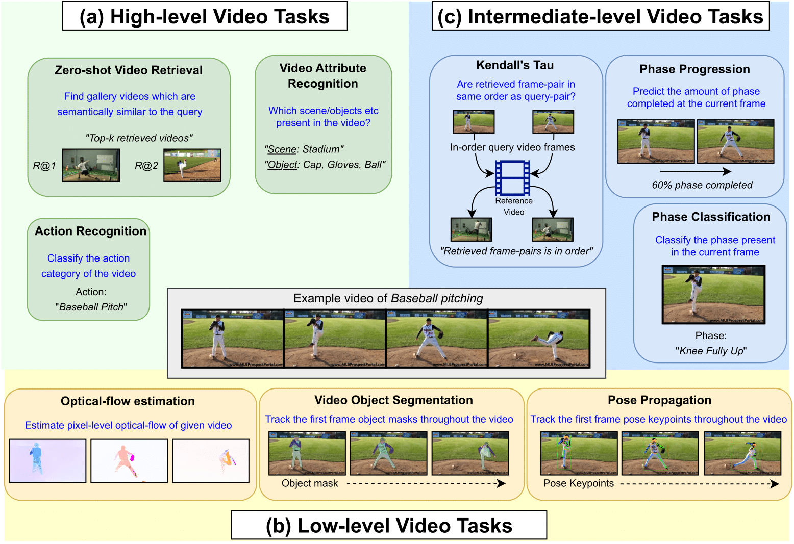
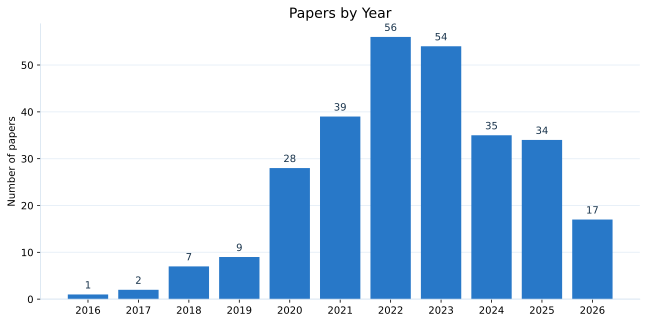
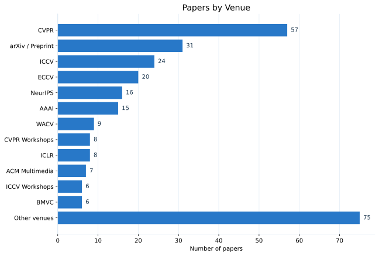
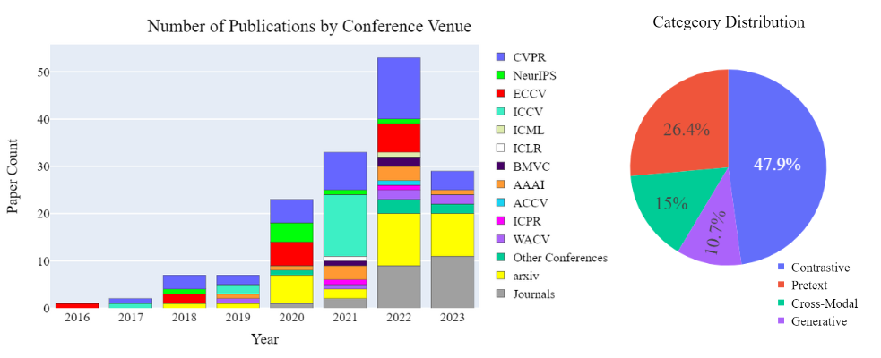
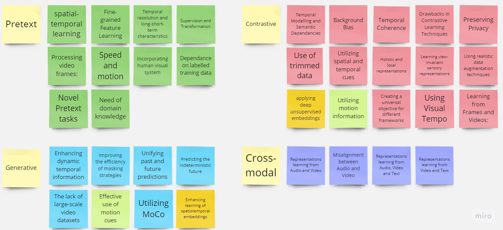

[](https://github.com/Malitha123/awesome-video-self-supervised-learning/commits/main) 
[](https://github.com/sindresorhus/awesome)
[](https://www.preprints.org/manuscript/202408.0133/v1)
[](https://malitha123.github.io/awesome-video-self-supervised-learning/)


# <p align=center>`Awesome Video Self-Supervised Learning (Video SSL / VideoSSL)`</p>

This repository is originating from our survey paper "**[Unifying Video Self-Supervised Learning across Families of Tasks: A Survey](https://www.preprints.org/manuscript/202408.0133/v1)**" and authors (**[Ishan Dave*](https://daveishan.github.io/)**, **[Malitha Gunawardhana*](https://malitha123.github.io/malitha/)**, **[Limalka Sadith](https://www.linkedin.com/in/limalka-sadith/1000/)**, **[Honglu Zhou](https://sites.google.com/view/hongluzhou/)**, **[Liel David](https://www.linkedin.com/in/liel-david-0bb41244/)**, **[Daniel Harari](https://scholar.google.com/citations?hl=en&user=xwdcDjUAAAAJ)**, **[Mubarak Shah](https://scholar.google.com/citations?user=p8gsO3gAAAAJ&hl=en)**, **[Muhammad Haris Khan](https://m-haris-khan.com/)**) will continue to update this over time.

**[Browse the searchable website](https://malitha123.github.io/awesome-video-self-supervised-learning/)** for the same collection with paper search, repository statistics, and direct links to the research.

> **Abstract:** *Video self-supervised learning (VideoSSL) offers significant potential for reducing annotation costs and enhancing a wide range of downstream tasks in video understanding. The ultimate goal of VideoSSL is to achieve human-level video intelligence across a spectrum of tasks, from low-level tasks such as pixel temporal correspondence to high-level complex spatio-temporal tasks like action recognition. However, most existing VideoSSL methods focus on isolated aspects of this spectrum and fail to integrate different levels of task complexity. Our study presents the first comprehensive survey that connects all families of VideoSSL methods. We provide a detailed review of the full spectrum of VideoSSL, from low to high levels, by conceptually linking their self-supervised learning objectives and including a comprehensive categorization. Our extensive evaluation highlights the strengths and limitations of each SSL objective across various downstream task families. We also detail the challenges in current VideoSSL research such as data curation, interpretability, deployment, and privacy concerns, an area that previous surveys have not thoroughly explored. In addressing these challenges, we recognize the strengths of existing methods in addressing these challenges and outline future directions for research.*
<div align="center">
    
    <p>Overview of the three major families of video self-supervised learning methods. <a href="https://www.preprints.org/manuscript/202408.0133/v1">Dave and Gunawardhana et al. (2024)</a></p>
</div>


This repository contains a collection of state-of-the-art self-supervised learning in video approaches for various downstream tasks, such as action recognition, video retrieval, etc. With the exponential growth of video data, there is an increasing need for automatic video analysis methods that can learn from large amounts of unlabeled data. Self-supervised learning provides an effective solution to this problem by allowing models to learn from the data itself without explicit supervision.


<!-- AUTO:STATS:START -->
## Repository Statistics

The charts below summarize the canonical collection by publication year and venue. Additional research metadata remains available in the repository data files but is intentionally omitted from the public catalog and README.

<div class="stats-kpis">
  <div><strong>282</strong><span>representation-learning papers</span></div>
  <div><strong>2016–2026</strong><span>years covered</span></div>
  <div><strong>64</strong><span>normalized venues</span></div>
</div>

<div class="stats-grid">
  <figure><figcaption>Papers by year</figcaption></figure>
  <figure><figcaption>Papers by venue</figcaption></figure>
</div>
<!-- AUTO:STATS:END -->

## Acknowledgments
This research was supported by the joint grant P007 from [Mohamed Bin Zayed University of Artificial Intelligence](https://mbzuai.ac.ae/)  and the [Weizmann Institute of Science](https://www.weizmann.ac.il/pages/). The authors would like to express their sincere gratitude for this generous support, which made the study possible.

## Citing

If you find our work useful. Please consider giving a star :star: and a citation.
```bibtex
@article{dave2024unifying,
  title={Unifying Video Self-Supervised Learning across Families of Tasks: A Survey},
  author={Dave, Ishan and Gunawardhana, Malitha and Sadith, Limalka and Zhou, Honglu and David, Liel and Harari, Daniel and Shah, Mubarak and Khan, Muhammad Haris},
  year={2024},
  publisher={Preprints}
}

```

<!--
We identify three major families of videoSSL methods: (a) Methods that focus on high-level semantic tasks which require complex spatio-temporal understanding, such as action recognition, video retrieval, and video attribute classification. (b) Methods that concentrate on low-level video dynamics, primarily learning good temporal correspondences between video segments. Tasks in this category include video object segmentation and pose tracking. (c) Objectives that aim to learn the action-class agnostic internal structure of an action, which falls between high-level semantic understanding and low-level correspondence. These methods focus on identifying frame-level key events and action phases, useful for fine-grained action understanding and temporal alignment of videos.
-->


In this repository, we have gathered some of the most promising self-supervised learning approaches for video analysis and organized them based on their publication year. Whether you are new to self-supervised learning in videos or an experienced researcher in the field, we hope that this repository will serve as a valuable resource for exploring the latest advances in this exciting area of research.


**Let's collaborate and enrich this list together! Reach out to [me](https://malitha123.github.io/malitha/) or submit a [pull request](https://github.com/Malitha123/awesome-video-self-supervised-learning/pulls). Your contributions are highly appreciated.**

<div align="center">
    
</div>


<!--

 Benchmark - https://arxiv.org/pdf/2203.14221.pdf
Page - https://bpiyush.github.io/SEVERE-website/
Code - https://github.com/fmthoker/SEVERE-BENCHMARK


Survey - https://dl.acm.org/doi/pdf/10.1145/3577925

-->

### Contents
- [Repository Statistics](#repository-statistics)
- [Surveys](#Surveys)
- [Benchmarking](#Benchmarking)
- [Representation Learning](#Representation-Learning)
   - [2026](#2026)
   - [2025](#2025)
   - [2024](#2024)
   - [2023](#2023)
   - [2022](#2022)
   - [2021](#2021)
   - [2020](#2020)
   - [2019](#2019)
   - [2018](#2018)
   - [2017](#2017)
   - [2016](#2016)
- [2025](#2025)
   - [2024](#2024)
   - [2023](#2023)
   - [2022](#2022)
   - [2021](#2021)
   - [2020](#2020)
   - [2019](#2019) 
   - [2018](#2018)
   - [2017](#2017)
   - [2016](#2016)
<!--<p float="left">
   
</p>  -->


<!--
<p float="left">
   
</p>
  -->
<!--
 - **** (2023)<br> 
** <br>
<br>
[[Paper]]() [[Github]]()
-->

#  Surveys

 - **Unifying Video Self-Supervised Learning across Families of Tasks: A Survey** (2024)<br> 
*Preprint* <br>
Ishan Dave*, Malitha Gunawardhana*, Limalka Sadith, Honglu Zhou, Liel David, Daniel Harari, Mubarak Shah, Muhammad Hairs Khan <br>
[[Paper]](https://www.preprints.org/manuscript/202408.0133/v1)


 - **Self-Supervised Learning for Videos: A Survey** (2022)<br> 
*ACM Computing Surveys* <br>
Madeline C. Schiappa, Yogesh S. Rawat, And Mubarak Shah <br>
[[Paper]](https://dl.acm.org/doi/pdf/10.1145/3577925)


# Benchmarking


 - **SEVERE++: Evaluating Benchmark Sensitivity in Generalization of Video Representation Learning** (2024) <br> 
*arXiv preprint* <br>
Fida Mohammad Thoker, Letian Jiang, Chen Zhao, Piyush Bagad, Hazel Doughty, Bernard Ghanem, Cees G. M. Snoek <br>
[[Paper]](https://arxiv.org/abs/2504.05706) [[Code]](https://github.com/fmthoker/SEVERE-BENCHMARK-plus-plus)


 - **How Effective are Self-Supervised Models for Contact Identification in Videos** (2024) <br> 
*arXiv preprint* <br>
Malitha Gunawardhana, Limalka Sadith, Liel David, Daniel Harari, Muhammad Haris Khan <br>
[[Paper]](https://arxiv.org/abs/2408.00498) [[Code]](https://github.com/Malitha123/Model_Eval/tree/main)

 - **Benchmarking self-supervised video representation learning** (2023) <br> 
*arXiv preprint arXiv:2306.06010* <br>
Akash Kumar, Ashlesha Kumar, Vibhav Vineet, Yogesh Singh Rawat <br>
[[Paper]](https://arxiv.org/pdf/2306.06010.pdf) [[Page]](https://thecodeeagle.github.io/webb/)


- **A Large-scale Study of Spatiotemporal Representation Learning with a New Benchmark on Action Recognition** (2023)  <br>
*arXiv preprint arXiv:2303.13505* <br>
Deng, A., Yang, T., & Chen, C. <br>
[[Paper]](https://arxiv.org/pdf/2303.13505.pdf)  


 - **How Severe Is Benchmark-Sensitivity in Video Self-supervised Learning?** (2022, October) <br> 
*In Computer Vision–ECCV 2022: 17th European Conference, Tel Aviv, Israel, October 23–27, 2022* <br>
Fida Mohammad Thoker, Hazel Doughty, Piyush Bagad, Cees Snoek <br>
[[Paper]](https://arxiv.org/pdf/2203.14221.pdf) [[Github]](https://github.com/fmthoker/SEVERE-BENCHMARK) [[Page]](https://bpiyush.github.io/SEVERE-website/)


# Representation Learning

# *2026*

- **Progressive Mask Distillation for Self-supervised Video Representation** (2026)<br>
*CVPR 2026* <br>
Kewei Wu, Chong Liang, Zhao Xie, Dan Guo<br>
[[Paper]](https://openaccess.thecvf.com/content/CVPR2026/html/Wu_Progressive_Mask_Distillation_for_Self-supervised_Video_Representation_CVPR_2026_paper.html)


- **TrackMAE: Video Representation Learning via Track Mask and Predict** (2026)<br>
*CVPR 2026* <br>
Renaud Vandeghen, Fida Mohammad Thoker, Marc Van Droogenbroeck, Bernard Ghanem<br>
[[Paper]](https://openaccess.thecvf.com/content/CVPR2026/html/Vandeghen_TrackMAE_Video_Representation_Learning_via_Track_Mask_and_Predict_CVPR_2026_paper.html) [[Code]](https://github.com/rvandeghen/TrackMAE)


- **V-JEPA 2.1: Unlocking Dense Features in Video Self-Supervised Learning** (2026)<br>
*arXiv preprint* <br>
Lorenzo Mur-Labadia, Matthew Muckley, Amir Bar, Mido Assran, Koustuv Sinha, Mike Rabbat, Yann LeCun, Nicolas Ballas, Adrien Bardes<br>
[[Paper]](https://arxiv.org/abs/2603.14482) [[Code]](https://github.com/facebookresearch/vjepa2)


- **From Static to Dynamic: Exploring Self-supervised Image-to-Video Representation Transfer Learning** (2026)<br>
*CVPR 2026* <br>
Yang Liu, Qianqian Xu, Peisong Wen, Siran Dai, Xilin Zhao, Qingming Huang<br>
[[Paper]](https://openaccess.thecvf.com/content/CVPR2026/html/Liu_From_Static_to_Dynamic_Exploring_Self-supervised_Image-to-Video_Representation_Transfer_Learning_CVPR_2026_paper.html) [[Code]](https://github.com/yafeng19/Co-Settle)


- **The TIME Machine: On The Power of Motion for Efficient Perception** (2026)<br>
*arXiv preprint* <br>
Mantas Skackauskas, Xinyue Hao, Laura Sevilla-Lara<br>
[[Paper]](https://arxiv.org/abs/2605.23045) [[Project Page]](https://time-model.github.io/)


- **TrAction: Action Recognition with Sparse Trajectories** (2026)<br>
*arXiv preprint* <br>
Jan F. Meier, Felix B. Mueller, Alexander Ecker, Timo Lüddecke<br>
[[Paper]](https://arxiv.org/abs/2606.03490) [[Code]](https://github.com/ecker-lab/TrAction)


- **OneVision-Encoder: Codec-Aligned Sparsity as a Foundational Principle for Multimodal Intelligence** (2026)<br>
*arXiv preprint* <br>
Feilong Tang, Xiang An, Yunyao Yan, Yin Xie, Bin Qin, Kaicheng Yang, Yifei Shen, Yuanhan Zhang, Chunyuan Li, Shikun Feng, Changrui Chen, Huajie Tan, Ming Hu, Manyuan Zhang, Bo Li, Ziyong Feng, Ziwei Liu, Zongyuan Ge, Jiankang Deng<br>
[[Paper]](https://arxiv.org/abs/2602.08683) [[Code]](https://github.com/EvolvingLMMs-Lab/OneVision-Encoder)


- **Factorized Latent Dynamics for Video JEPA: An Empirical Study of Auxiliary Objectives** (2026)<br>
*arXiv preprint* <br>
Santosh Premi<br>
[[Paper]](https://arxiv.org/abs/2605.17165) [[Code]](https://github.com/santoshpremi/Factorized-Latent-Dynamics-for-Video-JEPA-An-Empirical-Study-of-Auxiliary-Objectives)


- **Self-Supervised Learning of Structured Dynamics from Videos** (2026)<br>
*arXiv preprint* <br>
Lukas Knobel, Andrew Zisserman, Yuki M. Asano<br>
[[Paper]](https://arxiv.org/abs/2607.21576) [[Code]](https://github.com/lukasknobel/StructuredDynamics) [[Project Page]](https://lukasknobel.github.io/projects/StructuredDynamics/)


- **Depth-Wise Representation Development Under Blockwise Self-Supervised Learning for Video Vision Transformers** (2026)<br>
*arXiv preprint* <br>
Jonas Römer, Timo Dickscheid<br>
[[Paper]](https://arxiv.org/abs/2601.09040) [[Code]](https://github.com/JosRor/BWSSL-for-Video-ViTs)


- **Beyond reconstruction: Enhancing masked autoencoders with contrastive learning for video representation learning** (2026)<br>
*Engineering Applications of Artificial Intelligence, volume 171, article 114283 (2026)* <br>
Yawei Feng, Lijun Guo, Guitao Yu, Rong Zhang, Jiangbo Qian, Chong Wang, Shangce Gao<br>
[[Paper]](https://doi.org/10.1016/j.engappai.2026.114283)


- **Structured-Noise Masked Modeling for Video, Audio and Beyond** (2026)<br>
*ECCV 2026* <br>
Aritra Bhowmik, Fida Mohammad Thoker, Carlos Hinojosa, Bernard Ghanem, Cees G. M. Snoek<br>
[[Paper]](https://carloshinojosa.me/publication/conf-eccv2026-structured-noise/)


- **Rethinking JEPA: Compute-Efficient Video SSL with Frozen Teachers** (2026)<br>
*ICLR 2026* <br>
Xianhang Li, Chen Huang, Chun-Liang Li, Eran Malach, Josh Susskind, Vimal Thilak, Etai Littwin<br>
[[Paper]](https://openreview.net/forum?id=3cB9243E9i)


- **Recurrent Video Masked Autoencoders** (2026)<br>
*CVPR 2026* <br>
Daniel Zoran, Nikhil Parthasarathy, Yi Yang, Drew A. Hudson, Joao Carreira, Andrew Zisserman<br>
[[Paper]](https://openaccess.thecvf.com/content/CVPR2026/html/Zoran_Recurrent_Video_Masked_Autoencoders_CVPR_2026_paper.html)


- **Dual Perspectives on Non-Contrastive Self-Supervised Learning** (2026)<br>
*ICLR 2026* <br>
Jean Ponce, Martial Hebert, Basile Terver ;<br>
[[Paper]](https://openreview.net/forum?id=f5MC1G6XhB)


- **Self-Supervised Video Representation Learning in a Heuristic Decoupled Perspective** (2026)<br>
*International Journal of Computer Vision 2026* <br>
Zeen Song, Jingyao Wang, Jianqi Zhang, Changwen Zheng, Wenwen Qiang<br>
[[Paper]](https://link.springer.com/article/10.1007/s11263-026-02785-4)


- **BIMM: Brain Inspired Masked Modeling for Video Representation Learning** (2026)<br>
*IEEE Transactions on Circuits and Systems for Video Technology 2026* <br>
Zhifan Wan, Jie Zhang, Changzhen Li, Shiguang Shan<br>
[[Paper]](https://ieeexplore.ieee.org/document/11481118/)


# *2025*

- **Efficient VideoMAE via Temporal Progressive Training** (2025)<br>
*CVPR Workshops 2025* <br>
Xianhang Li, Peng Wang, Xinyu Li, Heng Wang, Hongru Zhu, Cihang Xie<br>
[[Paper]](https://openaccess.thecvf.com/content/CVPR2025W/PVUW/html/Li_Efficient_VideoMAE_via_Temporal_Progressive_Training_CVPRW_2025_paper.html)


- **An Empirical Study of Autoregressive Pre-training from Videos** (2025)<br>
*ICCV 2025* <br>
Jathushan Rajasegaran, Ilija Radosavovic, Rahul Ravishankar, Yossi Gandelsman, Christoph Feichtenhofer, Jitendra Malik<br>
[[Paper]](https://openaccess.thecvf.com/content/ICCV2025/html/Rajasegaran_An_Empirical_Study_of_Autoregressive_Pre-training_from_Videos_ICCV_2025_paper.html)


- **Reinforcement Learning Meets Masked Video Modeling: Trajectory-Guided Adaptive Token Selection** (2025)<br>
*ICCV Workshops 2025* <br>
Ayush K. Rai, Kyle Min, Tarun Krishna, Feiyan Hu, Alan F. Smeaton, Noel E. O'Connor<br>
[[Paper]](https://openaccess.thecvf.com/content/ICCV2025W/LongVid-Foundation/html/K._Reinforcement_Learning_meets_Masked_Video_Modeling__Trajectory-Guided_Adaptive_Token_ICCVW_2025_paper.html)


- **Entropy-Guided Masked Autoencoding for Self-Supervised Human Action Recognition Using Video Swin Transformer** (2025)<br>
*ACROSET 2025* <br>
Kollu Praveen Kumar; Guduri Baby Harshitha; Koti Vijay; Angothu Sravika<br>
[[Paper]](https://ieeexplore.ieee.org/document/11281001)


- **Privacy Preservation Using Superimposed 3D-Models for Self-Supervised Training in Action Recognition** (2025)<br>
*ICCV Workshops 2025* <br>
Asfandyar Azhar, Nidhish Shah, Shaurjya Mandal, Yongjie Jessica Zhang;<br>
[[Paper]](https://openaccess.thecvf.com/content/ICCV2025W/SafeMM-AI/html/Mandal_Privacy_Preservation_Using_Superimposed_3D-Models_for_Self-Supervised_Training_in_Action_ICCVW_2025_paper.html)


- **Learning Complementary Knowledge via Trusted Multi-view Space Decomposition for Self-Supervised Contrastive Learning** (2025)<br>
*Machine Learning 2025* <br>
Jiangmeng Li, Yunze Zhao, Yifan Jin, Changwen Zheng & Wenwen Qiang;<br>
[[Paper]](https://link.springer.com/article/10.1007/s10994-025-06927-6)


- **OSKAR: Omnimodal Self-supervised Knowledge Abstraction and Representation** (2025)<br>
*NeurIPS 2025* <br>
Mohamed O Abdelfattah, Kaouther Messaoud, Alexandre Alahi;<br>
[[Paper]](https://papers.nips.cc/paper_files/paper/2025/hash/010ca5a0ccb09cfb554ed637758a08da-Abstract-Conference.html)


- **MME: Video Representation Learning as World Model for Understanding and Planning** (2025)<br>
*TechRxiv preprint* <br>
Xinyu Sun, Changhao Li, Chen Jian, Chuang Gan, Peihao Chen, and Mingkui Tan;<br>
[[Paper]](https://www.techrxiv.org/doi/full/10.36227/techrxiv.175624509.93122186)


- **Hashtag2Action: Data Engineering and Self-Supervised Pre-Training for Action Recognition in Short-Form Videos** (2025)<br>
*ICCV Workshops 2025* <br>
Yang Qian, Ali Kargarandehkordi, Yinan Sun, Parnian Azizian, Onur Cezmi Mutlu, Saimourya Surabhi, Zain Jabbar, Dennis Wall, Peter Washington, Huaijin Chen;<br>
[[Paper]](https://openaccess.thecvf.com/content/ICCV2025W/SVU/html/Qian_Hashtag2Action_Data_Engineering_and_Self-Supervised_Pre-Training_for_Action_Recognition_in_ICCVW_2025_paper.html)


- **Kdhiera: boosting self-supervised masked video modeling via hierarchical knowledge distillation** (2025)<br>
*Cluster Computing 2025* <br>
Yunlong Wang, Hong Liang, Mingwen Shao & Qian Zhang;<br>
[[Paper]](https://link.springer.com/article/10.1007/s10586-025-05262-8)


- **Self-supervised video representation learning based on foreground and temporal information.** (2025)<br>
*Proceedings of SPIE, ETAI 2025* <br>
Zhongliang Zhou, Jiayong Fang ;<br>
[[Paper]](https://www.spiedigitallibrary.org/conference-proceedings-of-spie/13692/136923T/Self-supervised-video-representation-learning-based-on-foreground-and-temporal/10.1117/12.3068403.short)


- **Feature Hallucination for Self-supervised Action Recognition** (2025)<br>
*International Journal of Computer Vision 2025* <br>
Lei Wang, Piotr Koniusz; ;<br>
[[Paper]](https://link.springer.com/article/10.1007/s11263-025-02513-4)


- **ViDROP: Video Dense Representation through Spatio-Temporal Sparsity** (2025)<br>
*CVPR Workshops 2025* <br>
Sepehr Sameni, Simon Jenni, Paolo Favaro; ;<br>
[[Paper]](https://openaccess.thecvf.com/content/CVPR2025W/eLVM/html/Sameni_ViDROP_Video_Dense_Representation_through_Spatio-Temporal_Sparsity_CVPRW_2025_paper.html)


- **SF2T: Self-supervised Fragment Finetuning of Video-LLMs for Fine-Grained Understanding** (2025)<br>
*CVPR 2025* <br>
Yangliu Hu, Zikai Song, Na Feng, Yawei Luo, Junqing Yu, Yi-Ping Phoebe Chen, Wei Yang; ;<br>
[[Paper]](https://openaccess.thecvf.com/content/CVPR2025/html/Hu_SF2T_Self-supervised_Fragment_Finetuning_of_Video-LLMs_for_Fine-Grained_Understanding_CVPR_2025_paper.html)


- **V-JEPA 2: Self-Supervised Video Models Enable Understanding, Prediction and Planning** (2025)<br>
*arXiv preprint* <br>
Mido Assran, Adrien Bardes, David Fan, Quentin Garrido, Russell Howes, Mojtaba, Komeili, Matthew Muckley, Ammar Rizvi, Claire Roberts, Koustuv Sinha, Artem Zholus, Sergio Arnaud, Abha Gejji, Ada Martin, Francois Robert Hogan, Daniel Dugas, Piotr Bojanowski, Vasil Khalidov, Patrick Labatut, Francisco Massa, Marc Szafraniec, Kapil Krishnakumar, Yong Li, Xiaodong Ma, Sarath Chandar, Franziska Meier, Yann LeCun, Michael Rabbat, Nicolas Ballas ;<br>
[[Paper]](https://arxiv.org/abs/2506.09985) [[Code]](https://github.com/facebookresearch/vjepa2)


- **When the Future Becomes the Past: Taming Temporal Correspondence for Self-supervised Video Representation Learning** (2025)<br>
*CVPR 2025* <br>
Yang Liu, Qianqian Xu, Peisong Wen, Siran Dai, Qingming Huang;<br>
[[Paper]](https://openaccess.thecvf.com/content/CVPR2025/html/Liu_When_the_Future_Becomes_the_Past_Taming_Temporal_Correspondence_for_CVPR_2025_paper.html)


- **Self-Supervised Learning of Motion Concepts by Optimizing Counterfactuals** (2025)<br>
*NeurIPS 2025* <br>
Stefan Stojanov, David Wendt, Seungwoo Kim, Rahul Venkatesh, Kevin Feigelis, Jiajun Wu, Daniel LK Yamins<br>
[[Paper]](https://openreview.net/forum?id=fGuTN7huo5)


- **Label Ranker: Self-aware Preference for Classification Label Position in Visual Masked Self-supervised Pre-trained Model** (2025)<br>
*ICMR 2025* <br>
Peihao Xiang, Ou Bai<br>
[[Paper]](https://dl.acm.org/doi/10.1145/3731715.3733369)


- **AutoSSVH: Exploring Automated Frame Sampling for Efficient Self-Supervised Video Hashing** (2025)<br>
*CVPR 2025* <br>
Niu Lian, Jun Li, Jinpeng Wang, Ruisheng Luo, Yaowei Wang, Shu-Tao Xia, Bin Chen<br>
[[Paper]](https://openaccess.thecvf.com/content/CVPR2025/html/Lian_AutoSSVH_Exploring_Automated_Frame_Sampling_for_Efficient_Self-Supervised_Video_Hashing_CVPR_2025_paper.html) [[Code]](https://github.com/EliSpectre/CVPR25-AutoSSVH)


- **Efficient Self-Supervised Video Hashing with Selective State Spaces** (2025)<br>
*AAAI 2025* <br>
Jinpeng Wang, Niu Lian, Jun Li, Yuting Wang, Yan Feng, Bin Chen, Yongbing Zhang, Shu-Tao Xia1<br>
[[Paper]](https://ojs.aaai.org/index.php/AAAI/article/view/32835)


- **Exemplar-free class incremental action recognition based on self-supervised learning** (2025)<br>
*Image and Vision Computing 2025* <br>
Chunyu Hou, Yonghong Hou, Jinyin Jiang, Gunel Abdullayeva<br>
[[Paper]](https://www.sciencedirect.com/science/article/pii/S0262885625001325)


- **Learning from Streaming Video with Orthogonal Gradients** (2025)<br>
*CVPR 2025* <br>
Tengda Han⋄, Dilara Gokay, Joseph Heyward, Chuhan Zhang, Daniel Zoran, Viorica Patraucean, Joao Carreira, Dima Damen, Andrew Zisserman<br>
[[Paper]](https://openaccess.thecvf.com/content/CVPR2025/html/Chakraborty_Learning_from_Streaming_Video_with_Orthogonal_Gradients_CVPR_2025_paper.html)


- **Intuitive physics understanding emerges from self-supervised pretraining on natural videos** (2025)<br>
*arXiv preprint* <br>
Quentin Garrido, Nicolas Ballas, Mahmoud Assran, Adrien Bardes, Laurent Najman, Michael Rabbat, Emmanuel Dupoux, Yann LeCun<br>
[[Paper]](https://arxiv.org/abs/2502.11831)


- **ST-HViT: spatial-temporal hierarchical vision transformer for action recognition** (2025)<br>
*Pattern Analysis and Applications 2025* <br>
Limin Xia, Weiye Fu<br>
[[Paper]](https://link.springer.com/article/10.1007/s10044-024-01407-4)


- **Advancing video self-supervised learning via image foundation models** (2025)<br>
*Pattern Recognition Letters 2025* <br>
Jingwei Wu, Zhewei Huang, Chang Liu<br>
[[Paper]](https://www.sciencedirect.com/science/article/pii/S0167865525001072) [[Code]](https://github.com/JingwWu/advise-video-ssl)


- **SMILE: Infusing Spatial and Motion Semantics in Masked Video Learning** (2025)<br>
*CVPR 2025* <br>
Fida Mohammad Thoker, Letian Jiang, Chen Zhao†, Bernard Ghanem<br>
[[Paper]](https://openaccess.thecvf.com/content/CVPR2025/html/Thoker_SMILE_Infusing_Spatial_and_Motion_Semantics_in_Masked_Video_Learning_CVPR_2025_paper.html) [[Code]](https://github.com/fmthoker/SMILE)


- **A Large-Scale Analysis on Contextual Self-Supervised Video Representation Learning** (2025)<br>
*CVPR Workshops 2025* <br>
Akash Kumar, Ashlesha Kumar, Vibhav Vineet, Yogesh S Rawat<br>
[[Paper]](https://openaccess.thecvf.com/content/CVPR2025W/TCV/html/Kumar_A_Large-Scale_Analysis_on_Contextual_Self-Supervised_Video_Representation_Learning_CVPRW_2025_paper.html)


- **Progressive self-supervised spatio-temporal feature learning based on video sequence saliency** (2025)<br>
*Proceedings of SPIE, ICVIP 2024* <br>
Jinlong Kang, Tao Xu, Boting Qu, Xiang Wang, Xiaoli Lian, Jing Guo, Yuan Gao<br>
[[Paper]](https://www.spiedigitallibrary.org/conference-proceedings-of-spie/13558/1355809/Progressive-self-supervised-spatio-temporal-feature-learning-based-on-video/10.1117/12.3059113.short)


- **CrossVideoMAE: Self-Supervised Image-Video Representation Learning with Masked Autoencoders** (2025)<br>
*arXiv preprint* <br>
Shihab Aaqil Ahamed∗, Malitha Gunawardhana∗, Liel David, Michael Sidorov, Daniel Harari, Muhammad Haris Khan<br>
[[Paper]](https://arxiv.org/abs/2502.07811)


- **Motion-driven Adaptive Frame Selection Strategy for Video Action Recognition** (2025)<br>
*EURASIP Journal on Image and Video Processing 2025* <br>
Hao Ding, Chen Guo, Jing Sun, Xiaoping Jiang, Hongling Shi, Jianjin Li<br>
[[Paper]](https://jivp-eurasipjournals.springeropen.com/articles/10.1186/s13640-025-00675-2)


- **Mitigating background bias in self-supervised video representation learning** (2025)<br>
*Signal, Image and Video Processing 2025* <br>
Arif Akar, Ufuk Umut Senturk & Nazli Ikizler-Cinbis<br>
[[Paper]](https://link.springer.com/article/10.1007/s11760-024-03644-w)


- **ARVideo: Autoregressive Pretraining for Self-Supervised Video Representation Learning** (2025)<br>
*Transactions on Machine Learning Research 2025* <br>
Sucheng Ren, Hongru Zhu, Chen Wei, Yijiang Li, Alan Yuille, Cihang Xie<br>
[[Paper]](https://openreview.net/forum?id=hWlCc7Iksi)


- **Learning Video Representations without Natural Videos** (2025)<br>
*ICCV Workshops 2025* <br>
Xueyang Yu, Xinlei Chen, Yossi Gandelsman;<br>
[[Paper]](https://openreview.net/forum?id=nqDXwTTCWA)


- **Collaboratively Self-supervised Video Representation Learning for Action Recognition** (2025)<br>
*IEEE Transactions on Information Forensics and Security 2025* <br>
Jie Zhang, Zhifan Wan, Lanqing Hu, Stephen Lin, Shuzhe Wu, Shiguang Shan<br>
[[Paper]](https://ieeexplore.ieee.org/document/10847948/)


# *2024*

- **Asymmetric Masked Distillation for Pre-Training Small Foundation Models** (2024)<br>
*CVPR 2024* <br>
Zhiyu Zhao, Bingkun Huang, Sen Xing, Gangshan Wu, Yu Qiao, Limin Wang<br>
[[Paper]](https://openaccess.thecvf.com/content/CVPR2024/html/Zhao_Asymmetric_Masked_Distillation_for_Pre-Training_Small_Foundation_Models_CVPR_2024_paper.html)


- **Data Collection-free Masked Video Modeling** (2024)<br>
*ECCV 2024* <br>
Yuchi Ishikawa, Masayoshi Kondo, Yoshimitsu Aoki<br>
[[Paper]](https://www.ecva.net/papers/eccv_2024/papers_ECCV/html/1790_ECCV_2024_paper.php)


- **Text-Guided Video Masked Autoencoder** (2024)<br>
*ECCV 2024* <br>
David Fan, Jue Wang, Shuai Liao, Zhikang Zhang, Vimal Bhat, Xinyu Li<br>
[[Paper]](https://www.ecva.net/papers/eccv_2024/papers_ECCV/html/1737_ECCV_2024_paper.php)


- **FILS: Self-Supervised Video Feature Prediction In Semantic Language Space** (2024)<br>
*BMVC 2024* <br>
Mona Ahmadian, Frank Guerin, Andrew Gilbert<br>
[[Paper]](https://bmva-archive.org.uk/bmvc/2024/papers/Paper_790/paper.pdf)


- **Extending Video Masked Autoencoders to 128 Frames** (2024)<br>
*NeurIPS 2024* <br>
Nitesh Bharadwaj Gundavarapu, Luke Friedman, Raghav Goyal, Chaitra Hegde, Eirikur Agustsson, Sagar M. Waghmare, Mikhail Sirotenko, Ming-Hsuan Yang, Tobias Weyand, Boqing Gong, Leonid Sigal<br>
[[Paper]](https://proceedings.neurips.cc/paper_files/paper/2024/hash/8f08d4f7b00b763c2553f73d34157b0d-Abstract-Conference.html)


- **Scaling 4D Representations** (2024)<br>
*arXiv / Preprint* <br>
João Carreira et al.<br>
[[Paper]](https://arxiv.org/abs/2412.15212)


- **VideoMAC: Video Masked Autoencoders Meet ConvNets** (2024)<br>
*CVPR 2024* <br>
Gensheng Pei, Tao Chen, Xiruo Jiang, Huafeng Liu, Zeren Sun, Yazhou Yao<br>
[[Paper]](https://openaccess.thecvf.com/content/CVPR2024/html/Pei_VideoMAC_Video_Masked_Autoencoders_Meet_ConvNets_CVPR_2024_paper.html)


- **Self-supervised Video Object Segmentation with Distillation Learning of Deformable Attention** (2024)<br>
*arXiv / Preprint* <br>
Quang-Trung Truong,Duc Thanh Nguyen, Binh-Son Hua, Sai-Kit Yeung<br>
[[Paper]](https://arxiv.org/abs/2401.13937)


- **Towards Latent Masked Image Modeling for Self-supervised Visual Representation Learning** (2024)<br>
*ECCV 2024* <br>
Yibing Wei, Abhinav Gupta & Pedro Morgado<br>
[[Paper]](https://www.ecva.net/papers/eccv_2024/papers_ECCV/html/5568_ECCV_2024_paper.php) [[Code]](https://github.com/yibingwei-1/LatentMIM)


- **SIGMA: Sinkhorn-Guided Masked Video Modeling** (2024)<br>
*ECCV 2024* <br>
Mohammadreza Salehi, Michael Dorkenwald, Fida Mohammad Thoker, Efstratios Gavves, Cees G. M. Snoek & Yuki M. Asano<br>
[[Paper]](https://www.ecva.net/papers/eccv_2024/papers_ECCV/html/3506_ECCV_2024_paper.php) [[Code]](https://quva-lab.github.io/SIGMA)


- **ST2ST: Self-Supervised Test-time Adaptation for Video Action Recognition** (2024)<br>
*CVPR Workshops 2024* <br>
Masud An-Nur Islam Fahim, Mohammed Innat, Jani Boutellier;<br>
[[Paper]](https://openaccess.thecvf.com/content/CVPR2024W/MAT/html/Fahim_ST2ST_Self-Supervised_Test-time_Adaptation_for_Video_Action_Recognition_CVPRW_2024_paper.html)


- **Self-supervised learning of video representations from a child's perspective** (2024)<br>
*CogSci 2024* <br>
A. Emin Orhan, Wentao Wang, Alex N. Wang, Mengye Ren, Brenden M. Lake;<br>
[[Paper]](https://escholarship.org/uc/item/5ng8w8tv) [[Code]](https://github.com/eminorhan/video-models)


- **ViC-MAE: Self-supervised Representation Learning from Images and Video with Contrastive Masked Autoencoders** (2024)<br>
*ECCV 2024* <br>
Jefferson Hernandez, Ruben Villegas, Vicente Ordonez;<br>
[[Paper]](https://www.ecva.net/papers/eccv_2024/papers_ECCV/html/00629_ECCV_2024_paper.php) [[Code]](https://github.com/jeffhernandez1995/ViC-MAE)


- **Learning to Predict Activity Progress by Self-Supervised Video Alignment** (2024)<br>
*CVPR 2024* <br>
Gerard Donahue, Ehsan Elhamifar;<br>
[[Paper]](https://openaccess.thecvf.com/content/CVPR2024/html/Donahue_Learning_to_Predict_Activity_Progress_by_Self-Supervised_Video_Alignment_CVPR_2024_paper.html) [[Code]](https://github.com/gerardDonahue/GTCC_CVPR2024)


- **Repeat and learn: Self-supervised visual representations learning by Repeated Scene Localization** (2024)<br>
*Pattern Recognition 2024* <br>
Yuanhang Zhang, Shuang Yang, Shiguang Shan, Xilin Chen;<br>
[[Paper]](https://www.sciencedirect.com/science/article/pii/S0031320324005557) [[Code]](https://github.com/Hussein-A-Hassan/RSL-Pretext)


- **ES3: Evolving Self-Supervised Learning of Robust Audio-Visual Speech Representations** (2024)<br>
*CVPR 2024* <br>
Yuanhang Zhang, Shuang Yang, Shiguang Shan, Xilin Chen;<br>
[[Paper]](https://openaccess.thecvf.com/content/CVPR2024/html/Zhang_ES3_Evolving_Self-Supervised_Learning_of_Robust_Audio-Visual_Speech_Representations_CVPR_2024_paper.html)


- **Self-supervised Learning of Semantic Correspondence Using Web Videos** (2024)<br>
*WACV 2024* <br>
Donghyeon Kwon, Minsu Cho, Suha Kwak;<br>
[[Paper]](https://openaccess.thecvf.com/content/WACV2024/html/Kwon_Self-Supervised_Learning_of_Semantic_Correspondence_Using_Web_Videos_WACV_2024_paper.html)


- **Video Compression and Action Recognition in Self-supervised Learning** (2024)<br>
*IPEC 2024* <br>
Zongbo Hao; Conghui Hao; Kecheng He<br>
[[Paper]](https://ieeexplore.ieee.org/document/10695541)


- **CycleCL: Self-supervised Learning for Periodic Videos** (2024)<br>
*WACV 2024* <br>
Matteo Destro, Michael Gygl<br>
[[Paper]](https://openaccess.thecvf.com/content/WACV2024/html/Destro_CycleCL_Self-Supervised_Learning_for_Periodic_Videos_WACV_2024_paper.html)


- **Self-Supervised Learning via Multi-Transformation Classification for Action Recognition** (2024)<br>
*ICME Workshops 2024* <br>
Duc-Quang Vu; Ngan Le; Jia-Ching Wang<br>
[[Paper]](https://doi.org/10.1109/ICMEW63481.2024.10645477)


- **Motion-guided spatiotemporal multitask feature discrimination for self-supervised video representation learning** (2024)<br>
*Pattern Recognition 2024* <br>
Shuai Bi, Zhengping Hu, Hehao Zhang, Jirui Di, Zhe Sun<br>
[[Paper]](https://www.sciencedirect.com/science/article/pii/S0031320324004643)


- **What When and Where? Self-Supervised Spatio-Temporal Grounding in Untrimmed Multi-Action Videos from Narrated Instructions** (2024)<br>
*CVPR 2024* <br>
Brian Chen, Nina Shvetsova, Andrew Rouditchenko, Daniel Kondermann, Samuel Thomas, Shih-Fu Chang, Rogerio Feris, James Glass, Hilde Kuehne<br>
[[Paper]](https://openaccess.thecvf.com/content/CVPR2024/html/Chen_What_When_and_Where_Self-Supervised_Spatio-Temporal_Grounding_in_Untrimmed_Multi-Action_CVPR_2024_paper.html)


- **Clustering-based multi-featured self-supervised learning for human activities and video retrieval** (2024)<br>
*Applied Intelligence 2024* <br>
Muhammad Hafeez Javed, Zeng Yu, Taha M. Rajeh, Fahad Rafique & Tianrui Li<br>
[[Paper]](https://link.springer.com/article/10.1007/s10489-024-05460-8)


- **Positive and negative sampling strategies for self-supervised learning on audio-video data** (2024)<br>
*ICASSP Workshops 2024* <br>
Shanshan Wang, Soumya Tripathy, Toni Heittola, Annamaria Mesaros<br>
[[Paper]](https://cmsworkshops.com/ICASSP2024/view_paper.php?PaperNum=11780)


- **No More Shortcuts: Realizing the Potential of Temporal Self-Supervision** (2024)<br>
*AAAI 2024* <br>
Ishan Rajendrakumar Dave, Simon Jenni, Mubarak Shah.<br>
[[Paper]](https://ojs.aaai.org/index.php/AAAI/article/view/27913) [[Project Page]](https://daveishan.github.io/nms-webpage/)


- **GLOCAL: A self-supervised learning framework for global and local motion estimation** (2024)<br>
*Pattern Recognition Letters 2024* <br>
Yihao Zheng , Kunming Luo , Shuaicheng Liu , Zun Li , Ye Xiang , Lifang Wu , Bing Zeng , Chang Wen Chen<br>
[[Paper]](https://www.sciencedirect.com/science/article/pii/S016786552300377X)


- **Self-supervised Video Representation Learning via Capturing Semantic Changes Indicated by Saccades** (2024)<br>
*IEEE Transactions on Circuits and Systems for Video Technology 2024* <br>
Qiuxia Lai, Ailing Zeng, Ye Wang, Lihong Cao, Yu Li, Qiang Xu, IEEE<br>
[[Paper]](https://ieeexplore.ieee.org/document/10168973)


- **MAR: Masked Autoencoders for Efficient Action Recognition** (2024)<br>
*IEEE Transactions on Multimedia 2024* <br>
Zhiwu Qing, Shiwei Zhang, Ziyuan Huang, Xiang Wang, Yuehuan Wang, Yiliang Lv, Changxin Gao, Nong Sang<br>
[[Paper]](https://ieeexplore.ieee.org/document/10089159) [[Code]](https://github.com/alibaba-mmai-research/Masked-Action-Recognition)


- **VicTR: Video-conditioned Text Representations for Activity Recognition** (2024)<br>
*CVPR 2024* <br>
Kumara Kahatapitiya, Anurag Arnab, Arsha Nagrani, Michael S. Ryoo<br>
[[Paper]](https://openaccess.thecvf.com/content/CVPR2024/html/Kahatapitiya_VicTR_Video-conditioned_Text_Representations_for_Activity_Recognition_CVPR_2024_paper.html)


- **Self-Supervised Video Representation Learning by Video Incoherence Detection** (2024)<br>
*IEEE Transactions on Cybernetics 2024* <br>
Haozhi Cao, Yuecong Xu, Kezhi Mao, Lihua Xie, Jianxiong Yin, Simon See, Qianwen Xu, and Jianfei Yang<br>
[[Paper]](https://ieeexplore.ieee.org/document/10106103)


- **Structured Video-Language Modeling with Temporal Grouping and Spatial Grounding** (2024)<br>
*ICLR 2024* <br>
Xiong, Y., Zhao, L., Gong, B., Yang, M. H., Schroff, F., Liu, T., ... & Yuan, L.<br>
[[Paper]](https://openreview.net/forum?id=5dlfiJIXoh)


- **MotionMAE: Self-supervised Video Representation Learning with Motion-Aware Masked Autoencoders** (2024)<br>
*BMVC 2024* <br>
Haosen Yang, Deng Huang, Bin Wen, Jiannan Wu, Hongxun Yao, Yi Jiang, Xiatian Zhu, Zehuan Yuan<br>
[[Paper]](https://bmvc2024.org/proceedings/499/) [[Code]](https://github.com/happy-hsy/MotionMAE)


- **EVEREST: Efficient Masked Video Autoencoder by Removing Redundant Spatiotemporal Tokens** (2024)<br>
*ICML 2024* <br>
Sunil Hwang, Jaehong Yoon, Youngwan Lee, Sung Ju Hwan<br>
[[Paper]](https://proceedings.mlr.press/v235/hwang24d.html) [[Code]](https://github.com/sunilhoho/VideoMS)


- **XKD: Cross-modal Knowledge Distillation with Domain Alignment for Video Representation Learning** (2024)<br>
*AAAI 2024* <br>
Pritam Sarkar, Ali Etemad<br>
[[Paper]](https://ojs.aaai.org/index.php/AAAI/article/view/29407) [[Code]](https://github.com/pritamqu/XKD)


- **Controllable Augmentations for Video Representation Learning** (2024)<br>
*Visual Intelligence 2024* <br>
Rui Qian, Weiyao Lin, John See, Dian Li<br>
[[Paper]](https://link.springer.com/article/10.1007/s44267-023-00034-7)


# *2023*

- **Self-supervised object-centric learning for videos** (2023)<br>
*NeurIPS 2023* <br>
Görkay Aydemir, Weidi Xie, Fatma Guney<br>
[[Paper]](https://proceedings.neurips.cc/paper_files/paper/2023/hash/67b0e7c7c2a5780aeefe3b79caac106e-Abstract-Conference.html)


- **Language-based Action Concept Spaces Improve Video Self-Supervised Learning** (2023)<br>
*NeurIPS 2023* <br>
Kanchana Ranasinghe, Michael S Ryoo<br>
[[Paper]](https://proceedings.neurips.cc/paper_files/paper/2023/hash/ed67dff7cb96e7e86c4d91c0d5db49bb-Abstract-Conference.html)


- **Uncovering the Hidden Dynamics of Video Self-supervised Learning under Distribution Shifts** (2023)<br>
*NeurIPS 2023* <br>
Pritam Sarkar, Ahmad Beirami, Ali Etemad<br>
[[Paper]](https://proceedings.neurips.cc/paper_files/paper/2023/hash/a86d17b6cd70366d56ab48d2a05a4df1-Abstract-Conference.html) [[Project Page]](https://pritamsarkar.com/OOD-VSSL/)


- **Self-supervised video pretraining yields robust and more human-aligned visual representation** (2023)<br>
*NeurIPS 2023* <br>
Nikhil Parthasarathy, S. M. Ali Eslami, João Carreira, Olivier J. Hénaff.<br>
[[Paper]](https://proceedings.neurips.cc/paper_files/paper/2023/hash/cf57022dff0929796f85ac99d7cefa86-Abstract-Conference.html)


- **AdaMAE: Adaptive Masking for Efficient Spatiotemporal Learning with Masked Autoencoders** (2023)<br>
*CVPR 2023* <br>
Wele Gedara Chaminda Bandara, Naman Patel, Ali Gholami, Mehdi Nikkhah, Motilal Agrawal, Vishal M. Patel<br>
[[Paper]](https://openaccess.thecvf.com/content/CVPR2023/html/Bandara_AdaMAE_Adaptive_Masking_for_Efficient_Spatiotemporal_Learning_With_Masked_Autoencoders_CVPR_2023_paper.html)


- **Spatio-Temporal Crop Aggregation for Video Representation Learning** (2023)<br>
*ICCV 2023* <br>
Sepehr Sameni, Simon Jenni, Paolo Favaro<br>
[[Paper]](https://openaccess.thecvf.com/content/ICCV2023/html/Sameni_Spatio-Temporal_Crop_Aggregation_for_Video_Representation_Learning_ICCV_2023_paper.html)


- **Motion-Guided Masking for Spatiotemporal Representation Learning** (2023)<br>
*ICCV 2023* <br>
David Fan, Jue Wang, Shuai Liao, Yi Zhu, Vimal Bhat, Hector Santos-Villalobos, Rohith MV, Xinyu Li<br>
[[Paper]](https://openaccess.thecvf.com/content/ICCV2023/html/Fan_Motion-Guided_Masking_for_Spatiotemporal_Representation_Learning_ICCV_2023_paper.html)


- **Fine-Grained Spatiotemporal Motion Alignment for Contrastive Video Representation Learning** (2023)<br>
*ACM Multimedia 2023* <br>
Minghao Zhu, Xiao Lin, Ronghao Dang, Chengju Liu, Qijun Chen<br>
[[Paper]](https://dl.acm.org/doi/10.1145/3581783.3611932)


- **Unmasked Teacher: Towards Training-Efficient Video Foundation Models** (2023)<br>
*ICCV 2023* <br>
Kunchang Li, Yali Wang, Yizhuo Li, Yi Wang, Yinan He, Limin Wang, Yu Qiao<br>
[[Paper]](https://openaccess.thecvf.com/content/ICCV2023/html/Li_Unmasked_Teacher_Towards_Training-Efficient_Video_Foundation_Models_ICCV_2023_paper.html)


- **Concatenated Masked Autoencoders as Spatial-Temporal Learner** (2023)<br>
*arXiv / Preprint* <br>
Zhouqiang Jiang, Bowen Wang, Tong Xiang, Zhaofeng Niu, Hong Tang, Guangshun Li, Liangzhi Li<br>
[[Paper]](https://arxiv.org/abs/2311.00961)


- **AV-MaskEnhancer: Enhancing Video Representations through Audio-Visual Masked Autoencoder** (2023)<br>
*ICTAI 2023* <br>
Xingjian Diao, Ming Cheng, Shitong Cheng<br>
[[Paper]](https://ieeexplore.ieee.org/document/10356561)


- **OmniMAE: Single Model Masked Pretraining on Images and Videos** (2023)<br>
*CVPR 2023* <br>
Rohit Girdhar, Alaaeldin El-Nouby, Mannat Singh,Kalyan Vasudev Alwala, Armand Joulin , Ishan Misra<br>
[[Paper]](https://openaccess.thecvf.com/content/CVPR2023/html/Girdhar_OmniMAE_Single_Model_Masked_Pretraining_on_Images_and_Videos_CVPR_2023_paper.html) [[Code]](https://github.com/facebookresearch/omnivore)


- **TimeBalance: Temporally-Invariant and Temporally-Distinctive Video Representations for Semi-Supervised Action Recognition** (2023)<br>
*CVPR 2023* <br>
Ishan Rajendrakumar Dave, Mamshad Nayeem Rizve, Chen Chen, Mubarak Shah<br>
[[Paper]](https://openaccess.thecvf.com/content/CVPR2023/html/Dave_TimeBalance_Temporally-Invariant_and_Temporally-Distinctive_Video_Representations_for_Semi-Supervised_Action_Recognition_CVPR_2023_paper.html) [[Code]](https://github.com/DAVEISHAN/TimeBalance) [[Project Page]](https://daveishan.github.io/timebalance_webpage/)


- **Attentive spatial-temporal contrastive learning for self-supervised video representation** (2023)<br>
*Image and Vision Computing 2023* <br>
Xingming Yang, Sixuan Xiong, Kewei Wu, Dongfeng Shan, Zhao Xie<br>
[[Paper]](https://www.sciencedirect.com/science/article/pii/S0262885623001397)


- **MGMAE: Motion Guided Masking for Video Masked Autoencoding** (2023)<br>
*ICCV 2023* <br>
Bingkun Huang, Zhiyu Zhao, Guozhen Zhang, Yu Qiao, Limin Wang<br>
[[Paper]](https://openaccess.thecvf.com/content/ICCV2023/html/Huang_MGMAE_Motion_Guided_Masking_for_Video_Masked_Autoencoding_ICCV_2023_paper.html) [[Code]](https://github.com/MCG-NJU/MGMAE)


- **Cross-modal Manifold Cutmix for Self-supervised Video Representation Learning** (2023)<br>
*MVA 2023* <br>
Srijan Das; Michael Ryoo<br>
[[Paper]](https://ieeexplore.ieee.org/document/10216260)


- **CHAIN: Exploring Global-Local Spatio-Temporal Information for Improved Self-Supervised Video Hashing** (2023)<br>
*ACM Multimedia 2023* <br>
Rukai Wei, Yu Liu, Jingkuan Song, Heng Cui, Yanzhao Xie, Ke Zhou<br>
[[Paper]](https://dl.acm.org/doi/10.1145/3581783.3613440)


- **Data-Efficient Masked Video Modeling for Self-supervised Action Recognition** (2023)<br>
*ACM Multimedia 2023* <br>
Qiankun Li, Xiaolong Huang, Zhifan Wan, Lanqing Hu, Shuzhe Wu, Jie Zhang, Shiguang Shan, Zengfu Wang(<br>
[[Paper]](https://dl.acm.org/doi/10.1145/3581783.3612496)


- **Temporal Transformer Networks with Self-Supervision for Action Recognition** (2023)<br>
*IEEE Internet of Things Journal 2023* <br>
Yongkang Zhang, Jun Li, Guoming Wu, Han Zhang, Zhiping Shi, Member, IEEE, Zhaoxun Liu, Zizhang Wu<br>
[[Paper]](https://ieeexplore.ieee.org/document/10064011)


- **CMAE-V: Contrastive Masked Autoencoders for Video Action Recognition** (2023)<br>
*arXiv / Preprint* <br>
Cheng-Ze Lu, Xiaojie Jin, Zhicheng Huang, Qibin Hou, Ming-Ming Cheng, Jiashi Feng<br>
[[Paper]](https://arxiv.org/abs/2301.06018)


- **Learning Representational Invariances for Data-Efficient Action Recognition** (2023)<br>
*Computer Vision and Image Understanding 2023* <br>
Yuliang Zou, Jinwoo Choi, Qitong Wang, Jia-Bin Huang<br>
[[Paper]](https://www.sciencedirect.com/science/article/pii/S1077314222001748) [[Code]](https://github.com/vt-vl-lab/video-data-aug)


- **SOR-TC: Self-attentive octave ResNet with temporal consistency for compressed video action recognition** (2023)<br>
*Neurocomputing 2023* <br>
Junsan Zhang, Xiaomin Wang, Yao Wan, Leiquan Wang, Jian Wang, Philip S. Yu<br>
[[Paper]](https://www.sciencedirect.com/science/article/pii/S0925231223001959)


- **Masked Motion Encoding for Self-Supervised Video Representation Learning** (2023)<br>
*CVPR 2023* <br>
Xinyu Sun, Peihao Chen, Liangwei Chen, Thomas H. Li, Mingkui Tan, Chuang Gan<br>
[[Paper]](https://openaccess.thecvf.com/content/CVPR2023/html/Sun_Masked_Motion_Encoding_for_Self-Supervised_Video_Representation_Learning_CVPR_2023_paper.html) [[Code]](https://github.com/XinyuSun/MME)


- **Spatiotemporal consistency enhancement self-supervised representation learning for action recognition** (2023)<br>
*Signal, Image and Video Processing 2023* <br>
Shuai Bi, Zhengping Hu, Mengyao Zhao, Shufang Li & Zhe Sun<br>
[[Paper]](https://link.springer.com/article/10.1007/s11760-022-02357-2)


- **Self-Supervised Video-Based Action Recognition With Disturbances** (2023)<br>
*IEEE Transactions on Image Processing 2023* <br>
Wei Lin, Xinghao Ding, Yue Huang, Huanqiang Zeng<br>
[[Paper]](https://ieeexplore.ieee.org/document/10109672)


- **Masked Video Distillation: Rethinking Masked Feature Modeling for Self-supervised Video Representation Learning** (2023)<br>
*CVPR 2023* <br>
Rui Wang, Dongdong Chen, Zuxuan Wu, Yinpeng Chen, Xiyang Dai, Mengchen Liu, Lu Yuan, Yu-Gang Jiang<br>
[[Paper]](https://openaccess.thecvf.com/content/CVPR2023/html/Wang_Masked_Video_Distillation_Rethinking_Masked_Feature_Modeling_for_Self-Supervised_Video_Representation_CVPR_2023_paper.html) [[Code]](https://github.com/ruiwang2021/mvd)


- **Enhancing motion visual cues for self-supervised video representation learning** (2023)<br>
*Engineering Applications of Artificial Intelligence 2023* <br>
Mu Nie, Zhibin Quan, Weiping Ding, and Wankou Yang<br>
[[Paper]](https://www.sciencedirect.com/science/article/pii/S0952197623003871)


- **Continuous frame motion sensitive self-supervised collaborative network for video representation learning** (2023)<br>
*Advanced Engineering Informatics 2023* <br>
Shuai Bi, Zhengping Hu, Mengyao Zhao, Hehao Zhang, Jirui Di, and Zhe Sun<br>
[[Paper]](https://www.sciencedirect.com/science/article/pii/S1474034623000691)


- **Self-supervised pretext task collaborative multi-view contrastive learning for video action recognition** (2023)<br>
*Signal, Image and Video Processing 2023* <br>
Shuai Bi, Zhengping Hu, Mengyao Zhao, Hehao Zhang, Jirui Di, and Zhe Sun<br>
[[Paper]](https://link.springer.com/article/10.1007/s11760-023-02605-z)


- **Self-Supervised Learning from Untrimmed Videos via Hierarchical Consistency** (2023)<br>
*IEEE Transactions on Pattern Analysis and Machine Intelligence 2023* <br>
Zhiwu Qing, Shiwei Zhang, Ziyuan Huang, Yi Xu, Xiang Wang, Changxin Gao, Rong Jin, and Nong Sang<br>
[[Paper]](https://ieeexplore.ieee.org/document/10119224)


- **Audio-Visual Contrastive Learning with Temporal Self-Supervision** (2023)<br>
*AAAI 2023* <br>
Simon Jenni, Alexander Black, and John Collomosse<br>
[[Paper]](https://ojs.aaai.org/index.php/AAAI/article/view/25967)


- **Video Test-Time Adaptation for Action Recognition** (2023)<br>
*CVPR 2023* <br>
Wei Lin, Muhammad Jehanzeb Mirza, Mateusz Kozinski, Horst Possegger, Hilde Kuehne, and Horst Bischof<br>
[[Paper]](https://openaccess.thecvf.com/content/CVPR2023/html/Lin_Video_Test-Time_Adaptation_for_Action_Recognition_CVPR_2023_paper.html) [[Code]](https://github.com/wlin-at/ViTTA)


- **Self-Supervised Video Representation Learning via Latent Time Navigation** (2023)<br>
*AAAI 2023* <br>
Di Yang, Yaohui Wang, Quan Kong, Antitza Dantcheva, Lorenzo Garattoni, Gianpiero Francesca, and Francois Bremond<br>
[[Paper]](https://ojs.aaai.org/index.php/AAAI/article/view/25416)


- **Temporal Contrastive Learning with Curriculum** (2023)<br>
*ICASSP 2023* <br>
Shuvendu Roy and Ali Etemad<br>
[[Paper]](https://ieeexplore.ieee.org/document/10095948)


- **Nearest-Neighbor Inter-Intra Contrastive Learning from Unlabeled Videos** (2023)<br>
*ICLR Workshops 2023* <br>
David Fan, Deyu Yang, Xinyu Li, Vimal Bhat, and Rohith MV<br>
[[Paper]](https://openreview.net/forum?id=-5_B8g3CcSr)


- **Tubelet-Contrastive Self-Supervision for Video-Efficient Generalization** (2023)<br>
*ICCV 2023* <br>
Fida Mohammad Thoker, Hazel Doughty, and Cees Snoek<br>
[[Paper]](https://openaccess.thecvf.com/content/ICCV2023/html/Thoker_Tubelet-Contrastive_Self-Supervision_for_Video-Efficient_Generalization_ICCV_2023_paper.html)


- **Multi-scale Compositional Constraints for Representation Learning on Videos** (2023)<br>
*ICASSP 2023* <br>
Georgios Paraskevopoulos, Chandrashekhar Lavania, Lovish Chum, and Shiva Sundaram<br>
[[Paper]](https://www.amazon.science/publications/multi-scale-compositional-constraints-for-representation-learning-on-videos)


- **Flavr: Flow-agnostic Video Representations for Fast Frame Interpolation** (2023)<br>
*WACV 2023* <br>
Tarun Kalluri, Deepak Pathak, Manmohan Chandraker, and Du Tran<br>
[[Paper]](https://openaccess.thecvf.com/content/WACV2023/html/Kalluri_FLAVR_Flow-Agnostic_Video_Representations_for_Fast_Frame_Interpolation_WACV_2023_paper.html)


- **HomE: Homography-Equivariant Video Representation Learning** (2023)<br>
*arXiv / Preprint* <br>
Anirudh Sriram, Adrien Gaidon, Jiajun Wu, Juan Carlos Niebles, Li Fei-Fei, and Ehsan Adeli<br>
[[Paper]](https://arxiv.org/abs/2306.01623) [[Code]](https://github.com/anirudhs123/HomE)


- **ViewCLR: Learning Self-supervised Video Representation for Unseen Viewpoints** (2023)<br>
*WACV 2023* <br>
Srijan Das and Michael S Ryoo<br>
[[Paper]](https://openaccess.thecvf.com/content/WACV2023/html/Das_ViewCLR_Learning_Self-Supervised_Video_Representation_for_Unseen_Viewpoints_WACV_2023_paper.html)


- **Videomae v2: Scaling Video Masked Autoencoders with Dual Masking** (2023)<br>
*CVPR 2023* <br>
Limin Wang, Bingkun Huang, Zhiyu Zhao, Zhan Tong, Yinan He, Yi Wang, Yali Wang, and Yu Qiao<br>
[[Paper]](https://openaccess.thecvf.com/content/CVPR2023/html/Wang_VideoMAE_V2_Scaling_Video_Masked_Autoencoders_With_Dual_Masking_CVPR_2023_paper.html)


- **Self-Supervised Audio-Visual Representation Learning with Relaxed Cross-Modal Synchronicity** (2023)<br>
*AAAI 2023* <br>
Pritam Sarkar, Ali Etemad<br>
[[Paper]](https://ojs.aaai.org/index.php/AAAI/article/view/25138) [[Code]](https://pritamqu.github.io/CrissCross)


- **Previts: contrastive pretraining with video tracking supervision** (2023)<br>
*WACV 2023* <br>
Chen, B., Selvaraju, R. R., Chang, S. F., Niebles, J. C., & Naik, N.<br>
[[Paper]](https://openaccess.thecvf.com/content/WACV2023/html/Chen_PreViTS_Contrastive_Pretraining_With_Video_Tracking_Supervision_WACV_2023_paper.html)


- **Modeling Video As Stochastic Processes for Fine-Grained Video Representation Learning** (2023)<br>
*CVPR 2023* <br>
Zhang, H., Liu, D., Zheng, Q., & Su, B.<br>
[[Paper]](https://openaccess.thecvf.com/content/CVPR2023/html/Zhang_Modeling_Video_As_Stochastic_Processes_for_Fine-Grained_Video_Representation_Learning_CVPR_2023_paper.html)


- **Learning Fine-Grained Features for Pixel-wise Video Correspondences** (2023)<br>
*ICCV 2023* <br>
Li, R., Zhou, S., & Liu, D.<br>
[[Paper]](https://openaccess.thecvf.com/content/ICCV2023/html/Li_Learning_Fine-Grained_Features_for_Pixel-Wise_Video_Correspondences_ICCV_2023_paper.html)


- **Cali-NCE: Boosting Cross-Modal Video Representation Learning With Calibrated Alignment** (2023)<br>
*CVPR Workshops 2023* <br>
Zhao, N., Jiao, J., Xie, W., & Lin, D.<br>
[[Paper]](https://openaccess.thecvf.com/content/CVPR2023W/WFM/html/Zhao_Cali-NCE_Boosting_Cross-Modal_Video_Representation_Learning_With_Calibrated_Alignment_CVPRW_2023_paper.html)


- **Self-supervised motion perception for spatiotemporal representation learning** (2023)<br>
*IEEE Transactions on Neural Networks and Learning Systems 2023* <br>
Chang Liu, Yuan Yao, Dezhao Luo, Yu Zhou, Qixiang Ye<br>
[[Paper]](https://ieeexplore.ieee.org/document/9745754) [[Code]](https://github.com/yuanyao366/SMP)


- **Similarity Contrastive Estimation for Image and Video Soft Contrastive Self-Supervised Learning** (2023)<br>
*Machine Vision and Applications 2023* <br>
Julien Denize, Jaonary Rabarisoa, Astrid Orcesi, Romain H´erault<br>
[[Paper]](https://link.springer.com/article/10.1007/s00138-023-01444-9)


- **Self-Supervised Contrastive Learning for Audio-Visual Action Recognition** (2023)<br>
*ICIP 2023* <br>
Yang Liu, Ying Tan, Haoyuan Lan<br>
[[Paper]](https://ieeexplore.ieee.org/document/10222383)


- **Self-Supervised Scene-Debiasing for Video Representation Learning via Background Patching** (2023)<br>
*IEEE Transactions on Multimedia 2023* <br>
Maregu Assefa, Wei Jiang, Kumie Gedamu, Getinet Yilma, Bulbula Kumeda, Melese Ayalew<br>
[[Paper]](https://ieeexplore.ieee.org/document/9839482)


- **LgNet: A local-global network for action recognition and beyond** (2023)<br>
*IEEE Transactions on Multimedia 2023* <br>
Jiaqi Zhou, Zehua Fu, Qiuyu Huang, Qingjie Liu, Yunhong Wang<br>
[[Paper]](https://ieeexplore.ieee.org/document/9817623)


- **Unsupervised Video-Based Action Recognition With Imagining Motion and Perceiving Appearance** (2023)<br>
*IEEE Transactions on Circuits and Systems for Video Technology 2023* <br>
Wei Lin , Xiaoyu Liu , Yihong Zhuang , Xinghao Ding , Xiaotong Tu , Yue Huang , Huanqiang Zeng<br>
[[Paper]](https://ieeexplore.ieee.org/document/9944692)


- **Spatiotemporal Augmentation on Selective Frequencies for Video Representation Learning** (2023)<br>
*AAAI 2023* <br>
Jinhyung Kim, Taeoh Kim, Minho Shim, Dongyoon Han, Dongyoon Wee, Junmo Kim<br>
[[Paper]](https://ojs.aaai.org/index.php/AAAI/article/view/25194)


- **Consistent Intra-video Contrastive Learning with Asynchronous Long-term Memory Bank** (2023)<br>
*IEEE Transactions on Circuits and Systems for Video Technology 2023* <br>
Zelin Chen, Kun-Yu Lin, Wei-Shi Zheng<br>
[[Paper]](https://ieeexplore.ieee.org/document/9893855)


# *2022*

- **BEVT: BERT Pretraining of Video Transformers** (2022)<br>
*CVPR 2022* <br>
Rui Wang, Dongdong Chen, Zuxuan Wu, Yinpeng Chen, Xiyang Dai, Mengchen Liu, Yu-Gang Jiang, Luowei Zhou, Lu Yuan<br>
[[Paper]](https://openaccess.thecvf.com/content/CVPR2022/html/Wang_BEVT_BERT_Pretraining_of_Video_Transformers_CVPR_2022_paper.html)


- **Masked Autoencoders As Spatiotemporal Learners** (2022)<br>
*NeurIPS 2022* <br>
Christoph Feichtenhofer, Haoqi Fan, Yanghao Li, Kaiming He<br>
[[Paper]](https://proceedings.neurips.cc/paper_files/paper/2022/hash/e97d1081481a4017df96b51be31001d3-Abstract-Conference.html)


- **SPAct: Self-supervised Privacy Preservation for Action Recognition** (2022)<br>
*CVPR 2022* <br>
Ishan Rajendrakumar Dave, Chen Chen, Mubarak Shah<br>
[[Paper]](https://openaccess.thecvf.com/content/CVPR2022/html/Dave_SPAct_Self-Supervised_Privacy_Preservation_for_Action_Recognition_CVPR_2022_paper.html) [[Code]](https://github.com/DAVEISHAN/SPAct)


- **Suppressing Static Visual Cues via Normalizing Flows for Self-Supervised Video Representation Learning** (2022)<br>
*AAAI 2022* <br>
Manlin Zhang, Jinpeng Wang, Andy J. Ma<br>
[[Paper]](https://ojs.aaai.org/index.php/AAAI/article/view/20254) [[Code]](https://github.com/mettyz/SSVC)


- **Self-supervised Video Transformer** (2022)<br>
*CVPR 2022* <br>
Kanchana Ranasinghe, Muzammal Naseer, Salman Khan, Fahad Shahbaz Khan, Michael S. Ryoo<br>
[[Paper]](https://openaccess.thecvf.com/content/CVPR2022/html/Ranasinghe_Self-Supervised_Video_Transformer_CVPR_2022_paper.html) [[Code]](https://git.io/J1juJ)


- **Exploring Relations in Untrimmed Videos for Self-Supervised Learning** (2022)<br>
*ACM Transactions on Multimedia Computing, Communications, and Applications 2022* <br>
Dezhao Luo, Bo Fang, Yu Zhou, Yucan Zhou, Dayan Wu, Weiping Wang<br>
[[Paper]](https://dl.acm.org/doi/10.1145/3473342)


- **MaMiCo: Macro-to-Micro Semantic Correspondence for Self-supervised Video Representation Learning** (2022)<br>
*ACM Multimedia 2022* <br>
Bo Fang, Wenhao Wu, Chang Liu, Yu Zhou, Dongliang He, Weiping Wang<br>
[[Paper]](https://dl.acm.org/doi/10.1145/3503161.3547888)


- **TCGL: Temporal Contrastive Graph for Self-Supervised Video Representation Learning** (2022)<br>
*IEEE Transactions on Image Processing 2022* <br>
Yang Liu , Keze Wang , Lingbo Liu , Haoyuan Lan, and Liang Lin<br>
[[Paper]](https://ieeexplore.ieee.org/document/9713748) [[Code]](https://github.com/YangLiu9208/TCGL)


- **Cross-Architecture Self-supervised Video Representation Learning** (2022)<br>
*CVPR 2022* <br>
Sheng Guo, Zihua Xiong, Yujie Zhong, Limin Wang, Xiaobo Guo, Bing Han, Weilin Huang<br>
[[Paper]](https://openaccess.thecvf.com/content/CVPR2022/html/Guo_Cross-Architecture_Self-Supervised_Video_Representation_Learning_CVPR_2022_paper.html)


- **Contrastive spatio-temporal pretext learning for self-supervised video representation** (2022)<br>
*AAAI 2022* <br>
Yujia Zhang, Lai-Man Po, Xuyuan Xu, Mengyang Liu, Yexin Wang, Weifeng Ou, Yuzhi Zhao, Wing-Yin Yu<br>
[[Paper]](https://ojs.aaai.org/index.php/AAAI/article/view/20248) [[Code]](https://github.com/KT27-A/CSTP)


- **Transrank: Self-supervised video representation learning via ranking-based transformation recognition** (2022)<br>
*CVPR 2022* <br>
Haodong Duan, Nanxuan Zhao, Kai Chen, Dahua Lin<br>
[[Paper]](https://openaccess.thecvf.com/content/CVPR2022/html/Duan_TransRank_Self-Supervised_Video_Representation_Learning_via_Ranking-Based_Transformation_Recognition_CVPR_2022_paper.html) [[Code]](https://github.com/kennymckormick/TransRank)


- **Learning from untrimmed videos: Self-supervised video representation learning with hierarchical consistency** (2022)<br>
*CVPR 2022* <br>
Zhiwu Qing, Shiwei Zhang, Ziyuan Huang, Yi Xu, Xiang Wang, Mingqian Tang, Changxin Gao, Rong Jin,Nong Sang<br>
[[Paper]](https://openaccess.thecvf.com/content/CVPR2022/html/Qing_Learning_From_Untrimmed_Videos_Self-Supervised_Video_Representation_Learning_With_Hierarchical_CVPR_2022_paper.html) [[Code]](https://hico-cvpr2022.github.io/)


- **Motion-aware contrastive video representation learning via foreground-background merging** (2022)<br>
*CVPR 2022* <br>
Shuangrui Ding, Maomao Li, Tianyu Yang, Rui Qian, Haohang Xu, Qingyi Chen, Jue Wang, Hongkai Xiong<br>
[[Paper]](https://openaccess.thecvf.com/content/CVPR2022/html/Ding_Motion-Aware_Contrastive_Video_Representation_Learning_via_Foreground-Background_Merging_CVPR_2022_paper.html) [[Code]](https://github.com/Mark12Ding/FAME)


- **Self-Supervised Video Representation Learning with Motion-Contrastive Perception** (2022)<br>
*ICME 2022* <br>
Jinyu Liu, Ying Cheng, Yuejie Zhang, Rui-Wei Zhao, Rui Feng<br>
[[Paper]](https://ieeexplore.ieee.org/document/9859802/)


- **Self-supervised video representation learning using improved instance-wise contrastive learning and deep clustering** (2022)<br>
*IEEE Transactions on Circuits and Systems for Video Technology 2022* <br>
Yisheng Zhu, Hui Shuai, Guangcan Liu, Senior Member, Qingshan Liu<br>
[[Paper]](https://ieeexplore.ieee.org/document/9761901)


- **TCLR: Temporal contrastive learning for video representation** (2022)<br>
*Computer Vision and Image Understanding 2022* <br>
Ishan Dave, Rohit Gupta, Mamshad Nayeem Rizve, Mubarak Shah<br>
[[Paper]](https://doi.org/10.1016/j.cviu.2022.103406) [[Code]](https://github.com/DAVEISHAN/TCLR)


- **Self-supervised spatiotemporal representation learning by exploiting video continuity** (2022)<br>
*AAAI 2022* <br>
Hanwen Liang, Niamul Quader, Zhixiang Chi, Lizhe Chen, Peng Dai, Juwei Lu, Yang Wang<br>
[[Paper]](https://ojs.aaai.org/index.php/AAAI/article/view/20047)


- **Probabilistic representations for video contrastive learning** (2022)<br>
*CVPR 2022* <br>
Jungin Park, Jiyoung Lee, Ig-Jae Kim, Kwanghoon Sohn<br>
[[Paper]](https://openaccess.thecvf.com/content/CVPR2022/html/Park_Probabilistic_Representations_for_Video_Contrastive_Learning_CVPR_2022_paper.html)


- **Contextualized spatio-temporal contrastive learning with self-supervision** (2022)<br>
*CVPR 2022* <br>
Liangzhe Yuan, Rui Qian, Yin Cui, Boqing Gong,Florian Schroff,Ming-Hsuan Yang, Hartwig Adam, Ting Liu<br>
[[Paper]](https://openaccess.thecvf.com/content/CVPR2022/html/Yuan_Contextualized_Spatio-Temporal_Contrastive_Learning_With_Self-Supervision_CVPR_2022_paper.html) [[Code]](https://github.com/tensorflow/models/tree/master/official/projects/const_cl)


- **VideoMAE: Masked Autoencoders Are Data-Efficient Learners for Self-Supervised Video Pre-Training** (2022)<br>
*NeurIPS 2022* <br>
Zhan Tong, Yibing Song, Jue Wang, Limin Wang<br>
[[Paper]](https://proceedings.neurips.cc/paper_files/paper/2022/hash/416f9cb3276121c42eebb86352a4354a-Abstract-Conference.html) [[Code]](https://github.com/MCG-NJU/VideoMAE)


- **Self-supervised video representation learning with cross-stream prototypical contrasting** (2022)<br>
*WACV 2022* <br>
Martine Toering, Ioannis Gatopoulos, Maarten Stol, Vincent Tao Hu<br>
[[Paper]](https://openaccess.thecvf.com/content/WACV2022/html/Toering_Self-Supervised_Video_Representation_Learning_With_Cross-Stream_Prototypical_Contrasting_WACV_2022_paper.html) [[Code]](https://github.com/martinetoering/ViCC)


- **SLIC: Self-supervised learning with iterative clustering for human action videos** (2022)<br>
*CVPR 2022* <br>
Salar Hosseini Khorasgani, Yuxuan Chen, Florian Shkurti<br>
[[Paper]](https://openaccess.thecvf.com/content/CVPR2022/html/Khorasgani_SLIC_Self-Supervised_Learning_With_Iterative_Clustering_for_Human_Action_Videos_CVPR_2022_paper.html)


- **GOCA: guided online cluster assignment for self-supervised video representation Learning** (2022)<br>
*ECCV 2022* <br>
Huseyin Coskun, Alireza Zareian, Joshua L. Moore, Federico Tombari, Chen Wang<br>
[[Paper]](https://link.springer.com/chapter/10.1007/978-3-031-20050-2_15) [[Code]](https://github.com/Seleucia/goca)


- **TCVM: Temporal Contrasting Video Montage Framework for Self-supervised Video Representation Learning** (2022)<br>
*ACCV 2022* <br>
Fengrui Tian, Jiawei Fan, Xie Yu, Shaoyi Du, Meina Song, Yu Zhao<br>
[[Paper]](https://openaccess.thecvf.com/content/ACCV2022/html/Tian_TCVM_Temporal_Contrasting_Video_Montage_Framework_for_Self-supervised_Video_Representation_ACCV_2022_paper.html)


- **Static and Dynamic Concepts for Self-supervised Video Representation Learning** (2022)<br>
*ECCV 2022* <br>
Rui Qian, Shuangrui Ding, Xian Liu, Dahua Lin<br>
[[Paper]](https://link.springer.com/chapter/10.1007/978-3-031-19809-0_9)


- **SOS! Self-supervised Learning over Sets of Handled Objects in Egocentric Action Recognition** (2022)<br>
*ECCV 2022* <br>
Victor Escorcia, Ricardo Guerrero, Xiatian Zhu, Brais Martinez<br>
[[Paper]](https://link.springer.com/chapter/10.1007/978-3-031-19778-9_35)


- **Self-Supervised Video Representation Learning with Cascade Positive Retrieval** (2022)<br>
*CVPR Workshops 2022* <br>
Cheng-En Wu, Farley Lai, Yu Hen Hu, Asim Kadav<br>
[[Paper]](https://openaccess.thecvf.com/content/CVPR2022W/L3D-IVU/html/Wu_Self-Supervised_Video_Representation_Learning_With_Cascade_Positive_Retrieval_CVPRW_2022_paper.html) [[Code]](https://github.com/necla-ml/CPR)


- **Self-Supervised Learning of Audio Representations From Audio-Visual Data Using Spatial Alignment** (2022)<br>
*IEEE Journal of Selected Topics in Signal Processing 2022* <br>
Shanshan Wang, Archontis Politis, Annamaria Mesaros<br>
[[Paper]](https://ieeexplore.ieee.org/document/9790080)


- **Hierarchically decoupled spatial-temporal contrast for self-supervised video representation learning** (2022)<br>
*WACV 2022* <br>
Zehua Zhang, David Crandall<br>
[[Paper]](https://openaccess.thecvf.com/content/WACV2022/html/Zhang_Hierarchically_Decoupled_Spatial-Temporal_Contrast_for_Self-Supervised_Video_Representation_Learning_WACV_2022_paper.html)


- **Spatio-temporal self-supervision enhanced transformer networks for action recognition** (2022)<br>
*ICME 2022* <br>
Yongkang Zhang, Han Zhang, Guoming Wu, Jun Li<br>
[[Paper]](https://ieeexplore.ieee.org/document/9859741)


- **Inter-Intra Cross-Modality Self-Supervised Video Representation Learning by Contrastive Clustering** (2022)<br>
*ICPR 2022* <br>
Jiutong Wei. Guan Luo, Bing Li, Weiming Hu<br>
[[Paper]](https://ieeexplore.ieee.org/document/9956697)


- **SCVRL: Shuffled Contrastive Video Representation Learning** (2022)<br>
*CVPR Workshops 2022* <br>
Michael Dorkenwald, Fanyi Xiao, Biagio Brattoli, Joseph Tighe, Davide Modolo<br>
[[Paper]](https://openaccess.thecvf.com/content/CVPR2022W/L3D-IVU/html/Dorkenwald_SCVRL_Shuffled_Contrastive_Video_Representation_Learning_CVPRW_2022_paper.html)


- **InternVideo: General Video Foundation Models via Generative and Discriminative Learning** (2022)<br>
*arXiv / Preprint* <br>
Yi Wang, Kunchang Li, Yizhuo Li, Yinan He, Bingkun Huang, Zhiyu Zhao, Hongjie Zhang,Jilan Xu, Yi Liu, Zun Wang, Sen Xing, Guo Chen, Junting Pan, Jiashuo Yu,Yali Wang, Limin Wang, Yu Qiao<br>
[[Paper]](https://arxiv.org/abs/2212.03191) [[Code]](https://github.com/OpenGVLab/InternVideo)


- **Video Motion Perception for Self-supervised Representation Learning** (2022)<br>
*ICANN 2022* <br>
Wei Li, Dezhao Luo, Bo Fang, Xiaoni Li, Yu Zhou,  Weiping Wang<br>
[[Paper]](https://link.springer.com/chapter/10.1007/978-3-031-15937-4_43)


- **An improved inter-intra contrastive learning framework on self-supervised video representation** (2022)<br>
*IEEE Transactions on Circuits and Systems for Video Technology 2022* <br>
Li Tao, Xueting Wang, Toshihiko Yamasaki<br>
[[Paper]](https://ieeexplore.ieee.org/document/9674754)


- **Auxiliary Learning for Self-Supervised Video Representation via Similarity-based Knowledge Distillation** (2022)<br>
*CVPR Workshops 2022* <br>
Amirhossein Dadashzadeh, Alan Whone, Majid Mirmehdi<br>
[[Paper]](https://openaccess.thecvf.com/content/CVPR2022W/L3D-IVU/html/Dadashzadeh_Auxiliary_Learning_for_Self-Supervised_Video_Representation_via_Similarity-Based_Knowledge_Distillation_CVPRW_2022_paper.html) [[Code]](https://github.com/Plrbear/auxSKD)


- **Motion Sensitive Contrastive Learning for Self-supervised Video Representation** (2022)<br>
*ECCV 2022* <br>
Jingcheng Ni, Nan Zhou, Jie Qin, Qian Wu, Junqi Liu, Boxun Li, Di Huang<br>
[[Paper]](https://link.springer.com/chapter/10.1007/978-3-031-19833-5_27)


- **Unsupervised Learning of Spatio-Temporal Representation with Multi-Task Learning for Video Retrieval** (2022)<br>
*National Conference on Communications 2022* <br>
Vidit Kumar<br>
[[Paper]](https://ieeexplore.ieee.org/document/9806811)


- **Federated Self-supervised Learning for Video Understanding** (2022)<br>
*ECCV 2022* <br>
Yasar Abbas Ur Rehman, Yan Gao, Jiajun Shen, Pedro Porto Buarque de Gusmão , Nicholas Lane<br>
[[Paper]](https://link.springer.com/chapter/10.1007/978-3-031-19821-2_29) [[Code]](https://github.com/yasar-rehman/FEDVSSL)


- **Contrastive predictive coding with transformer for video representation learning** (2022)<br>
*Neurocomputing 2022* <br>
Yue Liu, Junqi Ma, Yufei Xie, Xuefeng Yang, Xingzhen Tao, Lin Peng, Wei Gao<br>
[[Paper]](https://www.sciencedirect.com/science/article/pii/S0925231221017082) [[Code]](https://github.com/yliu1229/CPCTR)


- **Video representation learning by identifying spatio-temporal transformation** (2022)<br>
*Applied Intelligence 2022* <br>
Sheng Geng, Shimin Zhao , Hu Liu<br>
[[Paper]](https://link.springer.com/article/10.1007/s10489-021-02790-9)


- **On temporal granularity in self-supervised video representation learning** (2022)<br>
*BMVC 2022* <br>
Rui Qian, Yeqing Li, Liangzhe Yuan, Boqing Gong, Ting Liu, Matthew Brown, Serge Belongie, Ming-Hsuan Yang, Hartwig Adam, and Yin Cui<br>
[[Paper]](https://bmvc2022.mpi-inf.mpg.de/541/) [[Code]](https://github.com/tensorflow/models/tree/master/official/)


- **LAVA: Language Audio Vision Alignment for Data-Efficient Video Pre-Training** (2022)<br>
*ICML Pre-training Workshop 2022* <br>
Sumanth Gurram , Andy Fang , David Chan , John Canny<br>
[[Paper]](https://openreview.net/forum?id=uwcwviTrLY3)


- **It Takes Two: Masked Appearance-Motion Modeling for Self-supervised Video Transformer Pre-training** (2022)<br>
*arXiv / Preprint* <br>
Yuxin Song, Min Yang, Wenhao Wu, Dongliang He, Fu Li, Jingdong Wang<br>
[[Paper]](https://arxiv.org/abs/2210.05234)


- **MAC: Mask-Augmentation for Motion-Aware Video Representation Learning** (2022)<br>
*BMVC 2022* <br>
Arif Akar, Ufuk Umut Senturk, and Nazli Ikizler-Cinbis.<br>
[[Paper]](https://bmvc2022.mpi-inf.mpg.de/5/) [[Code]](https://github.com/ufukpage/MAC_SSL)


- **Temporal-Invariant Video Representation Learning with Dynamic Temporal Resolutions.** (2022)<br>
*AVSS 2022* <br>
Seong-Yun Jeong, Ho-Joong Kim, Myeong-Seok Oh, Gun-Hee Lee, Seong-Whan Lee<br>
[[Paper]](https://ieeexplore.ieee.org/document/9959310)


- **Dual Contrastive Learning for Spatio-temporal Representation** (2022)<br>
*ACM Multimedia 2022* <br>
Shuangrui Ding,, Rui Qian, and Hongkai Xiongo<br>
[[Paper]](https://dl.acm.org/doi/10.1145/3503161.3547783)


- **MoQuad: Motion-focused Quadruple Construction for Video Contrastive Learning** (2022)<br>
*ECCV Workshops 2022* <br>
Yuan Liu, Jiacheng Chen, Hao Wu<br>
[[Paper]](https://link.springer.com/chapter/10.1007/978-3-031-25069-9_2)


- **On Negative Sampling for Audio-Visual Contrastive Learning from Movies** (2022)<br>
*arXiv / Preprint* <br>
Mahdi M. Kalayeh, Shervin Ardeshir, Lingyi Liu, Nagendra Kamath, Ashok Chandrashekar<br>
[[Paper]](https://arxiv.org/abs/2205.00073)


- **Frame-wise Action Representations for Long Videos via Sequence Contrastive Learning** (2022)<br>
*CVPR 2022* <br>
Minghao Chen, Fangyun Wei, Chong Li, Deng Cai<br>
[[Paper]](https://openaccess.thecvf.com/content/CVPR2022/html/Chen_Frame-Wise_Action_Representations_for_Long_Videos_via_Sequence_Contrastive_Learning_CVPR_2022_paper.html) [[Code]](https://github.com/minghchen/CARL_code)


- **Masked Feature Prediction for Self-Supervised Visual Pre-Training** (2022)<br>
*CVPR 2022* <br>
Wei, C., Fan, H., Xie, S., Wu, C. Y., Yuille, A., & Feichtenhofer, C.<br>
[[Paper]](https://openaccess.thecvf.com/content/CVPR2022/html/Wei_Masked_Feature_Prediction_for_Self-Supervised_Visual_Pre-Training_CVPR_2022_paper.html)


- **Pixel-level Correspondence for Self-Supervised Learning from Video** (2022)<br>
*arXiv / Preprint* <br>
Yash Sharma, Yanchao Zhu, Chris Russell, Thomas Brox<br>
[[Paper]](https://arxiv.org/abs/2207.03866)


- **Temporal Alignment Networks for Long-Term Video** (2022)<br>
*CVPR 2022* <br>
Han, T., Xie, W., & Zisserman, A.<br>
[[Paper]](https://openaccess.thecvf.com/content/CVPR2022/html/Han_Temporal_Alignment_Networks_for_Long-Term_Video_CVPR_2022_paper.html)


- **SimVTP: Simple Video Text Pre-Training with Masked Autoencoders** (2022)<br>
*arXiv / Preprint* <br>
Ma, Y., Yang, T., Shan, Y., & Li, X.<br>
[[Paper]](https://arxiv.org/abs/2212.03490)


- **Learning Audio-Visual Speech Representation by Masked Multimodal Cluster Prediction** (2022)<br>
*ICLR 2022* <br>
Shi, B., Hsu, W. N., Lakhotia, K., & Mohamed, A.<br>
[[Paper]](https://openreview.net/forum?id=Z1Qlm11uOM)


- **Self-supervised video representation learning by uncovering spatio-temporal statistics** (2022)<br>
*IEEE Transactions on Pattern Analysis and Machine Intelligence 2022* <br>
Jiangliu Wang, Jianbo Jiao, Linchao Bao, Shengfeng He, Wei Liu, Yun-hui Liu<br>
[[Paper]](https://ieeexplore.ieee.org/document/9352025) [[Code]](https://github.com/laura-wang/video_repres_sts)


# *2021*

- **Inter-intra Variant Dual Representations for Self-supervised Video Recognition** (2021)<br>
*BMVC 2021* <br>
Lin Zhang, Qi She, Zhengyang Shen, Changhu Wang<br>
[[Paper]](https://doi.org/10.5244/C.35.131)


- **VIMPAC: Video Pre-Training via Masked Token Prediction and Contrastive Learning** (2021)<br>
*NeurIPS 2021* <br>
Hao Tan, Jie Lei, Thomas Wolf, Mohit Bansal<br>
[[Paper]](https://openreview.net/forum?id=NP9T_pViXU)


- **Watching too much television is good: Self-supervised audio-visual representation learning from movies and tv shows** (2021)<br>
*arXiv / Preprint* <br>
Mahdi M. Kalayeh, Nagendra Kamath, Lingyi Liu<br>
[[Paper]](https://arxiv.org/abs/2106.08513)


- **Temporally coherent embeddings for self-supervised video representation learning** (2021)<br>
*ICPR 2020* <br>
Joshua Knights, Ben Harwood, Daniel Ward, Anthony Vanderkop, Olivia Mackenzie-Ross, Peyman Moghadam<br>
[[Paper]](https://ieeexplore.ieee.org/document/9412071) [[Code]](https://github.com/csiro-robotics/tce)


- **Audio-visual instance discrimination with cross-modal agreement** (2021)<br>
*CVPR 2021* <br>
Pedro Morgado, Nuno Vasconcelos, Ishan Misra<br>
[[Paper]](https://openaccess.thecvf.com/content/CVPR2021/html/Morgado_Audio-Visual_Instance_Discrimination_With_Cross-Modal_Agreement_CVPR_2021_paper.html) [[Code]](https://github.com/facebookresearch/AVID-CMA)


- **Removing the background by adding the background: Towards background robust self-supervised video representation learning** (2021)<br>
*CVPR 2021* <br>
Jinpeng Wang, Yuting Gao, Ke Li, Yiqi Lin, Andy J. Ma, Hao Cheng, Pai Peng, Feiyue Huang, Rongrong Ji, Xing Sun<br>
[[Paper]](https://openaccess.thecvf.com/content/CVPR2021/html/Wang_Removing_the_Background_by_Adding_the_Background_Towards_Background_Robust_Self-Supervised_CVPR_2021_paper.html) [[Code]](https://github.com/FingerRec/BE)


- **Enhancing unsupervised video representation learning by decoupling the scene and the motion** (2021)<br>
*AAAI 2021* <br>
Jinpeng Wang, Yuting Gao, Ke Li, Jianguo Hu, Xinyang Jiang, Xiaowei Guo, Rongrong Ji, Xing Sun<br>
[[Paper]](https://ojs.aaai.org/index.php/AAAI/article/view/17215) [[Code]](https://github.com/FingerRec/DSM-decoupling-scene-motion)


- **SeCo: Exploring Sequence Supervision for Unsupervised Representation Learning** (2021)<br>
*AAAI 2021* <br>
Ting Yao, Yiheng Zhang, Zhaofan Qiu, Yingwei Pan, Tao Mei<br>
[[Paper]](https://ojs.aaai.org/index.php/AAAI/article/view/17274) [[Code]](https://github.com/YihengZhang-CV/SeCo-Sequence-Contrastive-Learning)


- **Enhancing self-supervised video representation learning via multi-level feature optimization** (2021)<br>
*ICCV 2021* <br>
Rui Qian, Yuxi Li, Huabin Liu, John See, Shuangrui Ding, Xian Liu, Dian Li, Weiyao Lin<br>
[[Paper]](https://openaccess.thecvf.com/content/ICCV2021/html/Qian_Enhancing_Self-Supervised_Video_Representation_Learning_via_Multi-Level_Feature_Optimization_ICCV_2021_paper.html) [[Code]](https://github.com/shvdiwnkozbw/Video-Representation-via-Multi-level-Optimization)


- **RSPNet: Relative Speed Perception for Unsupervised Video Representation Learning** (2021)<br>
*AAAI 2021* <br>
Peihao Chen, Deng Huang, Dongliang He, Xiang Long, Runhao Zeng, Shilei Wen, Mingkui Tan, Chuang Gan<br>
[[Paper]](https://ojs.aaai.org/index.php/AAAI/article/view/16189) [[Code]](https://github.com/PeihaoChen/RSPNet)


- **VideoMoCo: Contrastive Video Representation Learning with Temporally Adversarial Examples** (2021)<br>
*CVPR 2021* <br>
Tian Pan, Yibing Song, Tianyu Yang, Wenhao Jiang, Wei Liu<br>
[[Paper]](https://openaccess.thecvf.com/content/CVPR2021/html/Pan_VideoMoCo_Contrastive_Video_Representation_Learning_With_Temporally_Adversarial_Examples_CVPR_2021_paper.html) [[Code]](https://github.com/tinapan-pt/VideoMoCo)


- **On compositions of transformations in contrastive self-supervised learning** (2021)<br>
*ICCV 2021* <br>
Mandela Patrick, Yuki M. Asano, Polina Kuznetsova, Ruth Fong, João F. Henriques, Geoffrey Zweig, Andrea Vedaldi<br>
[[Paper]](https://openaccess.thecvf.com/content/ICCV2021/html/Patrick_On_Compositions_of_Transformations_in_Contrastive_Self-Supervised_Learning_ICCV_2021_paper.html) [[Code]](https://github.com/facebookresearch/GDT)


- **Unsupervised visual representation learning by tracking patches in video** (2021)<br>
*CVPR 2021* <br>
Guangting Wang, Yizhou Zhou, Chong Luo, Wenxuan Xie, Wenjun Zeng,  Zhiwei Xiong<br>
[[Paper]](https://openaccess.thecvf.com/content/CVPR2021/html/Wang_Unsupervised_Visual_Representation_Learning_by_Tracking_Patches_in_Video_CVPR_2021_paper.html) [[Code]](https://github.com/microsoft/CtP)


- **A large-scale study on unsupervised spatiotemporal representation learning** (2021)<br>
*CVPR 2021* <br>
Christoph Feichtenhofer, Haoqi Fan, Bo Xiong, Ross Girshick, Kaiming He<br>
[[Paper]](https://openaccess.thecvf.com/content/CVPR2021/html/Feichtenhofer_A_Large-Scale_Study_on_Unsupervised_Spatiotemporal_Representation_Learning_CVPR_2021_paper.html) [[Code]](https://github.com/facebookresearch/SlowFast)


- **CoCon: Cooperative-Contrastive Learning** (2021)<br>
*CVPR 2021* <br>
Nishant Rai, Ehsan Adeli ,Kuan-Hui Lee, Adrien Gaidon, Juan Carlos Niebles<br>
[[Paper]](https://openaccess.thecvf.com/content/CVPR2021/html/Rai_CoCon_Cooperative-Contrastive_Learning_CVPR_2021_paper.html) [[Code]](http://github.com/nishantrai18/CoCon)


- **VATT: Transformers for multimodal self-supervised learning from raw video, audio and text** (2021)<br>
*NeurIPS 2021* <br>
Hassan Akbari, Liangzhe Yuan, Rui Qian, Wei-Hong Chuang, Shih-Fu Chang, Yin Cui, Boqing Gong<br>
[[Paper]](https://proceedings.neurips.cc/paper/2021/hash/cb3213ada48302953cb0f166464ab356-Abstract.html) [[Code]](https://github.com/google-research/google-research/tree/master/vatt)


- **ASCNet: Self-supervised video representation learning with appearance-speed consistency** (2021)<br>
*ICCV 2021* <br>
Deng Huang, Wenhao Wu, Weiwen Hu, Xu Liu, Dongliang He, Zhihua Wu, Xiangmiao Wu, Mingkui Tan, Errui Ding<br>
[[Paper]](https://openaccess.thecvf.com/content/ICCV2021/html/Huang_ASCNet_Self-Supervised_Video_Representation_Learning_With_Appearance-Speed_Consistency_ICCV_2021_paper.html)


- **Self-supervised visual learning by variable playback speeds prediction of a video** (2021)<br>
*IEEE Access 2021* <br>
Hyeon Cho, Taehoon Kim, Hyungjin Chang, Wonjun Hwang<br>
[[Paper]](https://ieeexplore.ieee.org/document/9443174) [[Code]](https://github.com/hyeon-jo/PSPNet)


- **Self-supervised video representation learning with meta-contrastive network** (2021)<br>
*ICCV 2021* <br>
Yuanze Lin, Xun Guo, Yan Lu<br>
[[Paper]](https://openaccess.thecvf.com/content/ICCV2021/html/Lin_Self-Supervised_Video_Representation_Learning_With_Meta-Contrastive_Network_ICCV_2021_paper.html)


- **Long short view feature decomposition via contrastive video representation learning** (2021)<br>
*ICCV 2021* <br>
Nadine Behrmann, Mohsen Fayyaz, Juergen Gall, Mehdi Noroozi<br>
[[Paper]](https://openaccess.thecvf.com/content/ICCV2021/html/Behrmann_Long_Short_View_Feature_Decomposition_via_Contrastive_Video_Representation_Learning_ICCV_2021_paper.html)


- **Time-equivariant contrastive video representation learning** (2021)<br>
*ICCV 2021* <br>
Simon Jenni, Hailin Jin<br>
[[Paper]](https://openaccess.thecvf.com/content/ICCV2021/html/Jenni_Time-Equivariant_Contrastive_Video_Representation_Learning_ICCV_2021_paper.html)


- **Self-supervised video representation learning by context and motion decoupling** (2021)<br>
*CVPR 2021* <br>
Lianghua Huang, Yu Liu, Bin Wang, Pan Pan, Yinghui Xu, Rong Jin<br>
[[Paper]](https://openaccess.thecvf.com/content/CVPR2021/html/Huang_Self-Supervised_Video_Representation_Learning_by_Context_and_Motion_Decoupling_CVPR_2021_paper.html)


- **Unsupervised video representation learning by bidirectional feature prediction** (2021)<br>
*WACV 2021* <br>
Nadine Behrmann, Juergen Gall, Mehdi Noroozi<br>
[[Paper]](https://openaccess.thecvf.com/content/WACV2021/html/Behrmann_Unsupervised_Video_Representation_Learning_by_Bidirectional_Feature_Prediction_WACV_2021_paper.html)


- **Self-supervised learning of compressed video representations** (2021)<br>
*ICLR 2021* <br>
Youngjae Yu, Sangho Lee, Gunhee Kim, Yale Song<br>
[[Paper]](https://openreview.net/forum?id=jMPcEkJpdD)


- **Spatiotemporal contrastive video representation learning** (2021)<br>
*CVPR 2021* <br>
Rui Qian, Tianjian Meng, Boqing Gong, Ming-Hsuan Yang, Huisheng Wang, Serge Belongie, Yin Cui<br>
[[Paper]](https://openaccess.thecvf.com/content/CVPR2021/html/Qian_Spatio-Temporal_Contrastive_Video_Representation_Learning_CVPR_2021_paper.html) [[Code]](https://github.com/tensorflow/models/tree/master/official/)


- **MoDist: Motion Distillation for Self-Supervised Video Representation Learning** (2021)<br>
*arXiv / Preprint* <br>
Fanyi Xiao, Joseph Tighe, Davide Modolo<br>
[[Paper]](https://arxiv.org/abs/2106.09703)


- **Broaden your views for self-supervised video learning** (2021)<br>
*ICCV 2021* <br>
Adria Recasens, Pauline Luc, Jean-Baptiste Alayrac, Luyu Wang, Ross Hemsley, Florian Strub, Corentin Tallec, Mateusz Malinowski, Viorica Patraucean, Florent Altche, Michal Valko, Jean-Bastien Grill, Aaron van den Oord, Andrew Zisserman<br>
[[Paper]](https://openaccess.thecvf.com/content/ICCV2021/html/Recasens_Broaden_Your_Views_for_Self-Supervised_Video_Learning_ICCV_2021_paper.html) [[Code]](http://github.com/deepmind/brave)


- **Vi2CLR: Video and image for visual contrastive learning of representation** (2021)<br>
*ICCV 2021* <br>
Ali Diba, Vivek Sharma, Reza Safdari, Dariush Lotfi, M. Saquib Sarfraz,Rainer Stiefelhagen, Luc Van Gool,<br>
[[Paper]](https://openaccess.thecvf.com/content/ICCV2021/html/Diba_Vi2CLR_Video_and_Image_for_Visual_Contrastive_Learning_of_Representation_ICCV_2021_paper.html)


- **Contrast and order representations for video self-supervised learning** (2021)<br>
*ICCV 2021* <br>
Kai Hu, Jie Shao, Yuan Liu, Bhiksha Raj, Marios Savvides, Zhiqiang Shen<br>
[[Paper]](https://openaccess.thecvf.com/content/ICCV2021/html/Hu_Contrast_and_Order_Representations_for_Video_Self-Supervised_Learning_ICCV_2021_paper.html)


- **Motion-augmented self-training for video recognition at smaller scale** (2021)<br>
*ICCV 2021* <br>
Kirill Gavrilyuk, Mihir Jain, Ilia Karmanov, Cees G. M. Snoek<br>
[[Paper]](https://openaccess.thecvf.com/content/ICCV2021/html/Gavrilyuk_Motion-Augmented_Self-Training_for_Video_Recognition_at_Smaller_Scale_ICCV_2021_paper.html)


- **Video contrastive learning with global context** (2021)<br>
*ICCV Workshops 2021* <br>
Haofei Kuang, Yi Zhu, Zhi Zhang, Xinyu Li, Joseph Tighe,Soren Schwertfeger, Cyrill Stachniss, Mu Li<br>
[[Paper]](https://openaccess.thecvf.com/content/ICCV2021W/CVEU/html/Kuang_Video_Contrastive_Learning_With_Global_Context_ICCVW_2021_paper.html) [[Code]](https://github.com/amazon-science/video-contrastive-learning)


- **Motion-focused contrastive learning of video representations** (2021)<br>
*ICCV 2021* <br>
Rui Li, Yiheng Zhang, Zhaofan Qiu, Ting Yao, Dong Liu, and Tao Mei<br>
[[Paper]](https://openaccess.thecvf.com/content/ICCV2021/html/Li_Motion-Focused_Contrastive_Learning_of_Video_Representations_ICCV_2021_paper.html) [[Code]](https://github.com/YihengZhang-CV/MCL-Motion-Focused-Contrastive-Learning)


- **Back to the Future: Cycle Encoding Prediction for Self-supervised Video Representation Learning** (2021)<br>
*BMVC 2021* <br>
Xinyu Yang, Majid Mirmehdi,Tilo Burghardt<br>
[[Paper]](https://www.bmva-archive.org.uk/bmvc/2021/assets/papers/0399.pdf) [[Code]](https://github.com/youshyee/CEP)


- **Composable augmentation encoding for video representation learning** (2021)<br>
*ICCV 2021* <br>
Sun, C., Nagrani, A., Tian, Y., & Schmid, C.<br>
[[Paper]](https://openaccess.thecvf.com/content/ICCV2021/html/Sun_Composable_Augmentation_Encoding_for_Video_Representation_Learning_ICCV_2021_paper.html)


- **Learning temporal dynamics from cycles in narrated video** (2021)<br>
*ICCV 2021* <br>
Epstein, D., Wu, J., Schmid, C., & Sun, C.<br>
[[Paper]](https://openaccess.thecvf.com/content/ICCV2021/html/Epstein_Learning_Temporal_Dynamics_From_Cycles_in_Narrated_Video_ICCV_2021_paper.html)


- **CrossCLR: Cross-Modal Contrastive Learning for Multi-Modal Video Representations** (2021)<br>
*ICCV 2021* <br>
Zolfaghari, M., Zhu, Y., Gehler, P., & Brox, T.<br>
[[Paper]](https://openaccess.thecvf.com/content/ICCV2021/html/Zolfaghari_CrossCLR_Cross-Modal_Contrastive_Learning_for_Multi-Modal_Video_Representations_ICCV_2021_paper.html)


- **Watching the World Go By: Representation Learning from Unlabeled Videos** (2021)<br>
*ICLR 2021* <br>
Daniel Gordon, Kiana Ehsani, Dieter Fox, Ali Farhadi<br>
[[Paper]](https://openreview.net/forum?id=iktA2PtTRsK)


- **Parameter Efficient Multimodal Transformers for Video Representation Learning** (2021)<br>
*ICLR 2021* <br>
Lee, S., Yu, Y., Kim, G., Breuel, T., Kautz, J., & Song, Y.<br>
[[Paper]](https://openreview.net/forum?id=6UdQLhqJyFD)


- **Active Contrastive Learning of Audio-Visual Video Representations** (2021)<br>
*ICLR 2021* <br>
Ma, S., Zeng, Z., McDuff, D., & Song, Y.<br>
[[Paper]](https://openreview.net/forum?id=OMizHuea_HB)


# *2020*

- **Self-Supervised Learning to Detect Key Frames in Videos** (2020)<br>
*Sensors 2020* <br>
Xiang Yan,Syed Zulqarnain Gilani,Mingtao Feng ,Liang Zhang,Hanlin Qin and Ajmal Mian<br>
[[Paper]](https://www.mdpi.com/1424-8220/20/23/6941)


- **Self-supervised motion representation via scattering local motion cues** (2020)<br>
*ECCV 2020* <br>
Yuan Tian, Zhaohui Che, Wenbo Bao, Guangtao Zhai, Zhiyong Gao1<br>
[[Paper]](https://www.ecva.net/papers/eccv_2020/papers_ECCV/papers/123590069.pdf)


- **Self-supervised video representation learning using inter-intra contrastive framework** (2020)<br>
*ACM Multimedia 2020* <br>
Li Tao, Xueting Wang, Toshihiko Yamasaki<br>
[[Paper]](https://doi.org/10.1145/3394171.3413694) [[Code]](https://github.com/BestJuly/IIC)


- **Video representation learning with visual tempo consistency** (2020)<br>
*arXiv / Preprint* <br>
Ceyuan Yang, Yinghao Xu, Bo Dai, Bolei Zhou<br>
[[Paper]](https://arxiv.org/abs/2006.15489) [[Code]](https://github.com/decisionforce/VTHCL)


- **Self-supervised temporal discriminative learning for video representation learning** (2020)<br>
*arXiv / Preprint* <br>
Jinpeng Wang, Yiqi Lin, Andy J. Ma,Pong C. Yuen<br>
[[Paper]](https://arxiv.org/abs/2008.02129) [[Code]](https://github.com/FingerRec/Self-Supervised-Temporal-Discriminative-Representation-Learning-for-Video-Action-Recognition)


- **Self-supervised learning by cross-modal audio-video clustering** (2020)<br>
*NeurIPS 2020* <br>
Humam Alwassel, Dhruv Mahajan, Bruno Korbar ,Lorenzo Torresani, Bernard Ghanem, Du Tran<br>
[[Paper]](https://proceedings.neurips.cc/paper/2020/hash/6f2268bd1d3d3ebaabb04d6b5d099425-Abstract.html) [[Code]](https://github.com/HumamAlwassel/XDC)


- **Self-supervised video representation learning by pace prediction** (2020)<br>
*ECCV 2020* <br>
Jiangliu Wang, Jianbo Jiao, Yun-Hui Liu<br>
[[Paper]](https://www.robots.ox.ac.uk/~vgg/publications/2020/Wang20/) [[Code]](https://github.com/laura-wang/video-pace)


- **Unsupervised learning from video with deep neural embeddings** (2020)<br>
*CVPR 2020* <br>
Chengxu Zhuang, Tianwei She, Alex Andonian, Max Sobol Mark, Daniel Yamins<br>
[[Paper]](https://openaccess.thecvf.com/content_CVPR_2020/html/Zhuang_Unsupervised_Learning_From_Video_With_Deep_Neural_Embeddings_CVPR_2020_paper.html) [[Code]](https://github.com/neuroailab/VIE)


- **Unsupervised learning of video representations via dense trajectory clustering** (2020)<br>
*ECCV Workshops 2020* <br>
Pavel Tokmakov, Martial Hebert, Cordelia Schmid<br>
[[Paper]](https://doi.org/10.1007/978-3-030-66096-3_28) [[Code]](https://github.com/pvtokmakov/video_cluster)


- **Video representation learning by recognizing temporal transformations** (2020)<br>
*ECCV 2020* <br>
Simon Jenni, Givi Meishvili, Paolo Favaro<br>
[[Paper]](https://doi.org/10.1007/978-3-030-58604-1_26) [[Code]](https://github.com/sjenni/temporal-ssl)


- **Video playback rate perception for self-supervised spatio-temporal representation learning** (2020)<br>
*CVPR 2020* <br>
Yuan Yao, Chang Liu, Dezhao Luo, Yu Zhou, Qixiang Ye<br>
[[Paper]](https://openaccess.thecvf.com/content_CVPR_2020/html/Yao_Video_Playback_Rate_Perception_for_Self-Supervised_Spatio-Temporal_Representation_Learning_CVPR_2020_paper.html) [[Code]](https://github.com/yuanyao366/PRP)


- **Self-supervised co-training for video representation learning** (2020)<br>
*NeurIPS 2020* <br>
Tengda Han, Weidi Xie, Andrew Zisserman<br>
[[Paper]](https://proceedings.neurips.cc/paper/2020/hash/3def184ad8f4755ff269862ea77393dd-Abstract.html) [[Code]](https://github.com/TengdaHan/CoCLR)


- **Video cloze procedure for self-supervised spatio-temporal learning** (2020)<br>
*AAAI 2020* <br>
Dezhao Luo, Chang Liu, Yu Zhou, Dongbao Yang, Can Ma, Qixiang Ye, Weiping Wang<br>
[[Paper]](https://ojs.aaai.org/index.php/AAAI/article/view/6840) [[Code]](https://github.com/BestJuly/VCP)


- **End-to-end learning of visual representations from uncurated instructional videos** (2020)<br>
*CVPR 2020* <br>
Antoine Miech, Jean-Baptiste Alayrac, Lucas Smaira,Ivan Laptev, Josef Sivic, Andrew Zisserman<br>
[[Paper]](https://openaccess.thecvf.com/content_CVPR_2020/html/Miech_End-to-End_Learning_of_Visual_Representations_From_Uncurated_Instructional_Videos_CVPR_2020_paper.html) [[Code]](https://github.com/antoine77340/MIL-NCE_HowTo100M)


- **SpeedNet: Learning the Speediness in Videos** (2020)<br>
*CVPR 2020* <br>
Sagie Benaim, Ariel Ephrat, Oran Lang, Inbar Mosseri, William T. Freeman, Michael Rubinstein, Michal Irani, Tali Dekel<br>
[[Paper]](https://openaccess.thecvf.com/content_CVPR_2020/html/Benaim_SpeedNet_Learning_the_Speediness_in_Videos_CVPR_2020_paper.html) [[Code]](http://speednet-cvpr20.github.io/)


- **Contrastive multiview coding** (2020)<br>
*ECCV 2020* <br>
Yonglong Tian, Dilip Krishnan, Phillip Isola<br>
[[Paper]](https://link.springer.com/chapter/10.1007/978-3-030-58621-8_45) [[Code]](http://github.com/HobbitLong/CMC/)


- **Self-supervised video representation learning by maximizing mutual information** (2020)<br>
*Signal Processing: Image Communication 2020* <br>
Fei Xue, Hongbing Ji, Wenbo Zhang, Yi Cao<br>
[[Paper]](https://www.sciencedirect.com/science/article/pii/S0923596520301417)


- **Memory-augmented dense predictive coding for video representation learning** (2020)<br>
*ECCV 2020* <br>
Tengda Han, Weidi Xie, Andrew Zisserman<br>
[[Paper]](https://www.robots.ox.ac.uk/~vgg/research/DPC/) [[Code]](https://github.com/TengdaHan/MemDPC)


- **Evolving losses for unsupervised video representation learning** (2020)<br>
*CVPR 2020* <br>
AJ Piergiovanni, Anelia Angelova, Michael S. Ryoo<br>
[[Paper]](https://openaccess.thecvf.com/content_CVPR_2020/html/Piergiovanni_Evolving_Losses_for_Unsupervised_Video_Representation_Learning_CVPR_2020_paper.html)


- **AudioVisual SlowFast Networks for Video Recognition** (2020)<br>
*arXiv / Preprint* <br>
Fanyi Xiao, Yong Jae Lee, Kristen Grauman, Jitendra Malik, Christoph Feichtenhofer<br>
[[Paper]](https://arxiv.org/abs/2001.08740) [[Code]](https://github.com/facebookresearch/SlowFast)


- **Cycle-Contrast for Self-Supervised Video Representation Learning** (2020)<br>
*NeurIPS 2020* <br>
Quan Kong, Wenpeng Wei, Ziwei Deng, Tomoaki Yoshinaga, Tomokazu Murakami<br>
[[Paper]](https://proceedings.neurips.cc/paper_files/paper/2020/hash/5c9452254bccd24b8ad0bb1ab4408ad1-Abstract.html)


- **Can temporal information help with contrastive self-supervised learning?** (2020)<br>
*arXiv / Preprint* <br>
Yutong Bai, Haoqi Fan, Ishan Misra, Ganesh Venkatesh, Yongyi Lu<br>
[[Paper]](https://arxiv.org/abs/2011.13046)


- **Self-supervised multimodal versatile networks** (2020)<br>
*NeurIPS 2020* <br>
Jean-Baptiste Alayrac, Adrià Recasens, Rosalia Schneider, Relja Arandjelovic, Jason Ramapuram, Jeffrey De Fauw, Lucas Smaira Sander Dieleman, Andrew Zisserman<br>
[[Paper]](https://proceedings.neurips.cc/paper/2020/hash/0060ef47b12160b9198302ebdb144dcf-Abstract.html)


- **Pretext-Contrastive Learning: Toward Good Practices in Self-Supervised Video Representation Learning** (2020)<br>
*arXiv / Preprint* <br>
Li Tao, Xueting Wang, Toshihiko Yamasaki<br>
[[Paper]](https://arxiv.org/abs/2010.15464) [[Code]](https://github.com/BestJuly/Pretext-Contrastive-Learning)


- **UniVL: A Unified Video and Language Pre-Training Model for Multimodal Understanding and Generation** (2020)<br>
*arXiv / Preprint* <br>
Luo, H., Ji, L., Shi, B., Huang, H., Duan, N., Li, T., ... & Zhou, M.<br>
[[Paper]](https://arxiv.org/abs/2002.06353)


- **Self-supervised learning of audio-visual objects from video** (2020)<br>
*ECCV 2020* <br>
Afouras, T., Owens, A., Chung, J. S., & Zisserman, A.<br>
[[Paper]](https://doi.org/10.1007/978-3-030-58523-5_13)


- **Speech2Action: Cross-Modal Supervision for Action Recognition** (2020)<br>
*CVPR 2020* <br>
Nagrani, A., Sun, C., Ross, D., Sukthankar, R., Schmid, C., & Zisserman, A.<br>
[[Paper]](https://openaccess.thecvf.com/content_CVPR_2020/html/Nagrani_Speech2Action_Cross-Modal_Supervision_for_Action_Recognition_CVPR_2020_paper.html)


- **Look, Listen, and Attend: Co-Attention Network for Self-Supervised Audio-Visual Representation Learning** (2020)<br>
*ACM Multimedia 2020* <br>
Cheng, Y., Wang, R., Pan, Z., Feng, R., & Zhang, Y.<br>
[[Paper]](https://dl.acm.org/doi/10.1145/3394171.3413869)


# *2019*

- **Self-supervised spatio-temporal representation learning for videos by predicting motion and appearance statistics** (2019)<br>
*CVPR 2019* <br>
Jiangliu Wang, Jianbo Jiao, Linchao Bao, Shengfeng He, Yunhui Liu, Wei Liu<br>
[[Paper]](https://openaccess.thecvf.com/content_CVPR_2019/html/Wang_Self-Supervised_Spatio-Temporal_Representation_Learning_for_Videos_by_Predicting_Motion_and_CVPR_2019_paper.html) [[Code]](https://github.com/laura-wang/video_repres_mas)


- **Video representation learning by dense predictive coding** (2019)<br>
*ICCV Workshops 2019* <br>
Tengda Han, Weidi Xie, Andrew Zisserman<br>
[[Paper]](https://openaccess.thecvf.com/content_ICCVW_2019/html/HVU/Han_Video_Representation_Learning_by_Dense_Predictive_Coding_ICCVW_2019_paper.html) [[Code]](https://github.com/TengdaHan/DPC)


- **Self-supervised spatiotemporal learning via video clip order prediction** (2019)<br>
*CVPR 2019* <br>
Dejing Xu, Jun Xiao, Zhou Zhao, Jian Shao, Di Xie, Yueting Zhuang<br>
[[Paper]](https://openaccess.thecvf.com/content_CVPR_2019/html/Xu_Self-Supervised_Spatiotemporal_Learning_via_Video_Clip_Order_Prediction_CVPR_2019_paper.html) [[Code]](https://github.com/xudejing/video-clip-order-prediction)


- **Video Jigsaw: Unsupervised Learning of Spatiotemporal Context for Video Action Recognition** (2019)<br>
*WACV 2019* <br>
Unaiza Ahsan, Rishi Madhok, Irfan Essa<br>
[[Paper]](https://doi.org/10.1109/WACV.2019.00025)


- **Self-supervised video representation learning with space-time cubic puzzles** (2019)<br>
*AAAI 2019* <br>
Dahun Kim, Donghyeon Cho, In So Kweon<br>
[[Paper]](https://ojs.aaai.org/index.php/AAAI/article/view/4873)


- **Learning Video Representations Using Contrastive Bidirectional Transformer** (2019)<br>
*arXiv / Preprint* <br>
Chen Sun, Fabien Baradel, Kevin Murphy, Cordelia Schmid<br>
[[Paper]](https://arxiv.org/abs/1906.05743)


- **DynamoNet: Dynamic Action and Motion Network** (2019)<br>
*ICCV 2019* <br>
Ali Diba, Vivek Sharma, Luc Van Gool, Rainer Stiefelhagen<br>
[[Paper]](https://openaccess.thecvf.com/content_ICCV_2019/html/Diba_DynamoNet_Dynamic_Action_and_Motion_Network_ICCV_2019_paper.html)


- **Temporal Cycle-Consistency Learning** (2019)<br>
*CVPR 2019* <br>
Dwibedi, D., Aytar, Y., Tompson, J., Sermanet, P., & Zisserman, A.<br>
[[Paper]](https://openaccess.thecvf.com/content_CVPR_2019/html/Dwibedi_Temporal_Cycle-Consistency_Learning_CVPR_2019_paper.html)


- **VideoBERT: A Joint Model for Video and Language Representation Learning** (2019)<br>
*ICCV 2019* <br>
Sun, C., Myers, A., Vondrick, C., Murphy, K., & Schmid, C.<br>
[[Paper]](https://openaccess.thecvf.com/content_ICCV_2019/html/Sun_VideoBERT_A_Joint_Model_for_Video_and_Language_Representation_Learning_ICCV_2019_paper.html)


# *2018*

- **Geometry Guided Convolutional Neural Networks for Self-Supervised Video Representation Learning** (2018)<br>
*CVPR 2018* <br>
Chuang Gan, Boqing Gong, Kun Liu, Hao Su, Leonidas J. Guibas<br>
[[Paper]](https://openaccess.thecvf.com/content_cvpr_2018/html/Gan_Geometry_Guided_Convolutional_CVPR_2018_paper.html)


- **Self-Supervised Spatiotemporal Feature Learning via Video Rotation Prediction** (2018)<br>
*arXiv / Preprint* <br>
Longlong Jing, Xiaodong Yang, Jinggen Liu, Yingli Tian<br>
[[Paper]](https://arxiv.org/abs/1811.11387)


- **Cooperative Learning of Audio and Video Models from Self-Supervised Synchronization** (2018)<br>
*NeurIPS 2018* <br>
Bruno Korbar, Du Tran, Lorenzo Torresani<br>
[[Paper]](https://proceedings.neurips.cc/paper/2018/hash/c4616f5a24a66668f11ca4fa80525dc4-Abstract.html)


- **Audio-Visual Scene Analysis with Self-Supervised Multisensory Features** (2018)<br>
*ECCV 2018* <br>
Andrew Owens, Alexei A. Efros<br>
[[Paper]](https://openaccess.thecvf.com/content_ECCV_2018/html/Andrew_Owens_Audio-Visual_Scene_Analysis_ECCV_2018_paper.html) [[Code]](https://github.com/andrewowens/multisensory)


- **Compressed Video Action Recognition** (2018)<br>
*CVPR 2018* <br>
Chao-Yuan Wu, Manzil Zaheer, Hexiang Hu, R. Manmatha, Alexander J. Smola, Philipp Krahenb<br>
[[Paper]](https://openaccess.thecvf.com/content_cvpr_2018/html/Wu_Compressed_Video_Action_CVPR_2018_paper.html)


- **Improving Spatiotemporal Self-Supervision by Deep Reinforcement Learning** (2018)<br>
*ECCV 2018* <br>
Uta Buchler, Biagio Brattoli, Bjorn Ommer<br>
[[Paper]](https://openaccess.thecvf.com/content_ECCV_2018/html/Uta_Buchler_Improving_Spatiotemporal_Self-Supervision_ECCV_2018_paper.html)


- **Learning and Using the Arrow of Time** (2018)<br>
*CVPR 2018* <br>
Donglai Wei, Joseph Lim, Andrew Zisserman, William T. Freeman<br>
[[Paper]](https://openaccess.thecvf.com/content_cvpr_2018/html/Wei_Learning_and_Using_CVPR_2018_paper.html)


# *2017*

- **Unsupervised Representation Learning by Sorting Sequences** (2017)<br>
*ICCV 2017* <br>
Hsin-Ying Lee, Jia-Bin Huang, Maneesh Singh, Ming-Hsuan Yang<br>
[[Paper]](https://openaccess.thecvf.com/content_ICCV_2017/papers/Lee_Unsupervised_Representation_Learning_ICCV_2017_paper.pdf)


- **Self-Supervised Video Representation Learning With Odd-One-Out Networks** (2017)<br>
*CVPR 2017* <br>
Basura Fernando, Hakan Bilen, Efstratios Gavves, Stephen Gould<br>
[[Paper]](https://openaccess.thecvf.com/content_cvpr_2017/html/Fernando_Self-Supervised_Video_Representation_CVPR_2017_paper.html)


# *2016*

- **Shuffle and Learn: Unsupervised Learning Using Temporal Order Verification** (2016)<br>
*ECCV 2016* <br>
Ishan Misra, C. Lawrence Zitnick, Martial Hebert<br>
[[Paper]](https://link.springer.com/chapter/10.1007/978-3-319-46448-0_32)
# Video SSL FAQ

## What is video self-supervised learning?
Video self-supervised learning is a family of methods that learns useful spatial and temporal representations from videos without requiring a manually annotated label for every training example. Common objectives include masked reconstruction, contrastive learning, temporal prediction, latent feature prediction, motion modeling, cross-modal learning, and knowledge distillation.

## What does Video SSL or VideoSSL mean?
Video SSL and VideoSSL are common abbreviations for video self-supervised learning. In research literature the same area is also described as self-supervised video representation learning, video representation pretraining, masked video modeling, and self-supervised action recognition.

## Which benchmarks are common in self-supervised video learning?
Frequently used benchmarks include UCF101, HMDB51, Kinetics-400, Something-Something V1 and V2, Diving48, and EPIC-KITCHENS. Different benchmarks emphasize appearance, motion, temporal reasoning, egocentric activity understanding, or fine-grained actions.

## What are the main families of VideoSSL methods?
Major families include contrastive and non-contrastive representation learning, masked video autoencoding and masked feature modeling, predictive and JEPA-style learning, motion-aware objectives, audio-visual or video-language self-supervision, temporal-order and transformation prediction, and fine-grained correspondence learning.
