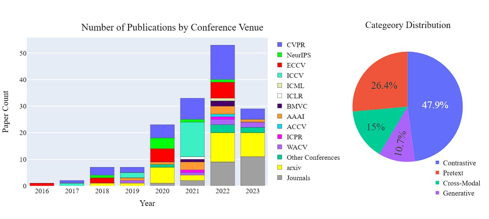
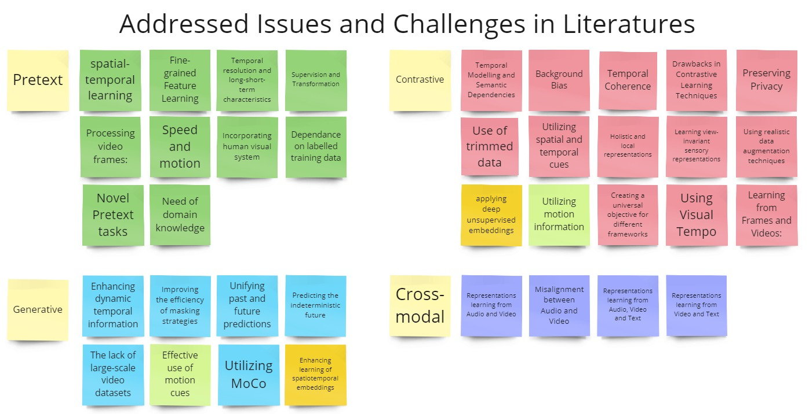

 

# 
`Awesome Self-Supervised Learning in Videos`

This repository contains a collection of state-of-the-art self-supervised learning in video approaches for various downstream tasks, such as action recognition, video retrieval, etc. With the exponential growth of video data, there is an increasing need for automatic video analysis methods that can learn from large amounts of unlabelled data. Self-supervised learning provides an effective solution to this problem by allowing models to learn from the data itself without explicit supervision.

In this repository, we have gathered some of the most promising self-supervised learning approaches for video analysis and organized them based on their publication year. Whether you are new to self-supervised learning in videos or an experienced researcher in the field, we hope that this repository will serve as a valuable resource for exploring the latest advances in this exciting area of research.

**Let's collaborate and enrich this list together! Reach out to [me](https://malitha123.github.io/malitha/) or submit a [pull request](https://github.com/Malitha123/awesome_video_self-supervised-learning/pulls). Your contributions are highly appreciated.**

<!--

 Benchmark - https://arxiv.org/pdf/2203.14221.pdf
Page - https://bpiyush.github.io/SEVERE-website/
Code - https://github.com/fmthoker/SEVERE-BENCHMARK

Survey - https://dl.acm.org/doi/pdf/10.1145/3577925

-->

### Contents
- [Surveys](#Surveys)
- [Benchmarking](#Benchmarking)
- [Representation Learning](#Representation-Learning)
   - [2024](#2024)
   - [2023](#2023)
   - [2022](#2022)
   - [2021](#2021)
   - [2020](#2020)
   - [2019](#2019) 
   - [2018](#2018)
   - [2017](#2017)
   - [2016](#2016)
<!-- - [Challenges](#Challenges)
   - [Pretext-task](#pretext-task)
   - [Contrastive-learning](#contrastive-learning)
   - [Generative](#generative)
   - [Cross-Modal](#Cross-Modal)
    -->

   

<!--

   

  -->
<!--
 - **** (2023)  
**  
 
[[Paper]]() [[Github]]()
-->

#  Surveys

 - **Self-Supervised Learning for Videos: A Survey** (2022)  
*ACM Computing Surveys*  
Madeline C. Schiappa, Yogesh S. Rawat, And Mubarak Shah  
[[Paper]](https://dl.acm.org/doi/pdf/10.1145/3577925)

# Benchmarking

 - **Benchmarking self-supervised video representation learning** (2023)   
*arXiv preprint arXiv:2306.06010*  
Akash Kumar, Ashlesha Kumar, Vibhav Vineet, Yogesh Singh Rawat  
[[Paper]](https://arxiv.org/pdf/2306.06010.pdf) [[Page]](https://thecodeeagle.github.io/webb/)

- **A Large-scale Study of Spatiotemporal Representation Learning with a New Benchmark on Action Recognition** (2023)   
*arXiv preprint arXiv:2303.13505*  
Deng, A., Yang, T., & Chen, C.  
[[Paper]](https://arxiv.org/pdf/2303.13505.pdf)  

 - **How Severe Is Benchmark-Sensitivity in Video Self-supervised Learning?** (2022, October)   
*In Computer Vision–ECCV 2022: 17th European Conference, Tel Aviv, Israel, October 23–27, 2022*  
Fida Mohammad Thoker, Hazel Doughty, Piyush Bagad, Cees Snoek  
[[Paper]](https://arxiv.org/pdf/2203.14221.pdf) [[Github]](https://github.com/fmthoker/SEVERE-BENCHMARK) [[Page]](https://bpiyush.github.io/SEVERE-website/)

# Representation Learning

# *2024*

 - **GLOCAL: A self-supervised learning framework for global and local motion estimation** (2024)  
*Pattern Recognition Letters*  
Yihao Zheng , Kunming Luo , Shuaicheng Liu , Zun Li , Ye Xiang , Lifang Wu , Bing Zeng , Chang Wen Chen   
[[Paper]](https://www.sciencedirect.com/science/article/pii/S016786552300377X?via%3Dihub) 

# *2023*

- **Self-supervised Video Representation Learning via Capturing Semantic Changes Indicated by Saccades** (2023) 
*IEEE Transactions on Circuits and Systems for Video Technology*  
Qiuxia Lai, Ailing Zeng, Ye Wang, Lihong Cao, Yu Li, Qiang Xu Senior Member, IEEE  
[[Paper]](https://ieeexplore.ieee.org/abstract/document/10168973)

- **Attentive spatial-temporal contrastive learning for self-supervised video representation** (2023) 
*Image and Vision Computing Journal*  
Xingming Yang, Sixuan Xiong, Kewei Wu, Dongfeng Shan, Zhao Xie  
[[Paper]](https://www.sciencedirect.com/science/article/abs/pii/S0262885623001397#preview-section-snippets)

- **Attentive spatial-temporal contrastive learning for self-supervised video representation** (2023) 
*Image and Vision Computing Journal*  
Xingming Yang, Sixuan Xiong, Kewei Wu, Dongfeng Shan, Zhao Xie  
[[Paper]](https://www.sciencedirect.com/science/article/abs/pii/S0262885623001397#preview-section-snippets)

- **Cross-modal Manifold Cutmix for Self-supervised Video Representation Learning** (2023) 
*18th International Conference on Machine Vision and Applications (MVA) 2023*  
Srijan Das; Michael Ryoo  
[[Paper]](https://ieeexplore.ieee.org/abstract/document/10216260)

- **CHAIN: Exploring Global-Local Spatio-Temporal Information for Improved Self-Supervised Video Hashing** (2023) 
*Proceedings of the 31st ACM International Conference on Multimedia*  
Rukai Wei, Yu Liu, Jingkuan Song, Heng Cui, Yanzhao Xie, Ke Zhou  
[[Paper]](https://dl.acm.org/doi/abs/10.1145/3581783.3613440)

- **Data-Efficient Masked Video Modeling for Self-supervised Action Recognition** (2023)  
*Proceedings of the 31st ACM International Conference on Multimedia*  
Qiankun Li, Xiaolong Huang, Zhifan Wan, Lanqing Hu, Shuzhe Wu, Jie Zhang, Shiguang Shan, Zengfu Wang(  
[[Paper]](https://dl.acm.org/doi/10.1145/3581783.3612496)

 - **MAR: Masked Autoencoders for Efficient Action Recognition** (2023)  
*IEEE Transactions on Multimedia*  
Zhiwu Qing, Shiwei Zhang, Ziyuan Huang, Xiang Wang, Yuehuan Wang, Yiliang Lv, Changxin Gao, Nong Sang  
[[Paper]](https://arxiv.org/pdf/2207.11660.pdf) [[Github]](https://github.com/alibaba-mmai-research/Masked-Action-Recognition)

 - **Temporal Transformer Networks with Self-Supervision for Action Recognition** (2023)  
*IEEE Internet of Things Journal*  
Yongkang Zhang, Jun Li, Guoming Wu, Han Zhang, Zhiping Shi, Member, IEEE, Zhaoxun Liu, Zizhang Wu  
[[Paper]](https://arxiv.org/pdf/2112.07338.pdf)

 - **CMAE-V: Contrastive Masked Autoencoders for Video Action Recognition** (2023)  
*arXiv preprint arXiv:2301.06018*  
Cheng-Ze Lu, Xiaojie Jin, Zhicheng Huang, Qibin Hou, Ming-Ming Cheng, Jiashi Feng  
[[Paper]](https://arxiv.org/pdf/2301.06018.pdf)

 - **Learning Representational Invariances for Data-Efficient Action Recognition** (2023)  
*Computer Vision and Image Understanding, 227, 103597*  
Yuliang Zou, Jinwoo Choi, Qitong Wang, Jia-Bin Huang  
[[Paper]](https://arxiv.org/pdf/2103.16565.pdf) [[Github]](https://github.com/vt-vl-lab/video-data-aug)

 - **SOR-TC: Self-attentive octave ResNet with temporal consistency for compressed video action recognition** (2023)  
*Neurocomputing, 533, 191-205*  
Junsan Zhang, Xiaomin Wang, Yao Wan, Leiquan Wang, Jian Wang, Philip S. Yu 
[[Paper]](https://www.sciencedirect.com/science/article/abs/pii/S0925231223001959)

 - **VicTR: Video-conditioned Text Representations for Activity Recognition** (2023)  
*arXiv preprint arXiv:2304.02560*  
Kumara Kahatapitiya, Anurag Arnab, Arsha Nagrani, Michael S. Ryoo  
[[Paper]](https://arxiv.org/pdf/2304.02560.pdf)

- **Masked Motion Encoding for Self-Supervised Video Representation Learning** (2023)   
*Proceedings of the IEEE/CVF Conference on Computer Vision and Pattern Recognition*  
Xinyu Sun, Peihao Chen, Liangwei Chen, Thomas H. Li, Mingkui Tan, Chuang Gan  
[[Paper]](https://arxiv.org/pdf/2210.06096.pdf) [[Github]](https://github.com/XinyuSun/MME)

 - **Spatiotemporal consistency enhancement self-supervised representation learning for action recognition** (2023)  
*Signal, Image and Video Processing*  
Shuai Bi, Zhengping Hu, Mengyao Zhao, Shufang Li & Zhe Sun   
[[Paper]](https://link.springer.com/article/10.1007/s11760-022-02357-2#Tab4)

 - **Self-Supervised Video-Based Action Recognition With Disturbances** (2023)  
*IEEE Transactions on Image Processing.*  
Wei Lin, Xinghao Ding, Yue Huang, Huanqiang Zeng   
[[Paper]](https://ieeexplore.ieee.org/stamp/stamp.jsp?tp=&arnumber=10109672)

- **Masked Video Distillation: Rethinking Masked Feature Modeling for Self-supervised Video Representation Learning** (2023)  
*In Proceedings of the IEEE/CVF Conference on Computer Vision and Pattern Recognition (pp. 6312-6322)*  
 Rui Wang, Dongdong Chen, Zuxuan Wu, Yinpeng Chen, Xiyang Dai, Mengchen Liu, Lu Yuan, Yu-Gang Jiang  
[[Paper]](https://arxiv.org/pdf/2212.04500.pdf)  [[Github]](https://github.com/ruiwang2021/mvd)

- **Enhancing motion visual cues for self-supervised video representation learning** (2023) 
*In Engineering Applications of Artificial Intelligence, Volume 123, Pages 106203* 
Mu Nie, Zhibin Quan, Weiping Ding, and Wankou Yang 
[[Paper]](https://www.sciencedirect.com/science/article/abs/pii/S0952197623003871)

- **Continuous frame motion sensitive self-supervised collaborative network for video representation learning** (2023) 
*In Advanced Engineering Informatics, Volume 56, Pages 101941* 
Shuai Bi, Zhengping Hu, Mengyao Zhao, Hehao Zhang, Jirui Di, and Zhe Sun 
[[Paper]](https://www.sciencedirect.com/science/article/abs/pii/S1474034623000691)

- **Self-supervised pretext task collaborative multi-view contrastive learning for video action recognition** (2023) 
*In Signal, Image and Video Processing, Pages 1--8* 
Shuai Bi, Zhengping Hu, Mengyao Zhao, Hehao Zhang, Jirui Di, and Zhe Sun 
[[Paper]](https://link.springer.com/article/10.1007/s11760-023-02605-z)

- **Self-Supervised Learning from Untrimmed Videos via Hierarchical Consistency** (2023)  
*In IEEE Transactions on Pattern Analysis and Machine Intelligence*  
Zhiwu Qing, Shiwei Zhang, Ziyuan Huang, Yi Xu, Xiang Wang, Changxin Gao, Rong Jin, and Nong Sang 
[[Paper]](https://ieeexplore.ieee.org/abstract/document/10119224) 

- **Self-Supervised Video Representation Learning by Video Incoherence Detection** (2023)  
*In IEEE Transactions on Cybernetics*  
Haozhi Cao, Yuecong Xu, Kezhi Mao, Lihua Xie, Jianxiong Yin, Simon See, Qianwen Xu, and Jianfei Yang 
[[Paper]](https://ieeexplore.ieee.org/abstract/document/10106103)

- **Audio-Visual Contrastive Learning with Temporal Self-Supervision** (2023)  
*Preprint on arXiv*  
Simon Jenni, Alexander Black, and John Collomosse 
[[Paper]](https://arxiv.org/pdf/2302.07702.pdf)

- **Video Test-Time Adaptation for Action Recognition** (2023)  
*In Proceedings of the IEEE/CVF Conference on Computer Vision and Pattern Recognition*  
Wei Lin, Muhammad Jehanzeb Mirza, Mateusz Kozinski, Horst Possegger, Hilde Kuehne, and Horst Bischof 
[[Paper]](https://openaccess.thecvf.com/content/CVPR2023/papers/Lin_Video_Test-Time_Adaptation_for_Action_Recognition_CVPR_2023_paper.pdf) [[GitHub]](https://github.com/wlin-at/ViTTA)

<!-- - **Self-Supervised Representation Learning from Temporal Ordering of Automated Driving Sequences** (2023)  
*Preprint on arXiv*  
Christopher Lang, Alexander Braun, Lars Schillingmann, Karsten Haug, and Abhinav Valada 
[[Paper]](https://arxiv.org/pdf/2302.09043.pdf) -->

- **Uncovering the Hidden Dynamics of Video Self-supervised Learning under Distribution Shifts** (2023)  
*Preprint on arXiv*  
Pritam Sarkar, Ahmad Beirami, and Ali Etemad 
[[Paper]](https://arxiv.org/pdf/2306.02014.pdf)

- **Self-Supervised Video Representation Learning via Latent Time Navigation** (2023)  
*Preprint on arXiv*  
Di Yang, Yaohui Wang, Quan Kong, Antitza Dantcheva, Lorenzo Garattoni, Gianpiero Francesca, and Francois Bremond 
[[Paper]](https://arxiv.org/pdf/2305.06437.pdf)

- **Temporal Contrastive Learning with Curriculum** (2023)  
*In ICASSP 2023-2023 IEEE International Conference on Acoustics, Speech and Signal Processing (ICASSP)*  
Shuvendu Roy and Ali Etemad 
[[Paper]](https://arxiv.org/pdf/2209.00760.pdf)

- **Nearest-Neighbor Inter-Intra Contrastive Learning from Unlabeled Videos** (2023)  
*Preprint on arXiv*  
David Fan, Deyu Yang, Xinyu Li, Vimal Bhat, and Rohith MV 
[[Paper]](https://arxiv.org/pdf/2303.07317.pdf)

- **Tubelet-Contrastive Self-Supervision for Video-Efficient Generalization** (2023)  
*Preprint on arXiv*  
Fida Mohammad Thoker, Hazel Doughty, and Cees Snoek 
[[Paper]](https://arxiv.org/pdf/2303.11003.pdf)

- **Multi-scale Compositional Constraints for Representation Learning on Videos** (2023)  
*In ICASSP 2023-2023 IEEE International Conference on Acoustics, Speech and Signal Processing (ICASSP)*  
Georgios Paraskevopoulos, Chandrashekhar Lavania, Lovish Chum, and Shiva Sundaram 
[[Paper]](https://www.amazon.science/publications/multi-scale-compositional-constraints-for-representation-learning-on-videos)

- **Flavr: Flow-agnostic Video Representations for Fast Frame Interpolation** (2023)  
*In Proceedings of the IEEE/CVF Winter Conference on Applications of Computer Vision*  
Tarun Kalluri, Deepak Pathak, Manmohan Chandraker, and Du Tran 
[[Paper]](https://openaccess.thecvf.com/content/WACV2023/papers/Kalluri_FLAVR_Flow-Agnostic_Video_Representations_for_Fast_Frame_Interpolation_WACV_2023_paper.pdf)

- **HomE: Homography-Equivariant Video Representation Learning** (2023)  
*Preprint on arXiv*  
Anirudh Sriram, Adrien Gaidon, Jiajun Wu, Juan Carlos Niebles, Li Fei-Fei, and Ehsan Adeli 
[[Paper]](https://arxiv.org/pdf/2306.01623.pdf) [[GitHub]](https://github.com/anirudhs123/HomE)

- **ViewCLR: Learning Self-supervised Video Representation for Unseen Viewpoints** (2023)  
*In Proceedings of the IEEE/CVF Winter Conference on Applications of Computer Vision*  
Srijan Das and Michael S Ryoo 
[[Paper]](https://openaccess.thecvf.com/content/WACV2023/papers/Das_ViewCLR_Learning_Self-Supervised_Video_Representation_for_Unseen_Viewpoints_WACV_2023_paper.pdf)

- **Videomae v2: Scaling Video Masked Autoencoders with Dual Masking** (2023)  
*In Proceedings of the IEEE/CVF Conference on Computer Vision and Pattern Recognition*  
Limin Wang, Bingkun Huang, Zhiyu Zhao, Zhan Tong, Yinan He, Yi Wang, Yali Wang, and Yu Qiao 
[[Paper]](https://openaccess.thecvf.com/content/CVPR2023/papers/Wang_VideoMAE_V2_Scaling_Video_Masked_Autoencoders_With_Dual_Masking_CVPR_2023_paper.pdf)

- **Self-Supervised Audio-Visual Representation Learning with Relaxed Cross-Modal Synchronicity** (2023)    
*Proceedings of the AAAI Conference on Artificial Intelligence*  
Pritam Sarkar, Ali Etemad  
[[Paper]](https://arxiv.org/pdf/2111.05329v5.pdf)  [[Github]](https://pritamqu.github.io/CrissCross)

- **Spatiotemporally Discriminative Video-Language Pre-Training with Text Grounding** (2023)   
*Spatiotemporally Discriminative Video-Language Pre-Training with Text Grounding*  
Xiong, Y., Zhao, L., Gong, B., Yang, M. H., Schroff, F., Liu, T., ... & Yuan, L.  
[[Paper]](https://arxiv.org/pdf/2303.16341.pdf)  

- **Previts: contrastive pretraining with video tracking supervision** (2023)   
*In Proceedings of the IEEE/CVF Winter Conference on Applications of Computer Vision (pp. 1560-1570)*  
Chen, B., Selvaraju, R. R., Chang, S. F., Niebles, J. C., & Naik, N.  
[[Paper]](https://arxiv.org/pdf/2112.00804.pdf)  

- **Modeling Video As Stochastic Processes for Fine-Grained Video Representation Learning** (2023)   
*In Proceedings of the IEEE/CVF Conference on Computer Vision and Pattern Recognition (pp. 2225-2234)*  
Zhang, H., Liu, D., Zheng, Q., & Su, B.  
[[Paper]](https://openaccess.thecvf.com/content/CVPR2023/papers/Zhang_Modeling_Video_As_Stochastic_Processes_for_Fine-Grained_Video_Representation_Learning_CVPR_2023_paper.pdf)  

- **Learning Fine-Grained Features for Pixel-wise Video Correspondences** (2023)   
*arXiv preprint arXiv:2308.03040*  
Li, R., Zhou, S., & Liu, D.  
[[Paper]](https://arxiv.org/pdf/2308.03040.pdf)  

- **Cali-NCE: Boosting Cross-Modal Video Representation Learning With Calibrated Alignment** (2023)   
*In Proceedings of the IEEE/CVF Conference on Computer Vision and Pattern Recognition (pp. 6316-6326)*  
Zhao, N., Jiao, J., Xie, W., & Lin, D.  
[[Paper]](https://openaccess.thecvf.com/content/CVPR2023W/WFM/papers/Zhao_Cali-NCE_Boosting_Cross-Modal_Video_Representation_Learning_With_Calibrated_Alignment_CVPRW_2023_paper.pdf)  

 
# *2022*

 - **SPAct: Self-supervised Privacy Preservation for Action Recognition** (2022)  
   *In Proceedings of the IEEE/CVF Conference on Computer Vision and Pattern Recognition (pp. 20164-20173)*  
Ishan Rajendrakumar Dave, Chen Chen, Mubarak Shah  
[[Paper]](https://arxiv.org/pdf/2203.15205.pdf) [[Github]](https://github.com/DAVEISHAN/SPAct)

 
- **Suppressing Static Visual Cues via Normalizing Flows for Self-Supervised Video Representation Learning** (2022, June)   
*In Proceedings of the AAAI Conference on Artificial Intelligence (Vol. 36, No. 3, pp. 3300-3308)*  
   Manlin Zhang, Jinpeng Wang, Andy J. Ma  
[[Paper]](https://arxiv.org/pdf/2112.03803.pdf)  [[Github]](https://github.com/mettyz/SSVC) 

  
- **Self-supervised Video Representation Learning with Motion-Aware Masked Autoencoders** (2022)  
*arXiv preprint arXiv:2210.04154*  
 Haosen Yang, Deng Huang, Bin Wen, Jiannan Wu, Hongxun Yao, Yi Jiang, Xiatian Zhu, Zehuan Yuan  
[[Paper]](https://arxiv.org/pdf/2210.04154v1.pdf)  [[Github]](https://github.com/happy-hsy/MotionMAE) 

  
- **Self-supervised Video Transformer** (2022)   
*In Proceedings of the IEEE/CVF Conference on Computer Vision and Pattern Recognition (pp. 2874-2884)*  
Kanchana Ranasinghe, Muzammal Naseer, Salman Khan, Fahad Shahbaz Khan, Michael S. Ryoo 
[[Paper]](https://openaccess.thecvf.com/content/CVPR2022/papers/Ranasinghe_Self-Supervised_Video_Transformer_CVPR_2022_paper.pdf)  [[Github]](https://git.io/J1juJ)

- **Exploring Relations in Untrimmed Videos for Self-Supervised Learning** (2022)  
*ACM Transactions on Multimedia Computing, Communications, and Applications (TOMM),18(1s), 1-21*  
Dezhao Luo, Bo Fang, Yu Zhou, Yucan Zhou, Dayan Wu, Weiping Wang  
[[Paper]](https://arxiv.org/pdf/2008.02711)

- **MaMiCo: Macro-to-Micro Semantic Correspondence for Self-supervised Video Representation Learning** (2022, October)   
*In Proceedings of the 30th ACM International Conference on Multimedia (pp. 1348-1357)*  
Bo Fang, Wenhao Wu, Chang Liu, Yu Zhou, Dongliang He, Weiping Wang  
[[Paper]](https://dl.acm.org/doi/pdf/10.1145/3503161.3547888)

  
- **TCGL: Temporal Contrastive Graph for Self-Supervised Video Representation Learning** (2022)   
*IEEE Transactions on Image Processing, 31, 1978-1993*  
Yang Liu , Keze Wang , Lingbo Liu , Haoyuan Lan, and Liang Lin  
[[Paper]](https://ieeexplore.ieee.org/stamp/stamp.jsp?tp=&arnumber=9713748)  [[Github]](https://github.com/YangLiu9208/TCGL)

- **Cross-Architecture Self-supervised Video Representation Learning** (2022)   
*In Proceedings of the IEEE/CVF Conference on Computer Vision and Pattern Recognition (pp. 19270-19279)*  
Sheng Guo, Zihua Xiong, Yujie Zhong, Limin Wang, Xiaobo Guo, Bing Han, Weilin Huang  
[[Paper]](https://openaccess.thecvf.com/content/CVPR2022/papers/Guo_Cross-Architecture_Self-Supervised_Video_Representation_Learning_CVPR_2022_paper.pdf)

  
- **Contrastive spatio-temporal pretext learning for self-supervised video representation** (2022, June)   
*In Proceedings of the AAAI Conference on Artificial Intelligence (Vol. 36, No. 3, pp. 3380-3389)*  
Yujia Zhang, Lai-Man Po, Xuyuan Xu, Mengyang Liu, Yexin Wang, Weifeng Ou, Yuzhi Zhao, Wing-Yin Yu  
[[Paper]](https://arxiv.org/abs/2112.08913)  [[Github]](https://github.com/KT27-A/CSTP)

- **Transrank: Self-supervised video representation learning via ranking-based transformation recognition** (2022)   
*In Proceedings of the IEEE/CVF Conference on Computer Vision and Pattern Recognition (pp. 3000-3010)*  
Haodong Duan, Nanxuan Zhao, Kai Chen, Dahua Lin  
[[Paper]](https://openaccess.thecvf.com/content/CVPR2022/papers/Duan_TransRank_Self-Supervised_Video_Representation_Learning_via_Ranking-Based_Transformation_Recognition_CVPR_2022_paper.pdf)  [[Github]](https://github.com/kennymckormick/TransRank)

- **Learning from untrimmed videos: Self-supervised video representation learning with hierarchical consistency** (2022)   
*In Proceedings of the IEEE/CVF Conference on Computer Vision and Pattern Recognition (pp. 13821-13831)*  
Zhiwu Qing, Shiwei Zhang, Ziyuan Huang, Yi Xu, Xiang Wang, Mingqian Tang, Changxin Gao, Rong Jin,Nong Sang  
[[Paper]](https://openaccess.thecvf.com/content/CVPR2022/papers/Qing_Learning_From_Untrimmed_Videos_Self-Supervised_Video_Representation_Learning_With_Hierarchical_CVPR_2022_paper.pdf)  [[Github]](https://hico-cvpr2022.github.io/)

- **Motion-aware contrastive video representation learning via foreground-background merging** (2022)   
*In Proceedings of the IEEE/CVF Conference on Computer Vision and Pattern Recognition (pp. 9716-9726)*  
Shuangrui Ding, Maomao Li, Tianyu Yang, Rui Qian, Haohang Xu, Qingyi Chen, Jue Wang, Hongkai Xiong  
[[Paper]](https://openaccess.thecvf.com/content/CVPR2022/papers/Ding_Motion-Aware_Contrastive_Video_Representation_Learning_via_Foreground-Background_Merging_CVPR_2022_paper.pdf)  [[Github]](https://github.com/Mark12Ding/FAME)

  
- **Self-Supervised Video Representation Learning with Motion-Contrastive Perception** (2022, July)   
*In 2022 IEEE International Conference on Multimedia and Expo (ICME) (pp. 1-6). IEEE*  
Jinyu Liu, Ying Cheng, Yuejie Zhang, Rui-Wei Zhao, Rui Feng  
[[Paper]](https://arxiv.org/pdf/2204.04607.pdf)

- **Self-supervised video representation learning using improved instance-wise contrastive learning and deep clustering** (2022)   
*IEEE Transactions on Circuits and Systems for Video Technology, 32(10), 6741-6752*  
Yisheng Zhu, Hui Shuai, Guangcan Liu, Senior Member, Qingshan Liu  
[[Paper]](https://ieeexplore.ieee.org/stamp/stamp.jsp?tp=&arnumber=9761901)

- **TCLR: Temporal contrastive learning for video representation** (2022)   
*Computer Vision and Image Understanding, 219, 103406*  
Ishan Dave, Rohit Gupta, Mamshad Nayeem Rizve, Mubarak Shah  
[[Paper]](https://arxiv.org/pdf/2101.07974.pdf)  [[Github]](https://github.com/DAVEISHAN/TCLR)

- **Self-supervised motion perception for spatiotemporal representation learning** (2022)   
*IEEE Transactions on Neural Networks and Learning Systems*  
Chang Liu, Yuan Yao, Dezhao Luo, Yu Zhou, Qixiang Ye  
[[Paper]](https://ieeexplore.ieee.org/stamp/stamp.jsp?tp=&arnumber=9745754)  [[Github]](https://github.com/yuanyao366/SMP)

- **Self-supervised spatiotemporal representation learning by exploiting video continuity** (2022, June)   
*In Proceedings of the AAAI Conference on Artificial Intelligence (Vol. 36, No. 2, pp. 1564-1573)*  
Hanwen Liang, Niamul Quader, Zhixiang Chi, Lizhe Chen, Peng Dai, Juwei Lu, Yang Wang  
[[Paper]](https://arxiv.org/pdf/2112.05883.pdf)

- **Similarity Contrastive Estimation for Image and Video Soft Contrastive Self-Supervised Learning** (2022)   
*arXiv preprint arXiv:2212.11187*  
Julien Denize, Jaonary Rabarisoa, Astrid Orcesi, Romain H´erault  
[[Paper]](https://arxiv.org/pdf/2212.11187v1.pdf)  [[Github]]()

- **Probabilistic representations for video contrastive learning** (2022)   
*In Proceedings of the IEEE/CVF Conference on Computer Vision and Pattern Recognition (pp. 14711-14721)*  
Jungin Park, Jiyoung Lee, Ig-Jae Kim, Kwanghoon Sohn  
[[Paper]](https://arxiv.org/pdf/2204.03946.pdf)

- **Contextualized spatio-temporal contrastive learning with self-supervision** (2022)   
*In Proceedings of the IEEE/CVF Conference on Computer Vision and Pattern Recognition (pp. 13977-13986)*  
Liangzhe Yuan, Rui Qian, Yin Cui, Boqing Gong,Florian Schroff,Ming-Hsuan Yang, Hartwig Adam, Ting Liu 
[[Paper]](https://openaccess.thecvf.com/content/CVPR2022/papers/Yuan_Contextualized_Spatio-Temporal_Contrastive_Learning_With_Self-Supervision_CVPR_2022_paper.pdf)  [[Github]](https://github.com/tensorflow/models/tree/master/official/projects/const_cl)

- **Videomae: Masked autoencoders are data-efficient learners for self-supervised video pre-training** (2022)   
*In Advances in Neural Information Processing Systems, 2022*  
Zhan Tong, Yibing Song, Jue Wang, Limin Wang  
[[Paper]](https://arxiv.org/pdf/2203.12602.pdf)  [[Github]](https://github.com/MCG-NJU/VideoMAE)

 
- **Efficient Video Representation Learning via Masked Video Modeling with Motion-centric Token Selection** (2022)   
*arXiv preprint arXiv:2211.10636*  
Sunil Hwang, Jaehong Yoon, Youngwan Lee, Sung Ju Hwan  
[[Paper]](https://arxiv.org/pdf/2211.10636v1.pdf)  [[Github]](https://github.com/sunilhoho/VideoMS)

- **Self-supervised video representation learning with cross-stream prototypical contrasting** (2022)   
*In Proceedings of the IEEE/CVF Winter Conference on Applications of Computer Vision (pp. 108-118)*  
Martine Toering, Ioannis Gatopoulos, Maarten Stol, Vincent Tao Hu  
[[Paper]](https://arxiv.org/pdf/2106.10137v3.pdf)  [[Github]](https://github.com/martinetoering/ViCC)

- **SLIC: Self-supervised learning with iterative clustering for human action videos** (2022)   
*In Proceedings of the IEEE/CVF Conference on Computer Vision and Pattern Recognition (pp. 16091-16101)*  
Salar Hosseini Khorasgani, Yuxuan Chen, Florian Shkurti  
[[Paper]](https://arxiv.org/pdf/2206.12534v1.pdf)

- **GOCA: guided online cluster assignment for self-supervised video representation Learning** (2022, October)  
*In Computer Vision–ECCV 2022: 17th European Conference, Tel Aviv, Israel, October 23–27, 2022*  
Huseyin Coskun, Alireza Zareian, Joshua L. Moore, Federico Tombari, Chen Wang  
[[Paper]](https://arxiv.org/pdf/2207.10158.pdf)  [[Github]](https://github.com/Seleucia/goca)

- **TCVM: Temporal Contrasting Video Montage Framework for Self-supervised Video Representation Learning** (2022)   
*In Proceedings of the Asian Conference on Computer Vision (pp. 1539-1555)*  
Fengrui Tian, Jiawei Fan, Xie Yu, Shaoyi Du, Meina Song, Yu Zhao  
[[Paper]](https://openaccess.thecvf.com/content/ACCV2022/papers/Tian_TCVM_Temporal_Contrasting_Video_Montage_Framework_for_Self-supervised_Video_Representation_ACCV_2022_paper.pdf)

- **Static and Dynamic Concepts for Self-supervised Video Representation Learning** (2022, November)  
*In Computer Vision–ECCV 2022: 17th European Conference, Tel Aviv, Israel, October 23–27, 2022*  
Rui Qian, Shuangrui Ding, Xian Liu, Dahua Lin  
[[Paper]](https://arxiv.org/pdf/2207.12795.pdf)

- **Audio-Visual Contrastive Learning for Self-Supervised Action Recognition** (2022)  
*arXiv preprint arXiv:2204.13386*  
Yang Liu, Ying Tan, Haoyuan Lan 
[[Paper]](https://arxiv.org/pdf/2204.13386.pdf)

- **SOS! Self-supervised Learning over Sets of Handled Objects in Egocentric Action Recognition** (2022, November)  
*In Computer Vision–ECCV 2022: 17th European Conference, Tel Aviv, Israel, October 23–27, 2022*  
Victor Escorcia, Ricardo Guerrero, Xiatian Zhu, Brais Martinez  
[[Paper]](https://arxiv.org/pdf/2204.04796.pdf)

- **Self-Supervised Video Representation Learning with Cascade Positive Retrieval** (2022)  
*In Proceedings of the IEEE/CVF Conference on Computer Vision and Pattern Recognition (pp. 4070-4079)*  
Cheng-En Wu, Farley Lai, Yu Hen Hu, Asim Kadav  
[[Paper]](https://openaccess.thecvf.com/content/CVPR2022W/L3D-IVU/papers/Wu_Self-Supervised_Video_Representation_Learning_With_Cascade_Positive_Retrieval_CVPRW_2022_paper.pdf)   [[Github]](https://github.com/necla-ml/CPR)

- **Self-Supervised Learning of Audio Representations From Audio-Visual Data Using Spatial Alignment** (2022)  
*IEEE Journal of Selected Topics in Signal Processing,16(6), 1467-1479*  
Shanshan Wang, Archontis Politis, Annamaria Mesaros  
[[Paper]](https://ieeexplore.ieee.org/stamp/stamp.jsp?arnumber=9790080)

- **Hierarchically decoupled spatial-temporal contrast for self-supervised video representation learning** (2022)  
*In Proceedings of the IEEE/CVF Winter Conference on Applications of Computer Vision (pp. 3235-3245)*  
 Zehua Zhang, David Crandall  
[[Paper]](https://openaccess.thecvf.com/content/WACV2022/papers/Zhang_Hierarchically_Decoupled_Spatial-Temporal_Contrast_for_Self-Supervised_Video_Representation_Learning_WACV_2022_paper.pdf)

- **Spatio-temporal self-supervision enhanced transformer networks for action recognition** (2022, July)  
*In 2022 IEEE International Conference on Multimedia and Expo (ICME) (pp. 1-6). IEEE*  
Yongkang Zhang, Han Zhang, Guoming Wu, Jun Li  
[[Paper]](https://ieeexplore.ieee.org/abstract/document/9859741)

- **Inter-Intra Cross-Modality Self-Supervised Video Representation Learning by Contrastive Clustering** (2022)  
*In 2022 26th International Conference on Pattern Recognition (ICPR) (pp. 4815-4821). IEEE*  
Jiutong Wei. Guan Luo, Bing Li, Weiming Hu  
[[Paper]](https://ieeexplore.ieee.org/abstract/document/9956697)

- **Self-Supervised Scene-Debiasing for Video Representation Learning via Background Patching** (2022)  
*IEEE Transactions on Multimedia*  
Maregu Assefa, Wei Jiang, Kumie Gedamu, Getinet Yilma, Bulbula Kumeda, Melese Ayalew  
[[Paper]](https://ieeexplore.ieee.org/abstract/document/9839482)

- **SCVRL: Shuffled Contrastive Video Representation Learning** (2022)  
*In Proceedings of the IEEE/CVF Conference on Computer Vision and Pattern Recognition (pp. 4132-4141)*  
Michael Dorkenwald, Fanyi Xiao, Biagio Brattoli, Joseph Tighe, Davide Modolo  
[[Paper]](https://openaccess.thecvf.com/content/CVPR2022W/L3D-IVU/papers/Dorkenwald_SCVRL_Shuffled_Contrastive_Video_Representation_Learning_CVPRW_2022_paper.pdf)  

- **XKD: Cross-modal Knowledge Distillation with Domain Alignment for Video Representation Learning** (2022)  
*arXiv preprint arXiv:2211.13929*  
Pritam Sarkar, Ali Etemad  
[[Paper]](https://arxiv.org/pdf/2211.13929.pdf)  [[Github]](https://github.com/pritamqu/XKD)

- **InternVideo: General Video Foundation Models via Generative and Discriminative Learning** (2022)  
*arXiv preprint arXiv:2212.03191*  
Yi Wang, Kunchang Li, Yizhuo Li, Yinan He, Bingkun Huang, Zhiyu Zhao, Hongjie Zhang,Jilan Xu, Yi Liu, Zun Wang, Sen Xing, Guo Chen, Junting Pan, Jiashuo Yu,Yali Wang, Limin Wang, Yu Qiao  
[[Paper]](https://arxiv.org/pdf/2212.03191.pdf)  [[Github]](https://github.com/OpenGVLab/InternVideo)

 - **Video Motion Perception for Self-supervised Representation Learning** (2022)  
*31st International Conference on Artificial Neural Networks, Bristol, UK, September 6–9, 2022*  
Wei Li, Dezhao Luo, Bo Fang, Xiaoni Li, Yu Zhou,  Weiping Wang  
[[Paper]](https://link.springer.com/content/pdf/10.1007/978-3-031-15937-4_43.pdf?pdf=inline%20link) 

 - **An improved inter-intra contrastive learning framework on self-supervised video representation** (2022)  
*IEEE Transactions on Circuits and Systems for Video Technology*  
Li Tao, Xueting Wang, Toshihiko Yamasaki  
[[Paper]](https://ieeexplore.ieee.org/stamp/stamp.jsp?tp=&arnumber=9674754) 

 - **Auxiliary Learning for Self-Supervised Video Representation via Similarity-based Knowledge Distillation** (2022)  
*In Proceedings of the IEEE/CVF Conference on Computer Vision and Pattern Recognition*  
Amirhossein Dadashzadeh, Alan Whone, Majid Mirmehdi  
[[Paper]](https://openaccess.thecvf.com/content/CVPR2022W/L3D-IVU/papers/Dadashzadeh_Auxiliary_Learning_for_Self-Supervised_Video_Representation_via_Similarity-Based_Knowledge_Distillation_CVPRW_2022_paper.pdf) [[Github]](https://github.com/Plrbear/auxSKD)

 - **LgNet: A local-global network for action recognition and beyond** (2022)  
*IEEE Transactions on Multimedia*  
Jiaqi Zhou, Zehua Fu, Qiuyu Huang, Qingjie Liu, Yunhong Wang  
[[Paper]](https://ieeexplore.ieee.org/document/9817623)

 - **Motion Sensitive Contrastive Learning for Self-supervised Video Representation** (2022)  
*In Computer Vision–ECCV 2022: 17th European Conference, Tel Aviv, Israel, October 23–27, 2022*  
Jingcheng Ni, Nan Zhou, Jie Qin, Qian Wu, Junqi Liu, Boxun Li, Di Huang 
[[Paper]](https://link.springer.com/content/pdf/10.1007/978-3-031-19833-5_27.pdf?pdf=inline%20link)

 - **Unsupervised Video-based Action Recognition With Imagining Motion And Perceiving Appearance** (2022)  
*IEEE Transactions on Circuits and Systems for Video Technology*  
Wei Lin , Xiaoyu Liu , Yihong Zhuang , Xinghao Ding , Xiaotong Tu , Yue Huang , Huanqiang Zeng 
[[Paper]](https://ieeexplore.ieee.org/document/9944692)

 - **Unsupervised Learning of Spatio-Temporal Representation with Multi-Task Learning for Video Retrieval** (2022)  
*In 2022 National Conference on Communications*  
Vidit Kumar  
[[Paper]](https://ieeexplore.ieee.org/stamp/stamp.jsp?tp=&arnumber=9806811)

 - **Federated Self-supervised Learning for Video Understanding** (2022)  
*In Computer Vision–ECCV 2022: 17th European Conference, Tel Aviv, Israel, October 23–27, 2022*  
Yasar Abbas Ur Rehman, Yan Gao, Jiajun Shen, Pedro Porto Buarque de Gusmão , Nicholas Lane  
[[Paper]](https://link.springer.com/chapter/10.1007/978-3-031-19821-2_29) [[Github]](https://github.com/yasar-rehman/FEDVSSL)

 - **Contrastive predictive coding with transformer for video representation learning** (2022)  
*Neurocomputing*  
Yue Liu, Junqi Ma, Yufei Xie, Xuefeng Yang, Xingzhen Tao, Lin Peng, Wei Gao  
[[Paper]](https://link.springer.com/chapter/10.1007/978-3-031-19821-2_29) [[Github]](https://github.com/yliu1229/CPCTR)

 - **Video representation learning by identifying spatio-temporal transformation** (2022)  
*Applied Intelligence*  
Sheng Geng, Shimin Zhao , Hu Liu  
[[Paper]](https://link.springer.com/article/10.1007/s10489-021-02790-9#Abs1)

 - **On temporal granularity in self-supervised video representation learning** (2022)  
*In 33rd British Machine Vision Conference 2022, BMVC 2022*  
Rui Qian, Yeqing Li, Liangzhe Yuan, Boqing Gong, Ting Liu, Matthew Brown, Serge Belongie, Ming-Hsuan Yang, Hartwig Adam, and Yin Cui  
[[Paper]](https://bmvc2022.mpi-inf.mpg.de/541/) [[Github]](https://github.com/tensorflow/models/tree/master/official/)

 - **LAVA: Language Audio Vision Alignment for Data-Efficient Video Pre-Training** (2022)  
*First Workshop on Pre-training: Perspectives, Pitfalls, and Paths Forward at ICML 2022*  
Sumanth Gurram , Andy Fang , David Chan , John Canny   
[[Paper]](https://arxiv.org/pdf/2207.08024.pdf) 

 - **It Takes Two: Masked Appearance-Motion Modeling for Self-supervised Video Transformer Pre-training** (2022)  
*arXiv preprint arXiv:2210.05234.*  
Yuxin Song, Min Yang, Wenhao Wu, Dongliang He, Fu Li, Jingdong Wang  
[[Paper]](https://arxiv.org/pdf/2210.05234.pdf) 

 - **MAC: Mask-Augmentation for Motion-Aware Video Representation Learning** (2022)  
*In 33rd British Machine Vision Conference 2022, BMVC 2022*  
Arif Akar, Ufuk Umut Senturk, and Nazli Ikizler-Cinbis.  
[[Paper]](https://bmvc2022.mpi-inf.mpg.de/5/) [[Github]](https://github.com/ufukpage/MAC_SSL)

 - **Temporal-Invariant Video Representation Learning with Dynamic Temporal Resolutions.** (2022)  
*IEEE International Conference on Advanced Video and Signal Based Surveillance*  
Seong-Yun Jeong, Ho-Joong Kim, Myeong-Seok Oh, Gun-Hee Lee, Seong-Whan Lee 
[[Paper]](https://ieeexplore.ieee.org/document/9959310) 

 - **Frequency Selective Augmentation for Video Representation Learning** (2022)  
*arXiv preprint arXiv:2204.03865*  
Jinhyung Kim, Taeoh Kim, Minho Shim, Dongyoon Han, Dongyoon Wee, Junmo Kim 
[[Paper]](https://arxiv.org/pdf/2204.03865.pdf) 

 - **Dual Contrastive Learning for Spatio-temporal Representation** (2022)  
*In ACM International Conference on Multimedia*  
Shuangrui Ding,, Rui Qian, and Hongkai Xiongo 
[[Paper]](https://dl.acm.org/doi/pdf/10.1145/3503161.3547783) 

- **Consistent Intra-video Contrastive Learning with Asynchronous Long-term Memory Bank** (2022)  
*In IEEE Transactions on Circuits and Systems for Video Technology*  
Zelin Chen, Kun-Yu Lin, Wei-Shi Zheng 
[[Paper]](https://ieeexplore.ieee.org/stamp/stamp.jsp?tp=&arnumber=9893855) 

- **Controllable Augmentations for Video Representation Learning** (2022) 
arXiv preprint arXiv:2203.16632 
Rui Qian, Weiyao Lin, John See, and Dian Li 
[[Paper]](https://arxiv.org/pdf/2203.16632.pdf)

- **MoQuad: Motion-focused Quadruple Construction for Video Contrastive Learning** (2022) 
arXiv preprint arXiv:2212.10870 
Yuan Liu, Jiacheng Chen, Hao Wu 
[[Paper]](https://arxiv.org/abs/2212.10870)

- **On Negative Sampling for Audio-Visual Contrastive Learning from Movies** (2022) 
arXiv preprint arXiv:2205.00073 
Mahdi M. Kalayeh, Shervin Ardeshir, Lingyi Liu, Nagendra Kamath, Ashok Chandrashekar 
[[Paper]](https://arxiv.org/pdf/2205.00073.pdf)

- **Frame-wise Action Representations for Long Videos via Sequence Contrastive Learning** (2022) 
*In Proceedings of the IEEE/CVF Conference on Computer Vision and Pattern Recognition (pp. 13801-13810)* 
Minghao Chen, Fangyun Wei, Chong Li, Deng Cai 
[[Paper]](https://openaccess.thecvf.com/content/CVPR2022/papers/Chen_Frame-Wise_Action_Representations_for_Long_Videos_via_Sequence_Contrastive_Learning_CVPR_2022_paper.pdf) [[Github]](https://github.com/minghchen/CARL_code)

- **Masked feature prediction for self-supervised visual pre-training** (2022)   
*In Proceedings of the IEEE/CVF Conference on Computer Vision and Pattern Recognition (pp. 14668-14678)*  
Wei, C., Fan, H., Xie, S., Wu, C. Y., Yuille, A., & Feichtenhofer, C.  
[[Paper]](https://arxiv.org/pdf/2112.09133.pdf)

- **Static and dynamic concepts for self-supervised video representation learning** (2022)   
*Qian, R., Ding, S., Liu, X., & Lin, D.*  
In European Conference on Computer Vision (pp. 145-164)  
[[Paper]](https://arxiv.org/pdf/2207.12795.pdf)

- **Pixel-level Correspondence for Self-Supervised Learning from Video** (2022)   
*Sharma, Y., Zhu, Y., Russell, C., & Brox, T.*  
arXiv preprint arXiv:2207.03866  
[[Paper]](https://arxiv.org/pdf/2207.03866.pdf)

- **Temporal alignment networks for long-term video** (2022)   
*In Proceedings of the IEEE/CVF Conference on Computer Vision and Pattern Recognition (pp. 2906-2916)*  
Han, T., Xie, W., & Zisserman, A.  
[[Paper]](https://arxiv.org/pdf/2204.02968.pdf)

- **Simvtp: Simple video text pre-training with masked autoencoders** (2022)   
*arXiv preprint arXiv:2212.03490*  
Ma, Y., Yang, T., Shan, Y., & Li, X.  
[[Paper]](https://arxiv.org/pdf/2212.03490.pdf)

- **Learning audio-visual speech representation by masked multimodal cluster prediction** (2022)   
*arXiv preprint arXiv:2201.02184*  
Shi, B., Hsu, W. N., Lakhotia, K., & Mohamed, A.  
[[Paper]](https://arxiv.org/pdf/2201.02184.pdf)

# *2021*

- **Temporally coherent embeddings for self-supervised video representation learning** (2021, January)  
*In 2020 25th International Conference on Pattern Recognition (ICPR) (pp. 8914-8921)*  
Joshua Knights, Ben Harwood, Daniel Ward, Anthony Vanderkop, Olivia Mackenzie-Ross, Peyman Moghadam  
[[Paper]](https://arxiv.org/pdf/2004.02753.pdf) [[Github]](https://github.com/csiro-robotics/tce)

- **Audio-visual instance discrimination with cross-modal agreement** (2021)  
*In Proceedings of the IEEE/CVF Conference on Computer Vision and Pattern Recognition (pp. 12475-12486)*  
Pedro Morgado, Nuno Vasconcelos, Ishan Misra  
[[Paper]](https://arxiv.org/pdf/2004.12943.pdf) [[Github]](https://github.com/facebookresearch/AVID-CMA)

 - **Removing the background by adding the background: Towards background robust self-supervised video representation learning** (2021)   
*In Proceedings of the IEEE/CVF Conference on Computer Vision and Pattern Recognition (pp. 11804-11813)*  
 Jinpeng Wang, Yuting Gao, Ke Li, Yiqi Lin, Andy J. Ma, Hao Cheng, Pai Peng, Feiyue Huang, Rongrong Ji, Xing Sun  
[[Paper]](https://arxiv.org/pdf/2009.05769.pdf)  [[Github]](https://github.com/FingerRec/BE)

 - **Enhancing unsupervised video representation learning by decoupling the scene and the motion** (2021, May)   
*In Proceedings of the AAAI Conference on Artificial Intelligence (Vol. 35, No. 11, pp. 10129-10137)*  
 Jinpeng Wang, Yuting Gao, Ke Li, Jianguo Hu, Xinyang Jiang, Xiaowei Guo, Rongrong Ji, Xing Sun 
[[Paper]](https://arxiv.org/pdf/2009.05757.pdf)  [[Github]](https://github.com/FingerRec/DSM-decoupling-scene-motion)

 - **Self-supervised video representation learning by uncovering spatio-temporal statistics**  (2021)  
*IEEE Transactions on Pattern Analysis and Machine Intelligence, 44(7), 3791-3806*  
Jiangliu Wang, Jianbo Jiao, Linchao Bao, Shengfeng He, Wei Liu, Yun-hui Liu  
[[Paper]](https://arxiv.org/pdf/2008.13426.pdf)  [[Github]](https://github.com/laura-wang/video_repres_sts)

- **Seco: Exploring sequence supervision for unsupervised representation learning** (2021, May)   
*In Proceedings of the AAAI Conference on Artificial Intelligence (Vol. 35, No. 12, pp. 10656-10664)*  
Ting Yao, Yiheng Zhang, Zhaofan Qiu, Yingwei Pan, Tao Mei  
[[Paper]](https://arxiv.org/pdf/2008.00975.pdf)  [[Github]](https://github.com/YihengZhang-CV/SeCo-Sequence-Contrastive-Learning) 

  
- **Enhancing self-supervised video representation learning via multi-level feature optimization** (2021)  
*In Proceedings of the IEEE/CVF international conference on computer vision (pp. 7990-8001)*  
Rui Qian, Yuxi Li, Huabin Liu, John See, Shuangrui Ding, Xian Liu, Dian Li, Weiyao Lin  
[[Paper]](https://arxiv.org/pdf/2108.02183.pdf)  [[Github]](https://github.com/shvdiwnkozbw/Video-Representation-via-Multi-level-Optimization) 

- **RSPnet: Relative speed perception for unsupervised video representation learning** (2021, May)   
*In Proceedings of the AAAI Conference on Artificial Intelligence (Vol. 35, No. 2, pp. 1045-1053)*  
 Peihao Chen, Deng Huang, Dongliang He, Xiang Long, Runhao Zeng, Shilei Wen, Mingkui Tan, Chuang Gan  
[[Paper]](https://arxiv.org/pdf/2011.07949.pdf)  [[Github]](https://github.com/PeihaoChen/RSPNet)

  
- **Videomoco: Contrastive video representation learning with temporally adversarial examples**  (2021)  
*In Proceedings of the IEEE/CVF Conference on Computer Vision and Pattern Recognition (pp. 11205-11214)*  
 Tian Pan, Yibing Song, Tianyu Yang, Wenhao Jiang, Wei Liu  
[[Paper]](https://openaccess.thecvf.com/content/CVPR2021/papers/Pan_VideoMoCo_Contrastive_Video_Representation_Learning_With_Temporally_Adversarial_Examples_CVPR_2021_paper.pdf)  [[Github]](https://github.com/tinapan-pt/VideoMoCo) 

- **On compositions of transformations in contrastive self-supervised learning** (2021)   
*In Proceedings of the IEEE/CVF International Conference on Computer Vision (pp. 9577-9587)*  
 Mandela Patrick, Yuki M. Asano, Polina Kuznetsova, Ruth Fong, João F. Henriques, Geoffrey Zweig, Andrea Vedaldi  
[[Paper]](https://arxiv.org/pdf/2003.04298.pdf)  [[Github]](https://github.com/facebookresearch/GDT) 

- **Unsupervised visual representation learning by tracking patches in video** (2021)   
*In Proceedings of the IEEE/CVF Conference on Computer Vision and Pattern Recognition (pp. 2563-2572)*  
Guangting Wang, Yizhou Zhou, Chong Luo, Wenxuan Xie, Wenjun Zeng,  Zhiwei Xiong  
[[Paper]](https://openaccess.thecvf.com/content/CVPR2021/papers/Wang_Unsupervised_Visual_Representation_Learning_by_Tracking_Patches_in_Video_CVPR_2021_paper.pdf) 
[[Github]](https://github.com/microsoft/CtP) 

- **A large-scale study on unsupervised spatiotemporal representation learning** (2021)   
*In Proceedings of the IEEE/CVF Conference on Computer Vision and Pattern Recognition (pp. 3299-3309)*  
 Christoph Feichtenhofer, Haoqi Fan, Bo Xiong, Ross Girshick, Kaiming He  
[[Paper]](https://arxiv.org/pdf/2104.14558.pdf)  [[Github]](https://github.com/facebookresearch/SlowFast)

- **Cocon: Cooperative-contrastive learning** (2021)   
*In Proceedings of the IEEE/CVF Conference on Computer Vision and Pattern Recognition (pp. 3384-3393)*  
Nishant Rai, Ehsan Adeli ,Kuan-Hui Lee, Adrien Gaidon, Juan Carlos Niebles  
[[Paper]](https://arxiv.org/pdf/2104.14764.pdf)  [[Github]](http://github.com/nishantrai18/CoCon) 

- **VATT: Transformers for multimodal self-supervised learning from raw video, audio and text** (2021)   
*Advances in Neural Information Processing Systems, 34, 24206-24221*  
Hassan Akbari, Liangzhe Yuan, Rui Qian, Wei-Hong Chuang, Shih-Fu Chang, Yin Cui, Boqing Gong  
[[Paper]](https://arxiv.org/pdf/2104.11178.pdf)  [[Github]](https://github.com/google-research/google-research/tree/master/vatt)

- **ASCNet: Self-supervised video representation learning with appearance-speed consistency** (2021)  
*In Proceedings of the IEEE/CVF International Conference on Computer Vision (pp. 8096-8105)*  
Deng Huang, Wenhao Wu, Weiwen Hu, Xu Liu, Dongliang He, Zhihua Wu, Xiangmiao Wu, Mingkui Tan, Errui Ding  
[[Paper]](https://arxiv.org/pdf/2106.02342.pdf)

- **Self-supervised visual learning by variable playback speeds prediction of a video** (2021)   
*IEEE Access, 79562-79571*  
Hyeon Cho, Taehoon Kim, Hyungjin Chang, Wonjun Hwang  
[[Paper]](https://arxiv.org/pdf/2003.02692.pdf)  [[Github]](https://github.com/hyeon-jo/PSPNet) 

- **Self-supervised video representation learning with meta-contrastive network** (2021)   
*In Proceedings of the IEEE/CVF International Conference on Computer Vision (pp. 8239-8249)*  
Yuanze Lin, Xun Guo, Yan Lu  
[[Paper]](https://openaccess.thecvf.com/content/ICCV2021/papers/Lin_Self-Supervised_Video_Representation_Learning_With_Meta-Contrastive_Network_ICCV_2021_paper.pdf)

 
- **Self-Supervised Video Representation Learning by Video Incoherence Detection** (2021)   
*arXiv preprint arXiv:2109.12493*  
Haozhi Cao, Yuecong Xu, Jianfei Yang, Kezhi Mao, Lihua Xie, Jianxiong Yin, Simon See  
[[Paper]](https://arxiv.org/pdf/2109.12493.pdf)

- **Long short view feature decomposition via contrastive video representation learning** (2021)   
*In Proceedings of the IEEE/CVF International Conference on Computer Vision (pp. 9244-9253)*  
Nadine Behrmann, Mohsen Fayyaz, Juergen Gall, Mehdi Noroozi  
[[Paper]](https://openaccess.thecvf.com/content/ICCV2021/papers/Behrmann_Long_Short_View_Feature_Decomposition_via_Contrastive_Video_Representation_Learning_ICCV_2021_paper.pdf)

- **Time-equivariant contrastive video representation learning** (2021)   
*In Proceedings of the IEEE/CVF International Conference on Computer Vision (pp. 9970-9980)*  
Simon Jenni, Hailin Jin  
[[Paper]](https://arxiv.org/pdf/2112.03624.pdf)

- **Self-supervised video representation learning by context and motion decoupling** (2021)   
*In Proceedings of the IEEE/CVF Conference on Computer Vision and Pattern Recognition (pp. 13886-13895)*  
Lianghua Huang, Yu Liu, Bin Wang, Pan Pan, Yinghui Xu, Rong Jin  
[[Paper]](https://arxiv.org/pdf/2104.00862.pdf)

- **Unsupervised video representation learning by bidirectional feature prediction** (2021)   
*In Proceedings of the IEEE/CVF Winter Conference on Applications of Computer Vision (pp. 1670-1679)*  
Nadine Behrmann, Juergen Gall, Mehdi Noroozi  
[[Paper]](https://arxiv.org/pdf/2011.06037.pdf)

- **Self-supervised learning of compressed video representations** (2021)  
*In International Conference on Learning Representation*  
Youngjae Yu, Sangho Lee, Gunhee Kim, Yale Song 
[[Paper]](https://openreview.net/pdf?id=jMPcEkJpdD)

- **Spatiotemporal contrastive video representation learning** (2021)   
*In Proceedings of the IEEE/CVF Conference on Computer Vision and Pattern Recognition (pp. 6964-6974)*  
Rui Qian, Tianjian Meng, Boqing Gong, Ming-Hsuan Yang, Huisheng Wang, Serge Belongie, Yin Cui 
[[Paper]](https://arxiv.org/pdf/2008.03800.pdf)  [[Github]](https://github.com/tensorflow/models/tree/master/official/) 

- **Modist: Motion distillation for self-supervised video representation learning** (2021)   
*arXiv preprint arXiv:2106.09703, 1(2), 4*  
Fanyi Xiao, Joseph Tighe, Davide Modolo  
[[Paper]](http://fanyix.cs.ucdavis.edu/project/modist/files/modist.pdf)

- **Broaden your views for self-supervised video learning** (2021)   
*In Proceedings of the IEEE/CVF International Conference on Computer Vision (pp. 1255-1265)*  
Adria Recasens, Pauline Luc, Jean-Baptiste Alayrac, Luyu Wang, Ross Hemsley, Florian Strub, Corentin Tallec, Mateusz Malinowski, Viorica Patraucean, Florent Altche, Michal Valko, Jean-Bastien Grill, Aaron van den Oord, Andrew Zisserman  
[[Paper]](https://arxiv.org/pdf/2103.16559.pdf)  [[Github]](http://github.com/deepmind/brave)

- **Vi2CLR: Video and image for visual contrastive learning of representation** (2021)  
*In Proceedings of the IEEE/CVF International Conference on Computer Vision (pp. 1502-1512)*  
Ali Diba, Vivek Sharma, Reza Safdari, Dariush Lotfi, M. Saquib Sarfraz,Rainer Stiefelhagen, Luc Van Gool, 
[[Paper]](https://openaccess.thecvf.com/content/ICCV2021/papers/Diba_Vi2CLR_Video_and_Image_for_Visual_Contrastive_Learning_of_Representation_ICCV_2021_paper.pdf)

- **Contrast and order representations for video self-supervised learning** (2021)   
*In Proceedings of the IEEE/CVF International Conference on Computer Vision (pp. 7939-7949)*  
Kai Hu, Jie Shao, Yuan Liu, Bhiksha Raj, Marios Savvides, Zhiqiang Shen  
[[Paper]](https://openaccess.thecvf.com/content/ICCV2021/papers/Hu_Contrast_and_Order_Representations_for_Video_Self-Supervised_Learning_ICCV_2021_paper.pdf)

- **Motion-augmented self-training for video recognition at smaller scale** (2021)   
*In Proceedings of the IEEE/CVF International Conference on Computer Vision (pp. 10429-10438)*  
Kirill Gavrilyuk, Mihir Jain, Ilia Karmanov, Cees G. M. Snoek  
[[Paper]](https://arxiv.org/pdf/2105.01646.pdf)

- **Composable augmentation encoding for video representation learning** (2021)  
*In Proceedings of the IEEE/CVF International Conference on Computer Vision (pp. 8834-8844)*  
Chen Sun, Arsha Nagrani, Yonglong Tian, Cordelia Schmid 
[[Paper]](https://arxiv.org/pdf/2104.00616.pdf)

- **Video contrastive learning with global context** (2021)   
*In Proceedings of the IEEE/CVF International Conference on Computer Vision (pp. 3195-3204)*  
Haofei Kuang, Yi Zhu, Zhi Zhang, Xinyu Li, Joseph Tighe,Soren Schwertfeger, Cyrill Stachniss, Mu Li  
[[Paper]](https://arxiv.org/pdf/2108.02722.pdf)  [[Github]](https://github.com/amazon-science/video-contrastive-learning)

- **Motion-focused contrastive learning of video representations** (2021)   
*In Proceedings of the IEEE/CVF International Conference on Computer Vision (pp. 2105-2114)*  
Rui Li, Yiheng Zhang, Zhaofan Qiu, Ting Yao, Dong Liu, and Tao Mei  
[[Paper]](https://arxiv.org/pdf/2201.04029.pdf)  [[Github]](https://github.com/YihengZhang-CV/MCL-Motion-Focused-Contrastive-Learning)

- **Back to the Future: Cycle Encoding Prediction for Self-supervised Video Representation Learning** (2021, November)   
*In The 32nd British Machine Vision Conference*  
Xinyu Yang, Majid Mirmehdi,Tilo Burghardt  
[[Paper]](https://arxiv.org/pdf/2010.07217.pdf)  [[Github]](https://github.com/youshyee/CEP) 

- **Composable augmentation encoding for video representation learning** (2021)   
*In Proceedings of the IEEE/CVF International Conference on Computer Vision (pp. 8834-8844)*  
Sun, C., Nagrani, A., Tian, Y., & Schmid, C. 
[[Paper]](https://openaccess.thecvf.com/content/ICCV2021/papers/Sun_Composable_Augmentation_Encoding_for_Video_Representation_Learning_ICCV_2021_paper.pdf)

- **Learning temporal dynamics from cycles in narrated video** (2021)   
*In Proceedings of the IEEE/CVF International Conference on Computer Vision (pp. 1480-1489)*  
Epstein, D., Wu, J., Schmid, C., & Sun, C.  
[[Paper]](https://arxiv.org/pdf/2101.02337.pdf)

  
- **Crossclr: Cross-modal contrastive learning for multi-modal video representations** (2021)   
*In Proceedings of the IEEE/CVF International Conference on Computer Vision (pp. 1450-1459)*  
Zolfaghari, M., Zhu, Y., Gehler, P., & Brox, T.  
[[Paper]](https://arxiv.org/pdf/2109.14910.pdf)

 
# *2020*

 - **Self-supervised video representation learning using inter-intra contrastive framework** (2020, October) 
*In Proceedings of the 28th ACM International Conference on Multimedia (pp. 2193-2201)*  
Li Tao, Xueting Wang, Toshihiko Yamasaki  
[[Paper]](https://arxiv.org/pdf/2008.02531.pdf) [[Github]](https://github.com/BestJuly/IIC)

   
 - **Video representation learning with visual tempo consistency** (2020)  
*arXiv preprint arXiv:2006.15489*  
Ceyuan Yang, Yinghao Xu, Bo Dai, Bolei Zhou  
[[Paper]](https://arxiv.org/pdf/2006.15489.pdf)  [[Github]](https://github.com/decisionforce/VTHCL)

 - **Self-supervised temporal discriminative learning for video representation learning**  (2020)  
*arXiv preprint arXiv:2008.02129*  
Jinpeng Wang, Yiqi Lin, Andy J. Ma,Pong C. Yuen  
[[Paper]](https://arxiv.org/pdf/2008.02129.pdf)  [[Github]](https://github.com/FingerRec/Self-Supervised-Temporal-Discriminative-Representation-Learning-for-Video-Action-Recognition)

   
 - **Self-supervised learning by cross-modal audio-video clustering**  (2020)  
*Advances in Neural Information Processing Systems, 33, 9758-9770*  
Humam Alwassel, Dhruv Mahajan, Bruno Korbar ,Lorenzo Torresani, Bernard Ghanem, Du Tran   
[[Paper]](https://arxiv.org/pdf/1911.12667.pdf)  [[Github]](https://github.com/HumamAlwassel/XDC)

   
 - **Self-supervised video representation learning by pace prediction** (2020)   
*In Computer Vision–ECCV 2020: 16th European Conference, Glasgow, UK, August 23–28, 2020*  
Jiangliu Wang, Jianbo Jiao, Yun-Hui Liu  
[[Paper]](https://www.robots.ox.ac.uk/~vgg/publications/2020/Wang20/wang20.pdf)  [[Github]](https://github.com/laura-wang/video-pace)

  
 - **Unsupervised learning from video with deep neural embeddings** (2020)  
*In Proceedings of the IEEE/CVF Conference on Computer Vision and Pattern Recognition (pp. 9563-9572)*  
  Chengxu Zhuang, Tianwei She, Alex Andonian, Max Sobol Mark, Daniel Yamins  
[[Paper]](https://arxiv.org/pdf/1905.11954.pdf)  [[Github]](https://github.com/neuroailab/VIE)

- **Unsupervised learning of video representations via dense trajectory clustering** (2020)  
*In Computer Vision–ECCV 2020 Workshops: Glasgow, UK, August 23–28, 2020*  
Pavel Tokmakov, Martial Hebert, Cordelia Schmid  
[[Paper]](https://arxiv.org/pdf/2006.15731.pdf)  [[Github]](https://github.com/pvtokmakov/video_cluster)

- **Video representation learning by recognizing temporal transformations** (2020)   
*In Computer Vision–ECCV 2020: 16th European Conference, Glasgow, UK, August 23–28, 2020*  
  Simon Jenni, Givi Meishvili, Paolo Favaro  
[[Paper]](https://arxiv.org/pdf/2007.10730.pdf)  [[Github]](https://github.com/sjenni/temporal-ssl)

- **Video playback rate perception for self-supervised spatio-temporal representation learning** (2020)   
*In Proceedings of the IEEE/CVF conference on computer vision and pattern recognition (pp. 6548-6557)*  
  Yuan Yao, Chang Liu, Dezhao Luo, Yu Zhou, Qixiang Ye  
[[Paper]](https://arxiv.org/pdf/2006.11476.pdf)  [[Github]](https://github.com/yuanyao366/PRP) 

  
- **Self-supervised co-training for video representation learning** (2020)   
*Advances in Neural Information Processing Systems, 33, 5679-5690*  
Tengda Han, Weidi Xie, Andrew Zisserman  
[[Paper]](https://www.robots.ox.ac.uk/~vgg/publications/2020/Han20b/han20b.pdf)  [[Github]](https://github.com/TengdaHan/CoCLR)

- **Video cloze procedure for self-supervised spatio-temporal learning** (2020, April)  
*In Proceedings of the AAAI conference on artificial intelligence (Vol. 34, No. 07, pp. 11701-11708)*  
Dezhao Luo, Chang Liu, Yu Zhou, Dongbao Yang, Can Ma, Qixiang Ye, Weiping Wang  
[[Paper]](https://arxiv.org/pdf/2001.00294.pdf)  [[Github]](https://github.com/BestJuly/VCP)

- **End-to-end learning of visual representations from uncurated instructional videos** (2020)   
*In Proceedings of the IEEE/CVF Conference on Computer Vision and Pattern Recognition (pp. 9879-9889)*  
 Antoine Miech, Jean-Baptiste Alayrac, Lucas Smaira,Ivan Laptev, Josef Sivic, Andrew Zisserman  
[[Paper]](https://arxiv.org/pdf/1912.06430.pdf)  [[Github]](https://github.com/antoine77340/MIL-NCE_HowTo100M) 

- **Speednet: Learning the speediness in videos** (2020)   
*In Proceedings of the IEEE/CVF Conference on Computer Vision and Pattern Recognition (pp. 9922-9931)*  
 Sagie Benaim, Ariel Ephrat, Oran Lang, Inbar Mosseri, William T. Freeman, Michael Rubinstein, Michal Irani, Tali Dekel  
[[Paper]](https://arxiv.org/pdf/2004.06130.pdf)  [[Github]](http://speednet-cvpr20.github.io/) 

  
- **Contrastive multiview coding** (2020)   
*In Computer Vision–ECCV 2020: 16th European Conference, Glasgow, UK, August 23–28, 2020, Proceedings, Part XI 16 (pp. 776-794)*  
 Yonglong Tian, Dilip Krishnan, Phillip Isola  
[[Paper]](https://arxiv.org/pdf/1906.05849.pdf)  [[Github]](http://github.com/HobbitLong/CMC/) 

- **Self-supervised video representation learning by maximizing mutual information** (2020)   
*Signal processing: Image communication, 88, 115967*  
Fei Xue, Hongbing Ji, Wenbo Zhang, Yi Cao 
[[Paper]](https://www.sciencedirect.com/science/article/pii/S0923596520301417)

- **Memory-augmented dense predictive coding for video representation learning**  (2020)  
*In Computer Vision–ECCV 2020: 16th European Conference, Glasgow, UK, August 23–28, 2020*  
Tengda Han, Weidi Xie, Andrew Zisserman  
[[Paper]](https://www.robots.ox.ac.uk/~vgg/publications/2020/Han20/han20.pdf)  [[Github]](https://github.com/TengdaHan/MemDPC) 

- **Evolving losses for unsupervised video representation learning** (2020)   
*In Proceedings of the IEEE/CVF Conference on Computer Vision and Pattern Recognition (pp. 133-142)*  
AJ Piergiovanni, Anelia Angelova, Michael S. Ryoo  
[[Paper]](https://openaccess.thecvf.com/content_CVPR_2020/papers/Piergiovanni_Evolving_Losses_for_Unsupervised_Video_Representation_Learning_CVPR_2020_paper.pdf)

- **Audiovisual slowfast networks for video recognition** (2020)  
*arXiv preprint arXiv:2001.08740*  
Fanyi Xiao, Yong Jae Lee, Kristen Grauman, Jitendra Malik, Christoph Feichtenhofer  
[[Paper]](https://arxiv.org/pdf/2001.08740.pdf)  [[Github]](https://github.com/facebookresearch/SlowFast)

- **Cycle-contrast for self-supervised video representation learning** (2020)   
*Advances in Neural Information Processing Systems, 33, 8089-8100*  
Quan Kong, Wenpeng Wei, Ziwei Deng, Tomoaki Yoshinaga, Tomokazu Murakami 
[[Paper]](https://arxiv.org/pdf/2010.14810.pdf)

- **Can temporal information help with contrastive self-supervised learning?** (2020)  
*arXiv preprint arXiv:2011.13046*  
Yutong Bai, Haoqi Fan, Ishan Misra, Ganesh Venkatesh, Yongyi Lu  
[[Paper]](https://arxiv.org/pdf/2011.13046.pdf)

- **Self-supervised multimodal versatile networks** (2020)  
*Advances in Neural Information Processing Systems, 33, 25-37*  
Jean-Baptiste Alayrac, Adrià Recasens, Rosalia Schneider, Relja Arandjelovic, Jason Ramapuram, Jeffrey De Fauw, Lucas Smaira Sander Dieleman, Andrew Zisserman  
[[Paper]](https://arxiv.org/pdf/2006.16228.pdf)

- **Watching the world go by: Representation learning from unlabeled videos** (2020)   
*arXiv preprint arXiv:2003.07990*  
Daniel Gordon, Kiana Ehsani, Dieter Fox, Ali Farhadi  
[[Paper]](https://arxiv.org/pdf/2003.07990.pdf)

- **Pretext-contrastive learning: Toward good practices in self-supervised video representation leaning** (2020)   
*arXiv preprint arXiv:2010.15464*  
Li Tao, Xueting Wang, Toshihiko Yamasaki  
[[Paper]](https://arxiv.org/pdf/2010.15464v2.pdf)  [[Github]](https://github.com/BestJuly/Pretext-Contrastive-Learning)

- **Univl: A unified video and language pre-training model for multimodal understanding and generation** (2020)   
*arXiv preprint arXiv:2002.06353*  
Luo, H., Ji, L., Shi, B., Huang, H., Duan, N., Li, T., ... & Zhou, M.  
[[Paper]](https://arxiv.org/pdf/2002.06353.pdf)

- **Self-supervised learning of audio-visual objects from video** (2020)   
*In Computer Vision–ECCV 2020: 16th European Conference, Glasgow, UK, August 23–28, 2020*  
Afouras, T., Owens, A., Chung, J. S., & Zisserman, A.  
[[Paper]](https://arxiv.org/pdf/2008.04237.pdf)

- **Parameter efficient multimodal transformers for video representation learning** (2020)   
*arXiv preprint arXiv:2012.04124*  
Lee, S., Yu, Y., Kim, G., Breuel, T., Kautz, J., & Song, Y.  
[[Paper]](https://arxiv.org/pdf/2012.04124.pdf)

- **Active contrastive learning of audio-visual video representations** (2020)   
*arXiv preprint arXiv:2009.09805*  
Ma, S., Zeng, Z., McDuff, D., & Song, Y.   
[[Paper]](https://arxiv.org/pdf/2009.09805.pdf)

- **Speech2action: Cross-modal supervision for action recognition** (2020)   
*In Proceedings of the IEEE/CVF conference on computer vision and pattern recognition (pp. 10317-10326)*  
Nagrani, A., Sun, C., Ross, D., Sukthankar, R., Schmid, C., & Zisserman, A.  
[[Paper]](https://openaccess.thecvf.com/content_CVPR_2020/papers/Nagrani_Speech2Action_Cross-Modal_Supervision_for_Action_Recognition_CVPR_2020_paper.pdf)

- **Look, listen, and attend: Co-attention network for self-supervised audio-visual representation learning** (2020)   
*In Proceedings of the 28th ACM International Conference on Multimedia (pp. 3884-3892)*  
Cheng, Y., Wang, R., Pan, Z., Feng, R., & Zhang, Y.  
[[Paper]](https://arxiv.org/pdf/2008.05789.pdf)

# *2019*

 - **Self-supervised spatio-temporal representation learning for videos by predicting motion and appearance statistics** (2019)   
*In Proceedings of the IEEE/CVF Conference on Computer Vision and Pattern Recognition (pp. 4006-4015)*  
Jiangliu Wang, Jianbo Jiao, Linchao Bao, Shengfeng He, Yunhui Liu, Wei Liu 
[[Paper]](https://openaccess.thecvf.com/content_CVPR_2019/papers/Wang_Self-Supervised_Spatio-Temporal_Representation_Learning_for_Videos_by_Predicting_Motion_and_CVPR_2019_paper.pdf)
[[Github]](https://github.com/laura-wang/video_repres_mas)

 - **Video representation learning by dense predictive coding** (2019)   
*In Proceedings of the IEEE/CVF International Conference on Computer Vision Workshops (ICCVW), Seoul, Korea (South), 2019 pp. 1483-1492*  
Tengda Han, Weidi Xie, Andrew Zisserman  
[[Paper]](https://arxiv.org/pdf/1909.04656.pdf)  [[Github]](https://github.com/TengdaHan/DPC)

- **Self-supervised spatiotemporal learning via video clip order prediction** (2019)  
*In Proceedings of the IEEE/CVF Conference on Computer Vision and Pattern Recognition (pp. 10334-10343)*  
Dejing Xu, Jun Xiao, Zhou Zhao, Jian Shao, Di Xie, Yueting Zhuang  
[[Paper]](https://openaccess.thecvf.com/content_CVPR_2019/papers/Xu_Self-Supervised_Spatiotemporal_Learning_via_Video_Clip_Order_Prediction_CVPR_2019_paper.pdf)
[[Github]](https://github.com/xudejing/video-clip-order-prediction)

  
- **Video jigsaw: Unsupervised learning of spatiotemporal context for video action recognition** (2019, January)  
*In 2019 IEEE Winter Conference on Applications of Computer Vision (WACV) (pp. 179-189)*  
 Unaiza Ahsan, Rishi Madhok, Irfan Essa  
[[Paper]](https://arxiv.org/pdf/1808.07507.pdf)

- **Self-supervised video representation learning with space-time cubic puzzles** (2019, July)   
*In Proceedings of the AAAI conference on artificial intelligence (Vol. 33, No. 01, pp. 8545-8552)*  
Dahun Kim, Donghyeon Cho, In So Kweon  
[[Paper]](https://arxiv.org/pdf/1811.09795v1.pdf)

- **Learning video representations using contrastive bidirectional transformer** (2019)   
*arXiv preprint arXiv:1906.05743*  
Chen Sun, Fabien Baradel, Kevin Murphy, Cordelia Schmid  
[[Paper]](https://arxiv.org/pdf/1906.05743.pdf)

- **Dynamonet: Dynamic action and motion network** (2019)   
*In Proceedings of the IEEE/CVF International Conference on Computer Vision (pp. 6192-6201)*  
Ali Diba, Vivek Sharma, Luc Van Gool, Rainer Stiefelhagen 
[[Paper]](https://openaccess.thecvf.com/content_ICCV_2019/papers/Diba_DynamoNet_Dynamic_Action_and_Motion_Network_ICCV_2019_paper.pdf)

- **Temporal cycle-consistency learning** (2019)   
*In Proceedings of the IEEE/CVF conference on computer vision and pattern recognition (pp. 1801-1810)*  
Dwibedi, D., Aytar, Y., Tompson, J., Sermanet, P., & Zisserman, A. 
[[Paper]](https://arxiv.org/pdf/1904.07846.pdf)

- **Videobert: A joint model for video and language representation learning** (2019)   
*In Proceedings of the IEEE/CVF international conference on computer vision (pp. 7464-7473)*  
Sun, C., Myers, A., Vondrick, C., Murphy, K., & Schmid, C. 
[[Paper]](https://arxiv.org/pdf/1904.01766.pdf)

  
# *2018*

- **Geometry guided convolutional neural networks for self-supervised video representation learning**    
*In Proceedings of the IEEE conference on computer vision and pattern recognition (pp. 5589-5597)*  
 Chuang Gan, Boqing Gong, Kun Liu, Hao Su, Leonidas J. Guibas  
[[Paper]](https://openaccess.thecvf.com/content_cvpr_2018/papers/Gan_Geometry_Guided_Convolutional_CVPR_2018_paper.pdf)

- **Self-supervised spatiotemporal feature learning via video rotation prediction** (2018)   
*arXiv preprint arXiv:1811.11387*  
 Longlong Jing, Xiaodong Yang, Jinggen Liu, Yingli Tian  
[[Paper]](https://arxiv.org/pdf/1811.11387.pdf)

- **Cooperative learning of audio and video models from self-supervised synchronization** (2018)  
*Advances in Neural Information Processing Systems, 31*  
Bruno Korbar, Du Tran, Lorenzo Torresani  
[[Paper]](https://proceedings.neurips.cc/paper/2018/file/c4616f5a24a66668f11ca4fa80525dc4-Paper.pdf)

- **Audio-visual scene analysis with self-supervised multisensory features** (2018)   
*In Proceedings of the European Conference on Computer Vision (ECCV) (pp. 631-648)*  
Andrew Owens, Alexei A. Efros  
[[Paper]](https://openaccess.thecvf.com/content_ECCV_2018/papers/Andrew_Owens_Audio-Visual_Scene_Analysis_ECCV_2018_paper.pdf)
[[Github]](https://github.com/andrewowens/multisensory)

- **Compressed video action recognition** (2018)   
*In Proceedings of the IEEE conference on computer vision and pattern recognition (pp. 6026-6035)*  
 Chao-Yuan Wu, Manzil Zaheer, Hexiang Hu, R. Manmatha, Alexander J. Smola, Philipp Krahenb  
[[Paper]](https://arxiv.org/pdf/1712.00636.pdf)

- **Improving spatiotemporal self-supervision by deep reinforcement learning** (2018)   
*In Proceedings of the European conference on computer vision (ECCV) (pp. 770-786)*  
Uta Buchler, Biagio Brattoli, Bjorn Ommer  
[[Paper]](https://arxiv.org/pdf/1807.11293.pdf)

- **Learning and using the arrow of time** (2018)   
*In Proceedings of the IEEE conference on computer vision and pattern recognition (pp. 8052-8060)*  
Donglai Wei, Joseph Lim, Andrew Zisserman, William T. Freeman  
[[Paper]](https://openaccess.thecvf.com/content_cvpr_2018/papers/Wei_Learning_and_Using_CVPR_2018_paper.pdf)

 
# *2017*

 - **Unsupervised representation learning by sorting sequences** (2017)   
*In Proceedings of the IEEE international conference on computer vision (pp. 667-676)*  
 Hsin-Ying Lee, Jia-Bin Huang, Maneesh Singh, Ming-Hsuan Yang  
[[Paper]](https://openaccess.thecvf.com/content_ICCV_2017/papers/Lee_Unsupervised_Representation_Learning_ICCV_2017_paper.pdf)

- **Self-supervised video representation learning with odd-one-out networks** (2017)   
*In Proceedings of the IEEE conference on computer vision and pattern recognition (pp. 3636-3645)*  
Basura Fernando, Hakan Bilen, Efstratios Gavves, Stephen Gould  
[[Paper]](https://openaccess.thecvf.com/content_cvpr_2017/papers/Fernando_Self-Supervised_Video_Representation_CVPR_2017_paper.pdf)

# *2016*

 - **Shuffle and learn: unsupervised learning using temporal order verification** (2016)   
*In Computer Vision–ECCV 2016: 14th European Conference, Amsterdam, The Netherlands, October 11–14, 2016, Proceedings, Part I 14 (pp. 527-544)*  
 Ishan Misra, C. Lawrence Zitnick, Martial Hebert 
[[Paper]](https://arxiv.org/pdf/1603.08561.pdf)

<!-- 
# Challenges

# Pretext Task

## *Spatial-temporal learning*

- **Self-supervised spatiotemporal learning via video clip order prediction** (2019)  
*In Proceedings of the IEEE/CVF Conference on Computer Vision and Pattern Recognition (pp. 10334-10343)*  
Dejing Xu, Jun Xiao, Zhou Zhao, Jian Shao, Di Xie, Yueting Zhuang  
[[Paper]](https://openaccess.thecvf.com/content_CVPR_2019/papers/Xu_Self-Supervised_Spatiotemporal_Learning_via_Video_Clip_Order_Prediction_CVPR_2019_paper.pdf)
[[Github]](https://github.com/xudejing/video-clip-order-prediction)

 - **Self-supervised video representation learning by uncovering spatio-temporal statistics**  (2021)  
*IEEE Transactions on Pattern Analysis and Machine Intelligence, 44(7), 3791-3806*  
Jiangliu Wang, Jianbo Jiao, Linchao Bao, Shengfeng He, Wei Liu, Yun-hui Liu  
[[Paper]](https://arxiv.org/pdf/2008.13426.pdf)  [[Github]](https://github.com/laura-wang/video_repres_sts)

 - **Self-supervised spatio-temporal representation learning for videos by predicting motion and appearance statistics** (2019)   
*In Proceedings of the IEEE/CVF Conference on Computer Vision and Pattern Recognition (pp. 4006-4015)*  
Jiangliu Wang, Jianbo Jiao, Linchao Bao, Shengfeng He, Yunhui Liu, Wei Liu 
[[Paper]](https://openaccess.thecvf.com/content_CVPR_2019/papers/Wang_Self-Supervised_Spatio-Temporal_Representation_Learning_for_Videos_by_Predicting_Motion_and_CVPR_2019_paper.pdf)
[[Github]](https://github.com/laura-wang/video_repres_mas)

- **Self-supervised video representation learning by context and motion decoupling** (2021)   
*In Proceedings of the IEEE/CVF Conference on Computer Vision and Pattern Recognition (pp. 13886-13895)*  
Lianghua Huang, Yu Liu, Bin Wang, Pan Pan, Yinghui Xu, Rong Jin  
[[Paper]](https://arxiv.org/pdf/2104.00862.pdf)

- **Video jigsaw: Unsupervised learning of spatiotemporal context for video action recognition** (2019, January)  
*In 2019 IEEE Winter Conference on Applications of Computer Vision (WACV) (pp. 179-189)*  
 Unaiza Ahsan, Rishi Madhok, Irfan Essa  
[[Paper]](https://arxiv.org/pdf/1808.07507.pdf)

- **Self-supervised video representation learning with space-time cubic puzzles** (2019, July)   
*In Proceedings of the AAAI conference on artificial intelligence (Vol. 33, No. 01, pp. 8545-8552)*  
Dahun Kim, Donghyeon Cho, In So Kweon  
[[Paper]](https://arxiv.org/pdf/1811.09795v1.pdf)

## *Fine-graind Feature Learning*

- **Geometry guided convolutional neural networks for self-supervised video representation learning**    
*In Proceedings of the IEEE conference on computer vision and pattern recognition (pp. 5589-5597)*  
 Chuang Gan, Boqing Gong, Kun Liu, Hao Su, Leonidas J. Guibas  
[[Paper]](https://openaccess.thecvf.com/content_cvpr_2018/papers/Gan_Geometry_Guided_Convolutional_CVPR_2018_paper.pdf)

- **Self-supervised spatiotemporal representation learning by exploiting video continuity** (2022, June)   
*In Proceedings of the AAAI Conference on Artificial Intelligence (Vol. 36, No. 2, pp. 1564-1573)*  
Hanwen Liang, Niamul Quader, Zhixiang Chi, Lizhe Chen, Peng Dai, Juwei Lu, Yang Wang  
[[Paper]](https://arxiv.org/pdf/2112.05883.pdf)

## *Temporal resolution and long-short-term characteristics*

- **Video playback rate perception for self-supervised spatio-temporal representation learning** (2020)   
*In Proceedings of the IEEE/CVF conference on computer vision and pattern recognition (pp. 6548-6557)*  
  Yuan Yao, Chang Liu, Dezhao Luo, Yu Zhou, Qixiang Ye  
[[Paper]](https://arxiv.org/pdf/2006.11476.pdf)  [[Github]](https://github.com/yuanyao366/PRP) 

- **Self-supervised motion perception for spatiotemporal representation learning** (2022)   
*IEEE Transactions on Neural Networks and Learning Systems*  
Chang Liu, Yuan Yao, Dezhao Luo, Yu Zhou, Qixiang Ye  
[[Paper]](https://ieeexplore.ieee.org/stamp/stamp.jsp?tp=&arnumber=9745754)  [[Github]](https://github.com/yuanyao366/SMP)

## *Processing Video Frames*

- **Self-supervised learning of compressed video representations** (2021)  
*In International Conference on Learning Representation*  
Youngjae Yu, Sangho Lee, Gunhee Kim, Yale Song 
[[Paper]](https://openreview.net/pdf?id=jMPcEkJpdD)

- **Exploring Relations in Untrimmed Videos for Self-Supervised Learning** (2022)  
*ACM Transactions on Multimedia Computing, Communications, and Applications (TOMM),18(1s), 1-21*  
Dezhao Luo, Bo Fang, Yu Zhou, Yucan Zhou, Dayan Wu, Weiping Wang  
[[Paper]](https://arxiv.org/pdf/2008.02711)

## *Speed and Motion*

- **Video representation learning by recognizing temporal transformations** (2020)   
*In Computer Vision–ECCV 2020: 16th European Conference, Glasgow, UK, August 23–28, 2020*  
  Simon Jenni, Givi Meishvili, Paolo Favaro  
[[Paper]](https://arxiv.org/pdf/2007.10730.pdf)  [[Github]](https://github.com/sjenni/temporal-ssl)

- **RSPnet: Relative speed perception for unsupervised video representation learning** (2021, May)   
*In Proceedings of the AAAI Conference on Artificial Intelligence (Vol. 35, No. 2, pp. 1045-1053)*  
 Peihao Chen, Deng Huang, Dongliang He, Xiang Long, Runhao Zeng, Shilei Wen, Mingkui Tan, Chuang Gan  
[[Paper]](https://arxiv.org/pdf/2011.07949.pdf)  [[Github]](https://github.com/PeihaoChen/RSPNet)

- **Speednet: Learning the speediness in videos** (2020)   
*In Proceedings of the IEEE/CVF Conference on Computer Vision and Pattern Recognition (pp. 9922-9931)*  
 Sagie Benaim, Ariel Ephrat, Oran Lang, Inbar Mosseri, William T. Freeman, Michael Rubinstein, Michal Irani, Tali Dekel  
[[Paper]](https://arxiv.org/pdf/2004.06130.pdf)  [[Github]](http://speednet-cvpr20.github.io/) 

- **Self-supervised visual learning by variable playback speeds prediction of a video** (2021)   
*IEEE Access, 79562-79571*  
Hyeon Cho, Taehoon Kim, Hyungjin Chang, Wonjun Hwang  
[[Paper]](https://arxiv.org/pdf/2003.02692.pdf)  [[Github]](https://github.com/hyeon-jo/PSPNet)

 - **Self-supervised video representation learning by pace prediction** (2020)   
*In Computer Vision–ECCV 2020: 16th European Conference, Glasgow, UK, August 23–28, 2020*  
Jiangliu Wang, Jianbo Jiao, Yun-Hui Liu  
[[Paper]](https://www.robots.ox.ac.uk/~vgg/publications/2020/Wang20/wang20.pdf)  [[Github]](https://github.com/laura-wang/video-pace)

## *Need of Domain Knowledge*

- **Video cloze procedure for self-supervised spatio-temporal learning** (2020, April)  
*In Proceedings of the AAAI conference on artificial intelligence (Vol. 34, No. 07, pp. 11701-11708)*  
Dezhao Luo, Chang Liu, Yu Zhou, Dongbao Yang, Can Ma, Qixiang Ye, Weiping Wang  
[[Paper]](https://arxiv.org/pdf/2001.00294.pdf)  [[Github]](https://github.com/BestJuly/VCP)

## *Supervison and Transformation*

- **Transrank: Self-supervised video representation learning via ranking-based transformation recognition** (2022)   
*In Proceedings of the IEEE/CVF Conference on Computer Vision and Pattern Recognition (pp. 3000-3010)*  
Haodong Duan, Nanxuan Zhao, Kai Chen, Dahua Lin  
[[Paper]](https://openaccess.thecvf.com/content/CVPR2022/papers/Duan_TransRank_Self-Supervised_Video_Representation_Learning_via_Ranking-Based_Transformation_Recognition_CVPR_2022_paper.pdf)  [[Github]](https://github.com/kennymckormick/TransRank)

- **Improving spatiotemporal self-supervision by deep reinforcement learning** (2018)   
*In Proceedings of the European conference on computer vision (ECCV) (pp. 770-786)*  
Uta Buchler, Biagio Brattoli, Bjorn Ommer  
[[Paper]](https://arxiv.org/pdf/1807.11293.pdf)

## *Novel Pretext Tasks*

- **Self-supervised video representation learning with odd-one-out networks** (2017)   
*In Proceedings of the IEEE conference on computer vision and pattern recognition (pp. 3636-3645)*  
Basura Fernando, Hakan Bilen, Efstratios Gavves, Stephen Gould  
[[Paper]](https://openaccess.thecvf.com/content_cvpr_2017/papers/Fernando_Self-Supervised_Video_Representation_CVPR_2017_paper.pdf)

 - **Shuffle and learn: unsupervised learning using temporal order verification** (2016)   
*In Computer Vision–ECCV 2016: 14th European Conference, Amsterdam, The Netherlands, October 11–14, 2016, Proceedings, Part I 14 (pp. 527-544)*  
 Ishan Misra, C. Lawrence Zitnick, Martial Hebert 
[[Paper]](https://arxiv.org/pdf/1603.08561.pdf)

 - **Unsupervised representation learning by sorting sequences** (2017)   
*In Proceedings of the IEEE international conference on computer vision (pp. 667-676)*  
 Hsin-Ying Lee, Jia-Bin Huang, Maneesh Singh, Ming-Hsuan Yang  
[[Paper]](https://openaccess.thecvf.com/content_ICCV_2017/papers/Lee_Unsupervised_Representation_Learning_ICCV_2017_paper.pdf)

- **Learning and using the arrow of time** (2018)   
*In Proceedings of the IEEE conference on computer vision and pattern recognition (pp. 8052-8060)*  
Donglai Wei, Joseph Lim, Andrew Zisserman, William T. Freeman  
[[Paper]](https://openaccess.thecvf.com/content_cvpr_2018/papers/Wei_Learning_and_Using_CVPR_2018_paper.pdf)

 

## *Incorporating human visual system*

- **Unsupervised visual representation learning by tracking patches in video** (2021)   
*In Proceedings of the IEEE/CVF Conference on Computer Vision and Pattern Recognition (pp. 2563-2572)*  
Guangting Wang, Yizhou Zhou, Chong Luo, Wenxuan Xie, Wenjun Zeng,  Zhiwei Xiong  
[[Paper]](https://openaccess.thecvf.com/content/CVPR2021/papers/Wang_Unsupervised_Visual_Representation_Learning_by_Tracking_Patches_in_Video_CVPR_2021_paper.pdf) 
[[Github]](https://github.com/microsoft/CtP) 

## *Dependence on labelled training data*

- **Self-supervised spatiotemporal feature learning via video rotation prediction** (2018)   
*arXiv preprint arXiv:1811.11387*  
 Longlong Jing, Xiaodong Yang, Jinggen Liu, Yingli Tian  
[[Paper]](https://arxiv.org/pdf/1811.11387.pdf)

# Contrastive Learning

## *Temporal Modelling and Semantic Dependencies*

- **Enhancing self-supervised video representation learning via multi-level feature optimization** (2021)  
*In Proceedings of the IEEE/CVF international conference on computer vision (pp. 7990-8001)*  
Rui Qian, Yuxi Li, Huabin Liu, John See, Shuangrui Ding, Xian Liu, Dian Li, Weiyao Lin  
[[Paper]](https://arxiv.org/pdf/2108.02183.pdf)  [[Github]](https://github.com/shvdiwnkozbw/Video-Representation-via-Multi-level-Optimization) 

- **TCGL: Temporal Contrastive Graph for Self-Supervised Video Representation Learning** (2022)   
*IEEE Transactions on Image Processing, 31, 1978-1993*  
Yang Liu , Keze Wang , Lingbo Liu , Haoyuan Lan, and Liang Lin  
[[Paper]](https://ieeexplore.ieee.org/stamp/stamp.jsp?tp=&arnumber=9713748)  [[Github]](https://github.com/YangLiu9208/TCGL)

- **Cross-Architecture Self-supervised Video Representation Learning** (2022)   
*In Proceedings of the IEEE/CVF Conference on Computer Vision and Pattern Recognition (pp. 19270-19279)*  
Sheng Guo, Zihua Xiong, Yujie Zhong, Limin Wang, Xiaobo Guo, Bing Han, Weilin Huang  
[[Paper]](https://openaccess.thecvf.com/content/CVPR2022/papers/Guo_Cross-Architecture_Self-Supervised_Video_Representation_Learning_CVPR_2022_paper.pdf)

  
- **TCLR: Temporal contrastive learning for video representation** (2022)   
*Computer Vision and Image Understanding, 219, 103406*  
Ishan Dave, Rohit Gupta, Mamshad Nayeem Rizve, Mubarak Shah  
[[Paper]](https://arxiv.org/pdf/2101.07974.pdf)  [[Github]](https://github.com/DAVEISHAN/TCLR)

- **Contrast and order representations for video self-supervised learning** (2021)   
*In Proceedings of the IEEE/CVF International Conference on Computer Vision (pp. 7939-7949)*  
Kai Hu, Jie Shao, Yuan Liu, Bhiksha Raj, Marios Savvides, Zhiqiang Shen  
[[Paper]](https://openaccess.thecvf.com/content/ICCV2021/papers/Hu_Contrast_and_Order_Representations_for_Video_Self-Supervised_Learning_ICCV_2021_paper.pdf)

- **Learning from untrimmed videos: Self-supervised video representation learning with hierarchical consistency** (2022)   
*In Proceedings of the IEEE/CVF Conference on Computer Vision and Pattern Recognition (pp. 13821-13831)*  
Zhiwu Qing, Shiwei Zhang, Ziyuan Huang, Yi Xu, Xiang Wang, Mingqian Tang, Changxin Gao, Rong Jin,Nong Sang  
[[Paper]](https://openaccess.thecvf.com/content/CVPR2022/papers/Qing_Learning_From_Untrimmed_Videos_Self-Supervised_Video_Representation_Learning_With_Hierarchical_CVPR_2022_paper.pdf)  [[Github]](https://hico-cvpr2022.github.io/)

## *Background Bias*

 - **Enhancing unsupervised video representation learning by decoupling the scene and the motion** (2021, May)   
*In Proceedings of the AAAI Conference on Artificial Intelligence (Vol. 35, No. 11, pp. 10129-10137)*  
 Jinpeng Wang, Yuting Gao, Ke Li, Jianguo Hu, Xinyang Jiang, Xiaowei Guo, Rongrong Ji, Xing Sun 
[[Paper]](https://arxiv.org/pdf/2009.05757.pdf)  [[Github]](https://github.com/FingerRec/DSM-decoupling-scene-motion)

- **Suppressing Static Visual Cues via Normalizing Flows for Self-Supervised Video Representation Learning** (2022, June)   
*In Proceedings of the AAAI Conference on Artificial Intelligence (Vol. 36, No. 3, pp. 3300-3308)*  
   Manlin Zhang, Jinpeng Wang, Andy J. Ma  
[[Paper]](https://arxiv.org/pdf/2112.03803.pdf)  [[Github]](https://github.com/mettyz/SSVC) 

- **Motion-aware contrastive video representation learning via foreground-background merging** (2022)   
*In Proceedings of the IEEE/CVF Conference on Computer Vision and Pattern Recognition (pp. 9716-9726)*  
Shuangrui Ding, Maomao Li, Tianyu Yang, Rui Qian, Haohang Xu, Qingyi Chen, Jue Wang, Hongkai Xiong  
[[Paper]](https://openaccess.thecvf.com/content/CVPR2022/papers/Ding_Motion-Aware_Contrastive_Video_Representation_Learning_via_Foreground-Background_Merging_CVPR_2022_paper.pdf)  [[Github]](https://github.com/Mark12Ding/FAME)

- **Self-Supervised Video Representation Learning with Motion-Contrastive Perception** (2022, July)   
*In 2022 IEEE International Conference on Multimedia and Expo (ICME) (pp. 1-6). IEEE*  
Jinyu Liu, Ying Cheng, Yuejie Zhang, Rui-Wei Zhao, Rui Feng  
[[Paper]](https://arxiv.org/pdf/2204.04607.pdf)

- **TCVM: Temporal Contrasting Video Montage Framework for Self-supervised Video Representation Learning** (2022)   
*In Proceedings of the Asian Conference on Computer Vision (pp. 1539-1555)*  
Fengrui Tian, Jiawei Fan, Xie Yu, Shaoyi Du, Meina Song, Yu Zhao  
[[Paper]](https://openaccess.thecvf.com/content/ACCV2022/papers/Tian_TCVM_Temporal_Contrasting_Video_Montage_Framework_for_Self-supervised_Video_Representation_ACCV_2022_paper.pdf)

## *Temporal Coherence*

- **Temporally coherent embeddings for self-supervised video representation learning** (2021, January)  
*In 2020 25th International Conference on Pattern Recognition (ICPR) (pp. 8914-8921)*  
Joshua Knights, Ben Harwood, Daniel Ward, Anthony Vanderkop, Olivia Mackenzie-Ross, Peyman Moghadam  
[[Paper]](https://arxiv.org/pdf/2004.02753.pdf) [[Github]](https://github.com/csiro-robotics/tce)

- **Self-supervised video representation learning by maximizing mutual information** (2020)   
*Signal processing: Image communication, 88, 115967*  
Fei Xue, Hongbing Ji, Wenbo Zhang, Yi Cao 
[[Paper]](https://www.sciencedirect.com/science/article/pii/S0923596520301417)

## *Drawbacks in Contrastive Learning Techniques*

- **Self-supervised video representation learning using improved instance-wise contrastive learning and deep clustering** (2022)   
*IEEE Transactions on Circuits and Systems for Video Technology, 32(10), 6741-6752*  
Yisheng Zhu, Hui Shuai, Guangcan Liu, Senior Member, Qingshan Liu  
[[Paper]](https://ieeexplore.ieee.org/stamp/stamp.jsp?tp=&arnumber=9761901)

- **Self-supervised video representation learning with meta-contrastive network** (2021)   
*In Proceedings of the IEEE/CVF International Conference on Computer Vision (pp. 8239-8249)*  
Yuanze Lin, Xun Guo, Yan Lu  
[[Paper]](https://openaccess.thecvf.com/content/ICCV2021/papers/Lin_Self-Supervised_Video_Representation_Learning_With_Meta-Contrastive_Network_ICCV_2021_paper.pdf)

 

- **Similarity Contrastive Estimation for Image and Video Soft Contrastive Self-Supervised Learning** (2022)   
*arXiv preprint arXiv:2212.11187*  
Julien Denize, Jaonary Rabarisoa, Astrid Orcesi, Romain H´erault  
[[Paper]](https://arxiv.org/pdf/2212.11187v1.pdf)  [[Github]]()

- **SLIC: Self-supervised learning with iterative clustering for human action videos** (2022)   
*In Proceedings of the IEEE/CVF Conference on Computer Vision and Pattern Recognition (pp. 16091-16101)*  
Salar Hosseini Khorasgani, Yuxuan Chen, Florian Shkurti  
[[Paper]](https://arxiv.org/pdf/2206.12534v1.pdf)

- **Cocon: Cooperative-contrastive learning** (2021)   
*In Proceedings of the IEEE/CVF Conference on Computer Vision and Pattern Recognition (pp. 3384-3393)*  
Nishant Rai, Ehsan Adeli ,Kuan-Hui Lee, Adrien Gaidon, Juan Carlos Niebles  
[[Paper]](https://arxiv.org/pdf/2104.14764.pdf)  [[Github]](http://github.com/nishantrai18/CoCon) 

- **Composable augmentation encoding for video representation learning** (2021)  
*In Proceedings of the IEEE/CVF International Conference on Computer Vision (pp. 8834-8844)*  
Chen Sun, Arsha Nagrani, Yonglong Tian, Cordelia Schmid 
[[Paper]](https://arxiv.org/pdf/2104.00616.pdf)

- **Self-supervised video representation learning with cross-stream prototypical contrasting** (2022)   
*In Proceedings of the IEEE/CVF Winter Conference on Applications of Computer Vision (pp. 108-118)*  
Martine Toering, Ioannis Gatopoulos, Maarten Stol, Vincent Tao Hu  
[[Paper]](https://arxiv.org/pdf/2106.10137v3.pdf)  [[Github]](https://github.com/martinetoering/ViCC)

- **Video contrastive learning with global context** (2021)   
*In Proceedings of the IEEE/CVF International Conference on Computer Vision (pp. 3195-3204)*  
Haofei Kuang, Yi Zhu, Zhi Zhang, Xinyu Li, Joseph Tighe,Soren Schwertfeger, Cyrill Stachniss, Mu Li  
[[Paper]](https://arxiv.org/pdf/2108.02722.pdf)  [[Github]](https://github.com/amazon-science/video-contrastive-learning)

  
- **Self-supervised co-training for video representation learning** (2020)   
*Advances in Neural Information Processing Systems, 33, 5679-5690*  
Tengda Han, Weidi Xie, Andrew Zisserman  
[[Paper]](https://www.robots.ox.ac.uk/~vgg/publications/2020/Han20b/han20b.pdf)  [[Github]](https://github.com/TengdaHan/CoCLR)

- **Probabilistic representations for video contrastive learning** (2022)   
*In Proceedings of the IEEE/CVF Conference on Computer Vision and Pattern Recognition (pp. 14711-14721)*  
Jungin Park, Jiyoung Lee, Ig-Jae Kim, Kwanghoon Sohn  
[[Paper]](https://arxiv.org/pdf/2204.03946.pdf)

- **ASCNet: Self-supervised video representation learning with appearance-speed consistency** (2021)  
*In Proceedings of the IEEE/CVF International Conference on Computer Vision (pp. 8096-8105)*  
Deng Huang, Wenhao Wu, Weiwen Hu, Xu Liu, Dongliang He, Zhihua Wu, Xiangmiao Wu, Mingkui Tan, Errui Ding  
[[Paper]](https://arxiv.org/pdf/2106.02342.pdf)

- **Self-supervised Video Transformer** (2022)   
*In Proceedings of the IEEE/CVF Conference on Computer Vision and Pattern Recognition (pp. 2874-2884)*  
Kanchana Ranasinghe, Muzammal Naseer, Salman Khan, Fahad Shahbaz Khan, Michael S. Ryoo 
[[Paper]](https://openaccess.thecvf.com/content/CVPR2022/papers/Ranasinghe_Self-Supervised_Video_Transformer_CVPR_2022_paper.pdf)  [[Github]](https://git.io/J1juJ)

## *Preserving Privacy*

 - **SPAct: Self-supervised Privacy Preservation for Action Recognition** (2022)  
   *In Proceedings of the IEEE/CVF Conference on Computer Vision and Pattern Recognition (pp. 20164-20173)*  
Ishan Rajendrakumar Dave, Chen Chen, Mubarak Shah  
[[Paper]](https://arxiv.org/pdf/2203.15205.pdf) [[Github]](https://github.com/DAVEISHAN/SPAct)

## *Use of trimmed data*

- **Learning from untrimmed videos: Self-supervised video representation learning with hierarchical consistency** (2022)   
*In Proceedings of the IEEE/CVF Conference on Computer Vision and Pattern Recognition (pp. 13821-13831)*  
Zhiwu Qing, Shiwei Zhang, Ziyuan Huang, Yi Xu, Xiang Wang, Mingqian Tang, Changxin Gao, Rong Jin,Nong Sang  
[[Paper]](https://openaccess.thecvf.com/content/CVPR2022/papers/Qing_Learning_From_Untrimmed_Videos_Self-Supervised_Video_Representation_Learning_With_Hierarchical_CVPR_2022_paper.pdf)  [[Github]](https://hico-cvpr2022.github.io/)

## *Utilizing spatial and temporal cues*

- **Spatiotemporal contrastive video representation learning** (2021)   
*In Proceedings of the IEEE/CVF Conference on Computer Vision and Pattern Recognition (pp. 6964-6974)*  
Rui Qian, Tianjian Meng, Boqing Gong, Ming-Hsuan Yang, Huisheng Wang, Serge Belongie, Yin Cui 
[[Paper]](https://arxiv.org/pdf/2008.03800.pdf)  [[Github]](https://github.com/tensorflow/models/tree/master/official/) 

 - **Self-supervised video representation learning using inter-intra contrastive framework** (2020, October) 
*In Proceedings of the 28th ACM International Conference on Multimedia (pp. 2193-2201)*  
Li Tao, Xueting Wang, Toshihiko Yamasaki  
[[Paper]](https://arxiv.org/pdf/2008.02531.pdf) [[Github]](https://github.com/BestJuly/IIC)

  

- **Seco: Exploring sequence supervision for unsupervised representation learning** (2021, May)   
*In Proceedings of the AAAI Conference on Artificial Intelligence (Vol. 35, No. 12, pp. 10656-10664)*  
Ting Yao, Yiheng Zhang, Zhaofan Qiu, Yingwei Pan, Tao Mei  
[[Paper]](https://arxiv.org/pdf/2008.00975.pdf)  [[Github]](https://github.com/YihengZhang-CV/SeCo-Sequence-Contrastive-Learning) 

  

- **Back to the Future: Cycle Encoding Prediction for Self-supervised Video Representation Learning** (2021, November)   
*In The 32nd British Machine Vision Conference*  
Xinyu Yang, Majid Mirmehdi,Tilo Burghardt  
[[Paper]](https://arxiv.org/pdf/2010.07217.pdf)  [[Github]](https://github.com/youshyee/CEP) 

- **Can temporal information help with contrastive self-supervised learning?** (2020)  
*arXiv preprint arXiv:2011.13046*  
Yutong Bai, Haoqi Fan, Ishan Misra, Ganesh Venkatesh, Yongyi Lu  
[[Paper]](https://arxiv.org/pdf/2011.13046.pdf)

- **Vi2CLR: Video and image for visual contrastive learning of representation** (2021)  
*In Proceedings of the IEEE/CVF International Conference on Computer Vision (pp. 1502-1512)*  
Ali Diba, Vivek Sharma, Reza Safdari, Dariush Lotfi, M. Saquib Sarfraz,Rainer Stiefelhagen, Luc Van Gool, 
[[Paper]](https://openaccess.thecvf.com/content/ICCV2021/papers/Diba_Vi2CLR_Video_and_Image_for_Visual_Contrastive_Learning_of_Representation_ICCV_2021_paper.pdf)

- **MaMiCo: Macro-to-Micro Semantic Correspondence for Self-supervised Video Representation Learning** (2022, October)   
*In Proceedings of the 30th ACM International Conference on Multimedia (pp. 1348-1357)*  
Bo Fang, Wenhao Wu, Chang Liu, Yu Zhou, Dongliang He, Weiping Wang  
[[Paper]](https://dl.acm.org/doi/pdf/10.1145/3503161.3547888)

  
## *Holistic and local representations*

- **Contextualized spatio-temporal contrastive learning with self-supervision** (2022)   
*In Proceedings of the IEEE/CVF Conference on Computer Vision and Pattern Recognition (pp. 13977-13986)*  
Liangzhe Yuan, Rui Qian, Yin Cui, Boqing Gong,Florian Schroff,Ming-Hsuan Yang, Hartwig Adam, Ting Liu 
[[Paper]](https://openaccess.thecvf.com/content/CVPR2022/papers/Yuan_Contextualized_Spatio-Temporal_Contrastive_Learning_With_Self-Supervision_CVPR_2022_paper.pdf)  [[Github]](https://github.com/tensorflow/models/tree/master/official/projects/const_cl)

## *Learning view-invariant sensory representations*

  
- **Contrastive multiview coding** (2020)   
*In Computer Vision–ECCV 2020: 16th European Conference, Glasgow, UK, August 23–28, 2020, Proceedings, Part XI 16 (pp. 776-794)*  
 Yonglong Tian, Dilip Krishnan, Phillip Isola  
[[Paper]](https://arxiv.org/pdf/1906.05849.pdf)  [[Github]](http://github.com/HobbitLong/CMC/) 

## *Using realistic data augmentation techniques*

- **Watching the world go by: Representation learning from unlabeled videos** (2020)   
*arXiv preprint arXiv:2003.07990*  
Daniel Gordon, Kiana Ehsani, Dieter Fox, Ali Farhadi  
[[Paper]](https://arxiv.org/pdf/2003.07990.pdf)

## *Applying deep unsupervised embeddings*

  
 - **Unsupervised learning from video with deep neural embeddings** (2020)  
*In Proceedings of the IEEE/CVF Conference on Computer Vision and Pattern Recognition (pp. 9563-9572)*  
  Chengxu Zhuang, Tianwei She, Alex Andonian, Max Sobol Mark, Daniel Yamins  
[[Paper]](https://arxiv.org/pdf/1905.11954.pdf)  [[Github]](https://github.com/neuroailab/VIE)

## *Learning from Frames and Videos* 

- **Vi2CLR: Video and image for visual contrastive learning of representation** (2021)  
*In Proceedings of the IEEE/CVF International Conference on Computer Vision (pp. 1502-1512)*  
Ali Diba, Vivek Sharma, Reza Safdari, Dariush Lotfi, M. Saquib Sarfraz,Rainer Stiefelhagen, Luc Van Gool, 
[[Paper]](https://openaccess.thecvf.com/content/ICCV2021/papers/Diba_Vi2CLR_Video_and_Image_for_Visual_Contrastive_Learning_of_Representation_ICCV_2021_paper.pdf)

- **Cycle-contrast for self-supervised video representation learning** (2020)   
*Advances in Neural Information Processing Systems, 33, 8089-8100*  
Quan Kong, Wenpeng Wei, Ziwei Deng, Tomoaki Yoshinaga, Tomokazu Murakami 
[[Paper]](https://arxiv.org/pdf/2010.14810.pdf)

## *Utilizing motion information*

- **Unsupervised learning of video representations via dense trajectory clustering** (2020)  
*In Computer Vision–ECCV 2020 Workshops: Glasgow, UK, August 23–28, 2020*  
Pavel Tokmakov, Martial Hebert, Cordelia Schmid  
[[Paper]](https://arxiv.org/pdf/2006.15731.pdf)  [[Github]](https://github.com/pvtokmakov/video_cluster)

- **Motion-focused contrastive learning of video representations** (2021)   
*In Proceedings of the IEEE/CVF International Conference on Computer Vision (pp. 2105-2114)*  
Rui Li, Yiheng Zhang, Zhaofan Qiu, Ting Yao, Dong Liu, and Tao Mei  
[[Paper]](https://arxiv.org/pdf/2201.04029.pdf)  [[Github]](https://github.com/YihengZhang-CV/MCL-Motion-Focused-Contrastive-Learning)

- **Long short view feature decomposition via contrastive video representation learning** (2021)   
*In Proceedings of the IEEE/CVF International Conference on Computer Vision (pp. 9244-9253)*  
Nadine Behrmann, Mohsen Fayyaz, Juergen Gall, Mehdi Noroozi  
[[Paper]](https://openaccess.thecvf.com/content/ICCV2021/papers/Behrmann_Long_Short_View_Feature_Decomposition_via_Contrastive_Video_Representation_Learning_ICCV_2021_paper.pdf)

- **Modist: Motion distillation for self-supervised video representation learning** (2021)   
*arXiv preprint arXiv:2106.09703, 1(2), 4*  
Fanyi Xiao, Joseph Tighe, Davide Modolo  
[[Paper]](http://fanyix.cs.ucdavis.edu/project/modist/files/modist.pdf)

## *Creating a universal objective for different frameworks*

- **A large-scale study on unsupervised spatiotemporal representation learning** (2021)   
*In Proceedings of the IEEE/CVF Conference on Computer Vision and Pattern Recognition (pp. 3299-3309)*  
 Christoph Feichtenhofer, Haoqi Fan, Bo Xiong, Ross Girshick, Kaiming He  
[[Paper]](https://arxiv.org/pdf/2104.14558.pdf)  [[Github]](https://github.com/facebookresearch/SlowFast)

## *Using Visual Tempo*

 - **Video representation learning with visual tempo consistency** (2020)  
*arXiv preprint arXiv:2006.15489*  
Ceyuan Yang, Yinghao Xu, Bo Dai, Bolei Zhou  
[[Paper]](https://arxiv.org/pdf/2006.15489.pdf)  [[Github]](https://github.com/decisionforce/VTHCL)

# Generative

## *Enhancing dynamic temporal information*

- **Self-supervised Video Representation Learning with Motion-Aware Masked Autoencoders** (2022)  
*arXiv preprint arXiv:2210.04154*  
 Haosen Yang, Deng Huang, Bin Wen, Jiannan Wu, Hongxun Yao, Yi Jiang, Xiatian Zhu, Zehuan Yuan  
[[Paper]](https://arxiv.org/pdf/2210.04154v1.pdf)  [[Github]](https://github.com/happy-hsy/MotionMAE) 

- **M3Video: Masked Motion Modeling for Self-Supervised Video Representation Learning** (2022)   
*arXiv preprint arXiv:2210.06096*  
Xinyu Sun, Peihao Chen, Liangwei Chen, Thomas H. Li, Mingkui Tan, Chuang Gan  
[[Paper]](https://arxiv.org/pdf/2210.06096.pdf)

## *Improving the efficiency of masking strategies*

- **Efficient Video Representation Learning via Masked Video Modeling with Motion-centric Token Selection** (2022)   
*arXiv preprint arXiv:2211.10636*  
Sunil Hwang, Jaehong Yoon, Youngwan Lee, Sung Ju Hwan  
[[Paper]](https://arxiv.org/pdf/2211.10636v1.pdf)  [[Github]](https://github.com/sunilhoho/VideoMS)

## *Predicting the indeterministic future*

- **Memory-augmented dense predictive coding for video representation learning**  (2020)  
*In Computer Vision–ECCV 2020: 16th European Conference, Glasgow, UK, August 23–28, 2020*  
Tengda Han, Weidi Xie, Andrew Zisserman  
[[Paper]](https://www.robots.ox.ac.uk/~vgg/publications/2020/Han20/han20.pdf)  [[Github]](https://github.com/TengdaHan/MemDPC) 

## *Unifying past and future predictions*

- **Unsupervised video representation learning by bidirectional feature prediction** (2021)   
*In Proceedings of the IEEE/CVF Winter Conference on Applications of Computer Vision (pp. 1670-1679)*  
Nadine Behrmann, Juergen Gall, Mehdi Noroozi  
[[Paper]](https://arxiv.org/pdf/2011.06037.pdf)

## *Effective use of motion cues*

- **Dynamonet: Dynamic action and motion network** (2019)   
*In Proceedings of the IEEE/CVF International Conference on Computer Vision (pp. 6192-6201)*  
Ali Diba, Vivek Sharma, Luc Van Gool, Rainer Stiefelhagen 
[[Paper]](https://openaccess.thecvf.com/content_ICCV_2019/papers/Diba_DynamoNet_Dynamic_Action_and_Motion_Network_ICCV_2019_paper.pdf)

## *Enhancing learning of spatiotemporal embeddings*

 - **Video representation learning by dense predictive coding** (2019)   
*In Proceedings of the IEEE/CVF International Conference on Computer Vision Workshops (ICCVW), Seoul, Korea (South), 2019 pp. 1483-1492*  
Tengda Han, Weidi Xie, Andrew Zisserman  
[[Paper]](https://arxiv.org/pdf/1909.04656.pdf)  [[Github]](https://github.com/TengdaHan/DPC)

## *Utilizing MoCo (Momentum Contrast) for videos*
  
- **Videomoco: Contrastive video representation learning with temporally adversarial examples**  (2021)  
*In Proceedings of the IEEE/CVF Conference on Computer Vision and Pattern Recognition (pp. 11205-11214)*  
 Tian Pan, Yibing Song, Tianyu Yang, Wenhao Jiang, Wei Liu  
[[Paper]](https://openaccess.thecvf.com/content/CVPR2021/papers/Pan_VideoMoCo_Contrastive_Video_Representation_Learning_With_Temporally_Adversarial_Examples_CVPR_2021_paper.pdf)  [[Github]](https://github.com/tinapan-pt/VideoMoCo) 

## *The lack of large-scale video datasets*

- **Videomae: Masked autoencoders are data-efficient learners for self-supervised video pre-training** (2022)   
*arXiv preprint arXiv:2203.12602*  
Zhan Tong, Yibing Song, Jue Wang, Limin Wang  
[[Paper]](https://arxiv.org/pdf/2203.12602.pdf)  [[Github]](https://github.com/MCG-NJU/VideoMAE)

# Cross-Modal

## *Representations learning from Audio and Video*

- **Audio-visual instance discrimination with cross-modal agreement** (2021)  
*In Proceedings of the IEEE/CVF Conference on Computer Vision and Pattern Recognition (pp. 12475-12486)*  
Pedro Morgado, Nuno Vasconcelos, Ishan Misra  
[[Paper]](https://arxiv.org/pdf/2004.12943.pdf) [[Github]](https://github.com/facebookresearch/AVID-CMA)

 - **Self-supervised learning by cross-modal audio-video clustering**  (2020)  
*Advances in Neural Information Processing Systems, 33, 9758-9770*  
Humam Alwassel, Dhruv Mahajan, Bruno Korbar ,Lorenzo Torresani, Bernard Ghanem, Du Tran   
[[Paper]](https://arxiv.org/pdf/1911.12667.pdf)  [[Github]](https://github.com/HumamAlwassel/XDC)

   

- **Cooperative learning of audio and video models from self-supervised synchronization** (2018)  
*Advances in Neural Information Processing Systems, 31*  
Bruno Korbar, Du Tran, Lorenzo Torresani  
[[Paper]](https://proceedings.neurips.cc/paper/2018/file/c4616f5a24a66668f11ca4fa80525dc4-Paper.pdf)

- **Audio-visual scene analysis with self-supervised multisensory features** (2018)   
*In Proceedings of the European Conference on Computer Vision (ECCV) (pp. 631-648)*  
Andrew Owens, Alexei A. Efros  
[[Paper]](https://openaccess.thecvf.com/content_ECCV_2018/papers/Andrew_Owens_Audio-Visual_Scene_Analysis_ECCV_2018_paper.pdf)
[[Github]](https://github.com/andrewowens/multisensory)

- **Audiovisual slowfast networks for video recognition** (2020)  
*arXiv preprint arXiv:2001.08740*  
Fanyi Xiao, Yong Jae Lee, Kristen Grauman, Jitendra Malik, Christoph Feichtenhofer  
[[Paper]](https://arxiv.org/pdf/2001.08740.pdf)  [[Github]](https://github.com/facebookresearch/SlowFast)

- **Evolving losses for unsupervised video representation learning** (2020)   
*In Proceedings of the IEEE/CVF Conference on Computer Vision and Pattern Recognition (pp. 133-142)*  
AJ Piergiovanni, Anelia Angelova, Michael S. Ryoo  
[[Paper]](https://openaccess.thecvf.com/content_CVPR_2020/papers/Piergiovanni_Evolving_Losses_for_Unsupervised_Video_Representation_Learning_CVPR_2020_paper.pdf)

- **Broaden your views for self-supervised video learning** (2021)   
*In Proceedings of the IEEE/CVF International Conference on Computer Vision (pp. 1255-1265)*  
Adria Recasens, Pauline Luc, Jean-Baptiste Alayrac, Luyu Wang, Ross Hemsley, Florian Strub, Corentin Tallec, Mateusz Malinowski, Viorica Patraucean, Florent Altche, Michal Valko, Jean-Bastien Grill, Aaron van den Oord, Andrew Zisserman  
[[Paper]](https://arxiv.org/pdf/2103.16559.pdf)  [[Github]](http://github.com/deepmind/brave)

- **Self-Supervised Audio-Visual Representation Learning with Relaxed Cross-Modal Synchronicity** (2021)    
*arXiv preprint arXiv:2111.05329*  
Pritam Sarkar, Ali Etemad  
[[Paper]](https://arxiv.org/pdf/2111.05329v5.pdf)  [[Github]](https://pritamqu.github.io/CrissCross)

## *Misalignment between Audio and Video*

- **Self-Supervised Audio-Visual Representation Learning with Relaxed Cross-Modal Synchronicity** (2021)    
*arXiv preprint arXiv:2111.05329*  
Pritam Sarkar, Ali Etemad  
[[Paper]](https://arxiv.org/pdf/2111.05329v5.pdf)  [[Github]](https://pritamqu.github.io/CrissCross)

- **End-to-end learning of visual representations from uncurated instructional videos** (2020)   
*In Proceedings of the IEEE/CVF Conference on Computer Vision and Pattern Recognition (pp. 9879-9889)*  
 Antoine Miech, Jean-Baptiste Alayrac, Lucas Smaira,Ivan Laptev, Josef Sivic, Andrew Zisserman  
[[Paper]](https://arxiv.org/pdf/1912.06430.pdf)  [[Github]](https://github.com/antoine77340/MIL-NCE_HowTo100M) 

## *Representations learning from Video and Text*

- **Learning video representations using contrastive bidirectional transformer** (2019)   
*arXiv preprint arXiv:1906.05743*  
Chen Sun, Fabien Baradel, Kevin Murphy, Cordelia Schmid  
[[Paper]](https://arxiv.org/pdf/1906.05743.pdf)

## *Representations learning from Audio, Video and Text*

- **On compositions of transformations in contrastive self-supervised learning** (2021)   
*In Proceedings of the IEEE/CVF International Conference on Computer Vision (pp. 9577-9587)*  
 Mandela Patrick, Yuki M. Asano, Polina Kuznetsova, Ruth Fong, João F. Henriques, Geoffrey Zweig, Andrea Vedaldi  
[[Paper]](https://arxiv.org/pdf/2003.04298.pdf)  [[Github]](https://github.com/facebookresearch/GDT) 

- **Self-supervised multimodal versatile networks** (2020)  
*Advances in Neural Information Processing Systems, 33, 25-37*  
Jean-Baptiste Alayrac, Adrià Recasens, Rosalia Schneider, Relja Arandjelovic, Jason Ramapuram, Jeffrey De Fauw, Lucas Smaira Sander Dieleman, Andrew Zisserman  
[[Paper]](https://arxiv.org/pdf/2006.16228.pdf)

- **VATT: Transformers for multimodal self-supervised learning from raw video, audio and text** (2021)   
*Advances in Neural Information Processing Systems, 34, 24206-24221*  
Hassan Akbari, Liangzhe Yuan, Rui Qian, Wei-Hong Chuang, Shih-Fu Chang, Yin Cui, Boqing Gong  
[[Paper]](https://arxiv.org/pdf/2104.11178.pdf)  [[Github]](https://github.com/google-research/google-research/tree/master/vatt) -->
